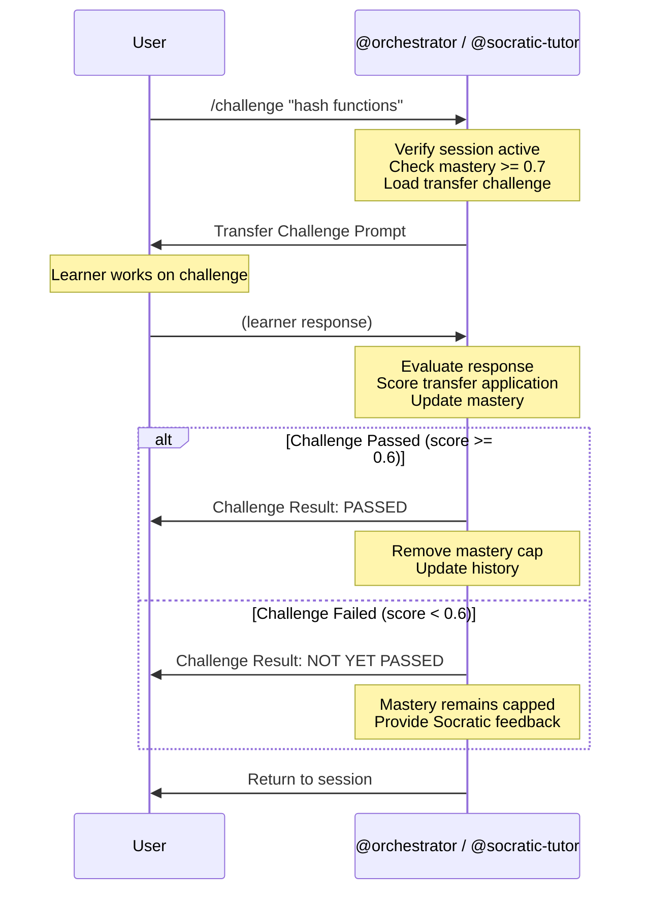

# /challenge -- Transfer Learning Challenge

[trace:step-8:section-5.3] [trace:step-1:section-9.1] [trace:step-7:section-6.4]

You are the @orchestrator executing the `/challenge` command -- triggering a transfer challenge for a mastered concept. Transfer challenges test the learner's ability to apply learned concepts in new domains, validating deep understanding and removing the mastery cap (0.7) for the challenged concept.

---

## Syntax

```
/challenge [concept]
```

## Arguments

| Argument | Type | Required | Default | Validation | Description |
|----------|------|----------|---------|------------|-------------|
| `concept` | string | No | -- | If provided, must match a concept ID or label in the curriculum; concept mastery must be >= 0.7 | Specific concept to challenge; if omitted, system selects the best candidate |

## Preconditions

1. Active session in TUTORING state (`learner-state.current_session.status == "active"`)
2. At least one concept with mastery >= 0.7 (eligible for transfer challenge)

## Execution Flow

```
1. Parse optional concept argument
2. Verify active session exists
   - If no active session: display error

   IF concept provided:
     a. Resolve concept (by ID or label) in auto-curriculum.json
     b. If not found: display error
     c. Check mastery >= 0.7 for this concept
     d. If mastery < 0.7: display error with current mastery
     e. Check if transfer challenge already passed
     f. If already passed: display INFO
     g. Load the transfer challenge definition from curriculum

   IF concept NOT provided:
     a. Scan learner-state.yaml.knowledge_state for concepts with mastery >= 0.7
     b. If none found: display error with highest mastery
     c. Prioritize concepts:
        - Without prior transfer challenge attempts (first priority)
        - Highest mastery score (tiebreaker)
     d. Select the best candidate

3. Determine challenge type:
   a. If concept has a transfer_challenge defined in curriculum: use it
   b. If no predefined challenge: @socratic-tutor generates one
      - same_field: apply concept within same domain
      - far_transfer: apply concept to a different domain

4. Present the transfer challenge to the learner

5. Wait for learner's response

6. Evaluate learner's response:
   - Score: 0.0-1.0 based on:
     - Application accuracy (correct mapping of properties)
     - Reasoning depth (explicit reasoning chain)
     - Completeness (all relevant properties addressed)
   - Update mastery using triangulation formula (transfer_score component)
   - If score >= 0.6: challenge PASSED
     - Mastery cap removed for this concept
     - Mastery updated to actual computed value
   - If score < 0.6: challenge NOT PASSED
     - Mastery remains capped at 0.7
     - Constructive Socratic feedback provided

7. Update learner-state.yaml:
   - knowledge_state[concept].mastery updated
   - knowledge_state[concept].transfer_validated = true (if passed)
   - history.transfer_challenges_completed += 1
   - history.transfer_challenges_passed += 1 (if passed)

8. Display challenge result
9. Return to session dialogue
```

## Agent Dispatch Sequence



## Progress Display

Challenge is an interactive operation within the session -- no step counter needed. The challenge is presented as a single prompt, and the result is displayed after evaluation.

## Success Output -- Challenge Presentation

```
┌─────────────────────────────────────────────────┐
│  전이 챌린지: <concept>                           │
│  유형: 동일 분야 / 원거리 전이                      │
│  대상 도메인: <domain>                            │
│                                                 │
│  챌린지:                                         │
│  <challenge question/scenario in Korean>         │
│                                                 │
│  천천히 생각해 보세요. 각 속성이 새로운 맥락에        │
│  어떻게 매핑되는지 생각해 보세요.                    │
└─────────────────────────────────────────────────┘
```

## Success Output -- Challenge Result (Passed)

```
┌─────────────────────────────────────────────────┐
│  챌린지 결과: 통과                                │
│                                                 │
│  • 전이 점수: X.XX                               │
│  • <concept> 숙달도: XX% -> XX%                   │
│    (숙달도 상한 해제!)                             │
│  • 전이 챌린지: N/M 통과                          │
│                                                 │
│  <Positive feedback with specific reasoning>     │
│                                                 │
│  세션으로 돌아갑니다...                             │
└─────────────────────────────────────────────────┘
```

## Success Output -- Challenge Result (Not Passed)

```
┌─────────────────────────────────────────────────┐
│  챌린지 결과: 아직 미통과                          │
│                                                 │
│  • 전이 점수: X.XX                               │
│  • <concept> 숙달도: 70%에서 유지                  │
│    (숙달도 상한 유지)                              │
│  • 전이 챌린지: N/M 통과                          │
│                                                 │
│  <Constructive feedback with Socratic hint>      │
│                                                 │
│  추가 학습 후 /challenge를 다시 시도할 수 있습니다.  │
│  세션으로 돌아갑니다...                             │
└─────────────────────────────────────────────────┘
```

## Mastery Cap Logic

The mastery cap implements Perkins & Salomon's transfer validation requirement:

| Condition | Effective Mastery | Transfer Status |
|-----------|------------------|-----------------|
| Raw mastery >= 0.8, no transfer validation | Capped at 0.7 | Pending |
| Transfer score >= 0.6 | Actual computed value (cap removed) | Validated |
| Transfer score < 0.6 | Stays capped at 0.7 | Failed (retry allowed) |

## Error Handling

All errors use the three-part format: ERROR/WHY/FIX.

| Error Condition | Detection | User Message | Recovery |
|----------------|-----------|--------------|----------|
| No active session | current_session.status != "active" | `ERROR: 활성 세션이 없습니다. WHY: /challenge는 활성 튜터링 세션이 필요합니다. FIX: 먼저 /start-learning으로 세션을 시작하세요.` | /start-learning |
| No eligible concepts | No concepts with mastery >= 0.7 | `ERROR: 챌린지 준비가 된 개념이 없습니다. WHY: 전이 챌린지는 숙달도 >= 70%가 필요합니다. 현재 최고 숙달도: {max}%. FIX: 학습을 계속하여 숙달도를 높이세요.` | Continue session |
| Concept not found | concept argument not in curriculum | `ERROR: 개념 "{concept}"을 찾을 수 없습니다. WHY: 현재 커리큘럼에 해당 개념이 없습니다. FIX: /concept-map으로 사용 가능한 개념을 확인하거나, 인수를 생략하여 자동 선택하세요.` | /challenge (no argument) |
| Concept mastery too low | mastery < 0.7 for specified concept | `ERROR: "{concept}" 숙달도가 {mastery}%입니다 (>= 70% 필요). WHY: 전이 챌린지는 충분한 숙달도가 있어야 심화 이해를 테스트합니다. FIX: 이 개념을 더 학습한 후 /challenge "{concept}"를 다시 시도하세요.` | Continue session |
| Challenge already passed | transfer_validated flag set | `INFO: "{concept}"의 전이 챌린지를 이미 통과했습니다. WHY: 각 개념의 주요 전이 챌린지는 한 번만 완료할 수 있습니다. FIX: 다른 개념으로 /challenge를 시도하거나, 인수를 생략하여 자동 선택하세요.` | /challenge (different concept or auto) |

## Command Interaction (Auto-Linking)

| Trigger | Auto-Link |
|---------|-----------|
| Mastery >= 0.8 during session | @socratic-tutor auto-triggers: "챌린지 준비가 되었습니다. /challenge를 시도해 보세요." |
| /end-session with mastered concepts | 성공 출력에 포함: "/challenge로 전이 챌린지 도전" |
| /my-progress shows concept >= 70% | 추천에 포함: "/challenge로 '<concept>' 도전" |

## Edge Cases

| Scenario | Detection | Behavior |
|----------|-----------|----------|
| All eligible concepts already challenged | All have transfer_validated = true | `INFO: 모든 적격 개념의 전이 챌린지를 완료했습니다. 새로운 개념을 학습하세요.` |
| Multiple concepts at exactly 70% | Tie in mastery | 전이 챌린지 시도 이력이 없는 개념 우선; 그 다음 알파벳 순 |
| Challenge references nonexistent concept | Concept ID lookup fails | 챌린지 건너뛰기; 대안 개념 제안 |
| Learner gives very short response | Length check | 추가 설명 요청: "좀 더 자세히 설명해 주시겠어요? 각 속성이 어떻게 적용되는지 구체적으로 말씀해 주세요." |
| Session ends during challenge | Session timeout | 챌린지 결과 저장 안 됨; interrupted/ 상태로 전환; /resume으로 복구 가능 |

## SOT Pattern

- Challenge results update `learner-state.yaml`
- Only @orchestrator writes to SOT files
- Challenge scoring is computed inline by @socratic-tutor behavior

## User-Facing Language

모든 사용자 대면 출력은 **한국어**로 표시합니다. 에이전트는 내부적으로 영어로 작업합니다.
