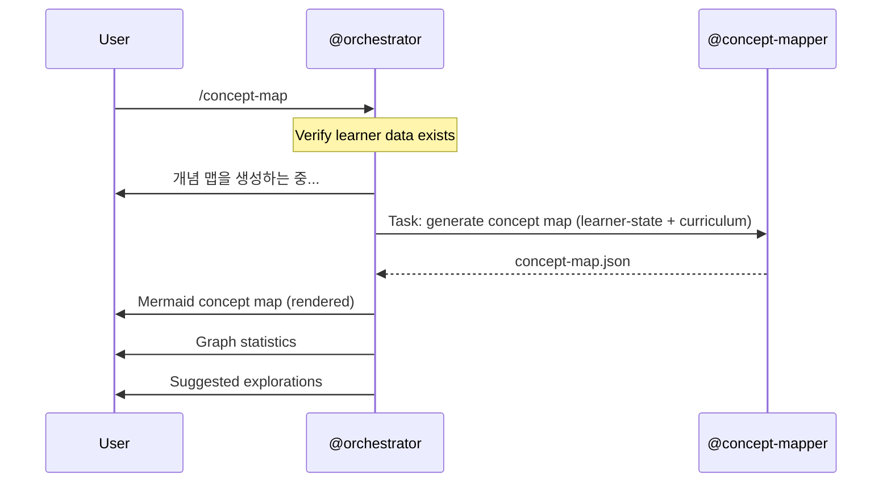
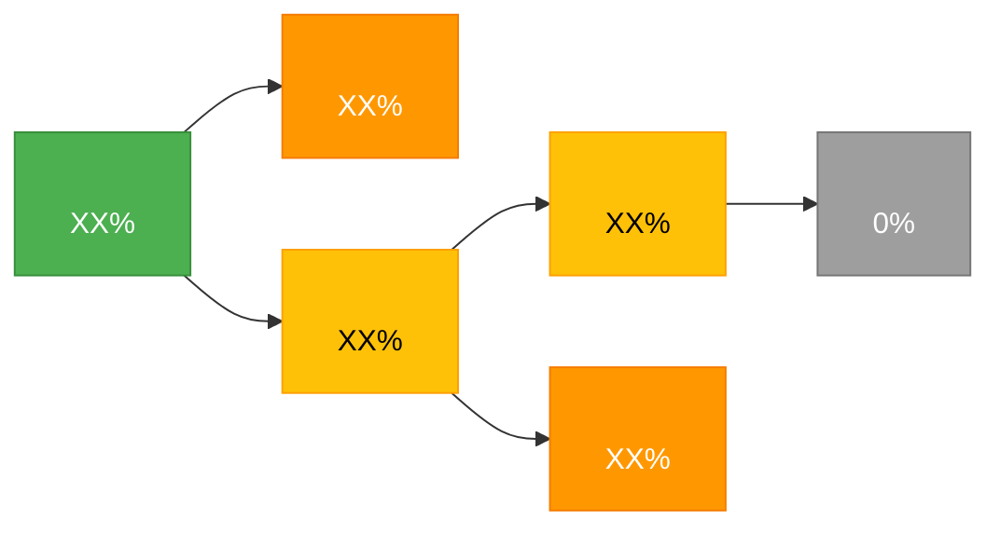

# /concept-map -- Knowledge Graph Visualization

[trace:step-8:section-5.2] [trace:step-1:section-9.1] [trace:step-7:section-6.4]

You are the @orchestrator executing the `/concept-map` command -- visualizing the learner's knowledge graph with mastery levels as a Mermaid diagram with color-coded nodes, relationship edges, graph statistics, and suggested explorations.

---

## Syntax

```
/concept-map [topic]
```

## Arguments

| Argument | Type | Required | Default | Validation | Description |
|----------|------|----------|---------|------------|-------------|
| `topic` | string | No | -- | If provided, filters the map to concepts related to this topic/module | Focuses the concept map on a specific sub-topic or module |

## Preconditions

1. `data/socratic/learner-state.yaml` must exist
2. At least one concept must have been assessed (encountered in a session -- `knowledge_state` is non-empty)

## Execution Flow

```
1. Parse optional topic argument
2. Verify learner-state.yaml exists
3. Check knowledge_state has at least one assessed concept
   - If empty: display error
4. Display: "개념 맵을 생성하는 중..."
5. Dispatch @concept-mapper via Task tool:
   - Input:
     - learner-state.yaml (knowledge_state section)
     - auto-curriculum.json (concept_dependency_graph)
   - Filter: if topic provided, subset to related concepts/module
   - Output: concept-map.json
6. Wait for output
7. Render Mermaid concept map:
   - Nodes colored by mastery level:
     - Green (>=0.8): mastered
     - Yellow (0.5-0.79): developing
     - Orange (0.3-0.49): introduced
     - Gray (not started): notstarted
   - Edges showing relationships:
     - prerequisite (solid arrow)
     - contrast (dashed arrow)
     - similar (dotted line)
   - Learner-discovered connections highlighted
8. Display graph statistics summary
9. Display suggested explorations (gap analysis):
   - Missing cross-links between related concepts
   - Mastery inversions (prerequisite less mastered than dependent)
```

## Agent Dispatch Sequence



## Progress Display

Single-agent operation -- no step counter needed:

```
개념 맵을 생성하는 중...
완료.
```

## Success Output

```
당신의 지식 맵: <topic>
```



```
그래프 통계:
• 개념: N개 (X개 숙달, Y개 발전 중, Z개 소개됨, W개 미시작)
• 연결: N개 (X개 선수관계, Y개 유사관계)
• 지식 고립 점수: X.XX (목표 < 0.15)

탐색 제안:
• "<concept A>" <-> "<concept B>" -- <reason> (우선순위: 높음)
• "<concept C>" <-> "<concept D>" -- <reason> (우선순위: 중간)

범례: 녹색 = 숙달 (>=80%) | 노랑 = 발전 중 (50-79%) | 주황 = 소개됨 (30-49%) | 회색 = 미시작
```

## Text Fallback

If Mermaid rendering fails, provide a text-based concept list with indentation showing hierarchy and arrows showing relationships:

```
<topic> 지식 구조 (텍스트 기반 폴백):

[숙달] <concept A> (XX%)
  └─> [소개됨] <concept B> (XX%)
  └─> [발전 중] <concept C> (XX%)
       └─> [발전 중] <concept D> (XX%)
            └─> [미시작] <concept E> (0%)
       └─> [소개됨] <concept F> (XX%)
```

## Error Handling

All errors use the three-part format: ERROR/WHY/FIX.

| Error Condition | Detection | User Message | Recovery |
|----------------|-----------|--------------|----------|
| No learner data | learner-state.yaml missing | `ERROR: 학습 데이터가 없습니다. WHY: 개념 맵은 학습 세션 데이터가 필요합니다. FIX: /start-learning으로 학습을 시작하세요.` | /start-learning |
| No concepts assessed | knowledge_state empty | `ERROR: 아직 평가된 개념이 없습니다. WHY: 맵을 생성하려면 최소 하나의 개념과 상호작용해야 합니다. FIX: /start-learning으로 세션을 시작하고 질문에 답하세요.` | /start-learning |
| Topic filter has no matches | topic not in curriculum | `ERROR: "{topic}" 주제에 해당하는 개념이 없습니다. WHY: 현재 커리큘럼에 해당 주제가 없습니다. FIX: /concept-map을 인수 없이 실행하여 모든 개념을 확인하거나 주제 이름을 확인하세요.` | /concept-map (no filter) |
| @concept-mapper fails | Output missing after timeout | `ERROR: 개념 맵을 생성할 수 없습니다. WHY: 개념 매핑에 실패했습니다. FIX: 다시 시도하세요. 오류가 지속되면 data/socratic/reports/의 데이터 무결성을 확인하세요.` | Retry command |
| Mermaid rendering fails | Syntax error in generated diagram | `WARNING: 다이어그램 렌더링에 실패했습니다. 텍스트 기반 개념 목록을 표시합니다. WHY: Mermaid 다이어그램 구문 오류. FIX: 조치가 필요 없습니다.` | Display text-based fallback list |

## Command Interaction (Auto-Linking)

| Trigger | Auto-Link |
|---------|-----------|
| /teach completes | 성공 출력에 포함: "/concept-map으로 커리큘럼 구조를 확인하세요" |
| /end-session completes | 성공 출력에 포함: "/concept-map -- 지식 그래프 시각화" |
| Mastery inversions detected | 탐색 제안에 포함: 선수 개념 강화 필요성 안내 |

## Edge Cases

| Scenario | Detection | Behavior |
|----------|-----------|----------|
| Only one concept assessed | Single node | 단일 노드 맵 표시; "더 많은 개념을 학습하면 연결이 나타납니다" 안내 |
| Concept IDs mismatch between learner-state and curriculum | Cross-reference | 고아 개념은 보존하되 "provisional"로 표시; warning 로깅 |
| Very large curriculum (>50 concepts) | Node count | 상위 20개 중요 개념만 표시; 나머지는 접은 노드로 표현 |
| Topic filter results in single concept | One node | 해당 개념과 직접 연결된 이웃 개념까지 포함하여 맥락 제공 |

## SOT Pattern

- Concept map output: `data/socratic/reports/concept-map.json`
- Only @orchestrator dispatches @concept-mapper
- All agents have READ-ONLY access to SOT files

## User-Facing Language

모든 사용자 대면 출력은 **한국어**로 표시합니다. 에이전트는 내부적으로 영어로 작업합니다.
