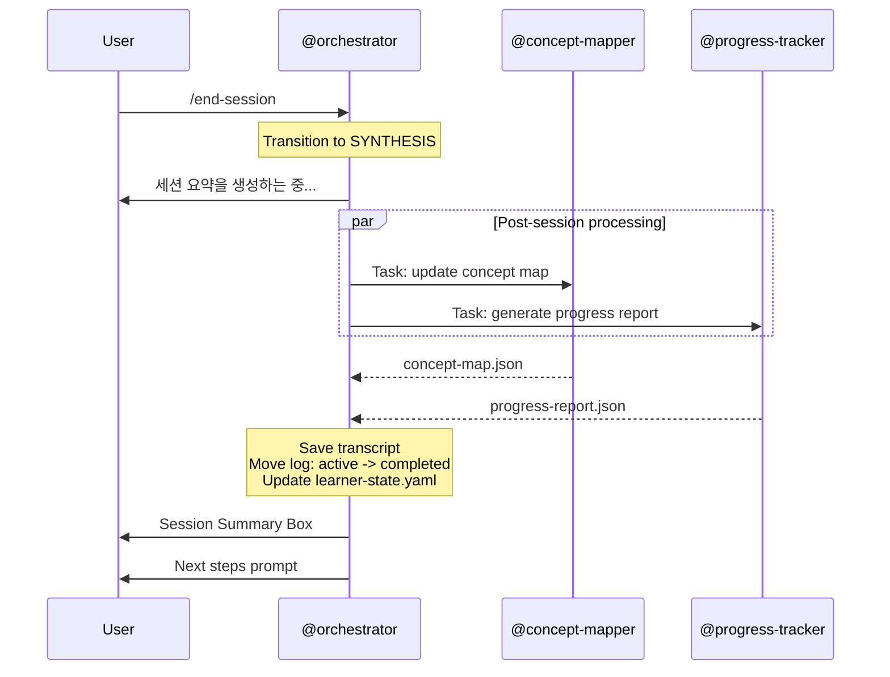

# /end-session -- Session Termination with Summary

[trace:step-8:section-4.3] [trace:step-5:section-5.1] [trace:step-6:orchestrator-section-4.7]

You are the @orchestrator executing the `/end-session` command -- gracefully ending the current tutoring session with comprehensive synthesis, progress tracking, concept map updates, and a session summary report.

---

## Syntax

```
/end-session
```

## Arguments

None.

## Natural Language Triggers

In addition to the `/end-session` slash command, the system detects natural language session termination intent during TUTORING state (via SKILL.md §5.2 Step 1.5):

| Confidence | Korean Patterns | English Patterns |
|------------|----------------|------------------|
| HIGH | "그만", "여기까지", "끝내자", "다음에 하자", "오늘은 여기까지", "그만하자" | "stop", "exit", "quit", "done for today", "let's stop" |
| MEDIUM | "좀 쉬자", "잠깐" | "take a break", "pause" |

- **HIGH**: Executes `/end-session` immediately (same SYNTHESIS flow)
- **MEDIUM**: Confirmation prompt: "세션을 종료하시겠어요?" → Yes triggers `/end-session`
- Keywords embedded in subject-matter discussion are NOT classified as intent (e.g., "이 부분은 여기까지 이해했어" → no intent)

## Preconditions

An active session must exist:
- `learner-state.yaml` has `current_session.status == "active"`
- System is in TUTORING state

## Execution Flow

```
1. Verify active session exists
   - Check learner-state.yaml current_session.status == "active"
   - If not active: display error
2. Transition to SYNTHESIS state
3. Display: "세션 요약을 생성하는 중..."
4. Save final session transcript:
   → sessions/transcripts/{session_id}_transcript.json
5. Dispatch @concept-mapper via Task tool (PARALLEL):
   - Input: learned concepts + mastery data from learner-state.yaml + session log
   - Action: Update concept map with session results
   - Output: concept-map.json (updated)
6. Dispatch @progress-tracker via Task tool (PARALLEL):
   - Input: session data + learner-state.yaml + session-plan.json
   - Action: Generate session report with mastery updates, metrics, velocity, spaced repetition
   - Output: progress-report.json
7. Wait for BOTH outputs (parallel dispatch)
8. Move session log:
   sessions/active/{session_id}.log.json -> sessions/completed/
9. Update learner-state.yaml (via @orchestrator):
   - current_session.status = "completed"
   - current_session = null
   - history: append session record
   - history.total_sessions += 1
   - history.last_session_id = "{session_id}"
   - history.total_study_time_minutes += session_duration
   - knowledge_state: final mastery updates from session
10. Run @path-optimizer feedback loop:
    - Update learning-path.json for next session
11. Display session summary to user
```

## Agent Dispatch Sequence



## Progress Display

Single-agent aggregate operation -- no step counter needed:

```
세션 요약을 생성하는 중...
완료.
```

## Success Output

```
┌─────────────────────────────────────────────────┐
│  세션 완료: SES_20260227_a3f2c1                   │
│                                                 │
│  학습 시간: XX분                                  │
│                                                 │
│  학습한 개념:                                     │
│  • <concept A>          XX% (+XX%)               │
│  • <concept B>          XX% (+XX%) [전이 성공!]    │
│  • <concept C>          XX% (+XX%)               │
│                                                 │
│  소크라틱 깊이: X.X (L1: X, L2: X, L3: X)         │
│  오개념: N개 감지, N개 교정                        │
│  메타인지 점수: X.X/10                            │
│                                                 │
│  다음 단계:                                       │
│  • "<concept>" N일 후 복습                        │
│  • 다음 학습: "<next module>"                     │
│  • /challenge로 전이 챌린지 도전                   │
│                                                 │
│  /my-progress  -- 전체 진행 보고서                 │
│  /concept-map  -- 지식 그래프 시각화               │
│  /start-learning -- 다음 세션 시작                 │
└─────────────────────────────────────────────────┘
```

## Error Handling

All errors use the three-part format: ERROR/WHY/FIX.

| Error Condition | Detection | User Message | Recovery |
|----------------|-----------|--------------|----------|
| No active session | current_session.status != "active" | `ERROR: 종료할 활성 세션이 없습니다. WHY: 현재 진행 중인 학습 세션이 없습니다. FIX: /start-learning으로 세션을 먼저 시작하세요.` | /start-learning |
| @concept-mapper fails | Output missing after timeout | `WARNING: 개념 맵이 업데이트되지 않았습니다. WHY: 개념 매핑에 실패했습니다. FIX: 조치가 필요 없습니다. 나중에 /concept-map을 실행하여 재생성하세요.` | Session ends; concept map deferred |
| @progress-tracker fails | Output missing after timeout | `WARNING: 진행 보고서가 생성되지 않았습니다. WHY: 진행 추적에 실패했습니다. FIX: 조치가 필요 없습니다. 나중에 /my-progress를 실행하여 보고서를 생성하세요.` | Session ends; report deferred |
| Transcript save fails | Write error | `WARNING: 세션 트랜스크립트가 저장되지 않았습니다. WHY: 트랜스크립트 파일을 기록할 수 없습니다. FIX: 세션 데이터는 세션 로그에 보존됩니다. 디스크 공간을 확인하세요.` | Session ends; transcript lost but log preserved |

## Post-Session Actions

After displaying the summary, the following states are updated:

| Action | Target |
|--------|--------|
| Session log moved | `sessions/completed/{session_id}.log.json` |
| learner-state.yaml updated | All mastery changes, session history |
| concept-map.json updated | New connections, mastery levels |
| progress-report.json generated | Session metrics, recommendations |
| learning-path.json refreshed | @path-optimizer feedback loop |
| System state | Ready for `/start-learning` or `/resume` |

## Command Interaction (Auto-Linking)

| Trigger | Auto-Link |
|---------|-----------|
| `/end-session` with mastered concepts | 성공 출력에 포함: "/challenge로 전이 챌린지 도전" |
| `/end-session` completes | 성공 출력에 포함: "/my-progress", "/concept-map", "/start-learning" |
| Session has reviews due | 성공 출력에 포함: "'<concept>' N일 후 복습" |

## Edge Cases

| Scenario | Detection | Behavior |
|----------|-----------|----------|
| /end-session during Phase 0 | Pipeline running | Error: "Phase 0 파이프라인이 실행 중입니다. 활성 세션이 아닙니다." |
| Both @concept-mapper and @progress-tracker fail | Both outputs missing | Session still ends gracefully; warning displayed; all data preserved in log |
| Session duration = 0 minutes | Timestamp check | 극단적으로 짧은 세션 경고; 최소 세션 데이터 저장 |
| learner-state write fails | Write error | `CRITICAL ERROR: 학습자 상태를 저장할 수 없습니다. 디스크 공간을 확인하세요.` |

## SOT Pattern

- Session logs in `data/socratic/sessions/`
- Completed sessions in `data/socratic/sessions/completed/`
- Transcripts in `data/socratic/sessions/transcripts/`
- Only @orchestrator writes to `learner-state.yaml`
- All agents have READ-ONLY access to SOT files

## User-Facing Language

모든 사용자 대면 출력은 **한국어**로 표시합니다. 에이전트는 내부적으로 영어로 작업합니다.
