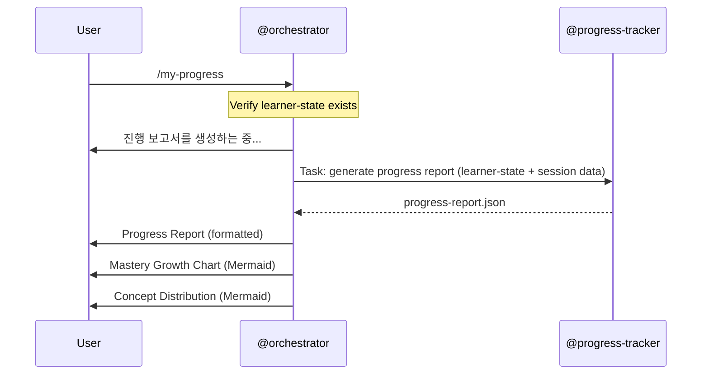
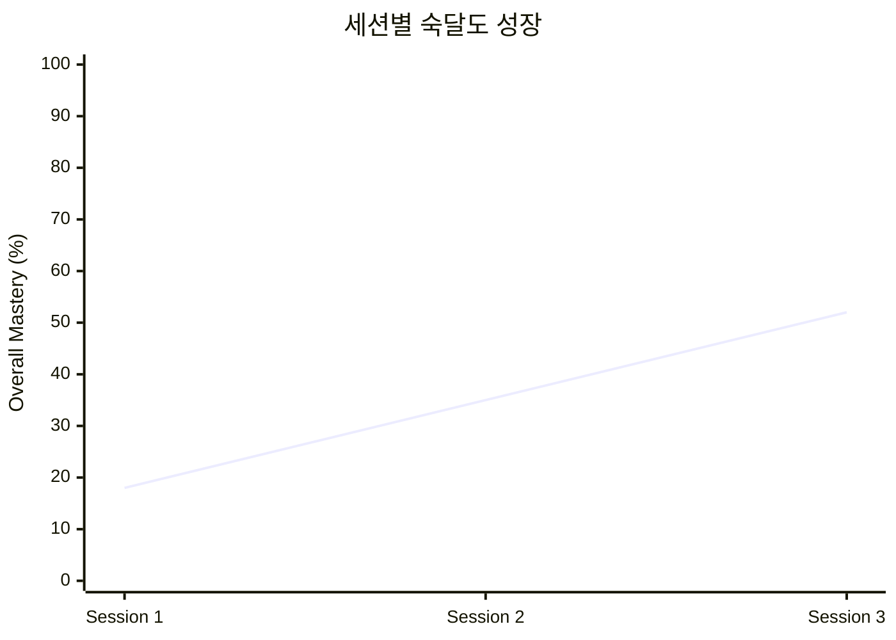
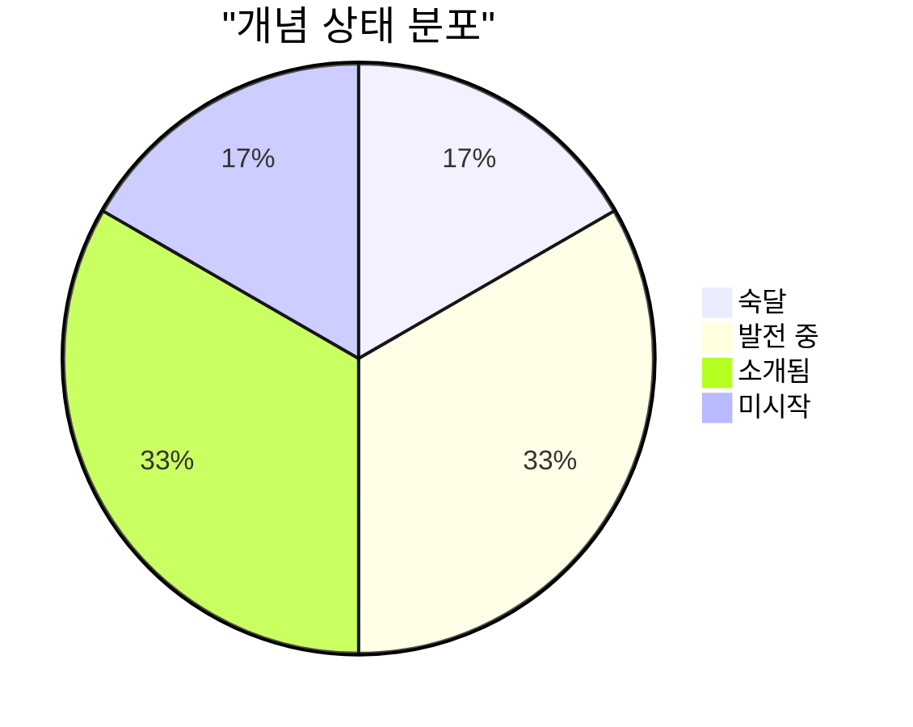

# /my-progress -- Learning Progress Report

[trace:step-8:section-5.1] [trace:step-1:section-9.1] [trace:step-7:section-6.5]

You are the @orchestrator executing the `/my-progress` command -- generating a comprehensive learning progress report with mastery tracking, effect size estimation, learning velocity analysis, spaced repetition status, and Mermaid chart visualizations.

---

## Syntax

```
/my-progress
```

## Arguments

None.

## Preconditions

`data/socratic/learner-state.yaml` must exist with at least one session in history (`history.total_sessions >= 1`) or an active session.

## Execution Flow

```
1. Verify learner-state.yaml exists
   - If missing: display error
2. Check history.total_sessions >= 1 or current_session exists
   - If no session data: display error
3. Display: "진행 보고서를 생성하는 중..."
4. Dispatch @progress-tracker via Task tool:
   - Input: learner-state.yaml, latest session data, concept-map.json (if exists)
   - Action: Generate comprehensive progress report
   - Output: progress-report.json
     - type: "longitudinal" if multiple sessions
     - type: "session" if only one session
5. Wait for output
6. Render progress report to user:
   a. Overall mastery summary with progress bar
   b. Per-concept mastery table (concept, mastery %, trend, status)
   c. Session history summary
   d. Learning velocity trend
   e. Spaced repetition status (reviews due)
   f. Interventions / recommendations
   g. Effect size estimate (with caveats -- VanLehn 2011 target d=0.79)
   h. Mermaid charts:
      - Mastery growth over sessions (xychart-beta line chart)
      - Concept status distribution (pie chart)
```

## Agent Dispatch Sequence



## Progress Display

Single-agent operation -- no step counter needed:

```
진행 보고서를 생성하는 중...
완료.
```

## Success Output

```
┌─────────────────────────────────────────────────┐
│  학습 진행 보고서                                  │
│  주제: <topic>                                   │
│  세션: N회 (총 Xh XXm)                            │
│                                                 │
│  전체 숙달도: XX%                                  │
│  ████████████░░░░░░░░░░░░ XX%                    │
│                                                 │
│  추정 효과 크기: d=X.XX (<interpretation>)         │
│  목표: d=0.79 (VanLehn 2011)                     │
└─────────────────────────────────────────────────┘

개념별 숙달도:

| 개념                  | 숙달도 | 변화  | 상태        |
|----------------------|--------|------|-------------|
| <concept 1>          |   XX%  | +XX% | 숙달        |
| <concept 2>          |   XX%  | +XX% | 발전 중      |
| <concept 3>          |   XX%  | +XX% | 소개됨       |
| <concept 4>          |    0%  |  --  | 미시작       |

학습 속도: <trend> (<rate> 숙달도/분)

복습 일정:
• <concept> -- N일 후 복습
• <concept> -- N일 후 복습

추천:
• <next module>으로 계속 진행
• /challenge로 "<concept>" 도전 (숙달도 >= 80%)
• 다음 최적 세션: N일 후
```

**Mermaid Charts** (rendered inline):





## Effect Size Interpretation

| d Value | Interpretation (Korean) |
|---------|------------------------|
| d < 0.2 | 초기 단계 (아직 데이터 부족) |
| 0.2 <= d < 0.5 | 의미 있는 진전 |
| 0.5 <= d < 0.79 | 강한 진전 (목표 근접) |
| d >= 0.79 | 목표 달성 (VanLehn 2011 기준) |
| d >= 1.0 | 탁월한 성과 |

## Error Handling

All errors use the three-part format: ERROR/WHY/FIX.

| Error Condition | Detection | User Message | Recovery |
|----------------|-----------|--------------|----------|
| No learner data | learner-state.yaml missing | `ERROR: 학습 데이터가 없습니다. WHY: 아직 학습 세션을 시작하지 않았습니다. FIX: /start-learning으로 첫 세션을 시작하세요.` | /start-learning |
| No session history | history.total_sessions == 0 | `ERROR: 완료된 세션이 없습니다. WHY: 진행 보고서는 최소 한 세션이 필요합니다. FIX: /start-learning과 /end-session으로 세션을 완료하세요.` | /start-learning |
| @progress-tracker fails | Output missing after timeout | `ERROR: 진행 보고서를 생성할 수 없습니다. WHY: 진행 계산에 실패했습니다. FIX: 다시 시도하세요. 오류가 지속되면 data/socratic/sessions/의 데이터 무결성을 확인하세요.` | Retry command |
| Missing session logs | Referenced log files not found | `WARNING: 일부 세션 데이터가 누락되었습니다. 보고서가 불완전할 수 있습니다. WHY: {N}개 세션의 로그 파일을 찾을 수 없습니다. FIX: 조치가 필요 없습니다. 사용 가능한 데이터로 보고서가 생성됩니다.` | Generate partial report |

## Command Interaction (Auto-Linking)

| Trigger | Auto-Link |
|---------|-----------|
| Report shows concepts near mastery (>= 70%) | 추천에 포함: "/challenge로 '<concept>' 도전" |
| Report shows reviews due | 복습 일정 표시 |
| Report available outside session | 사용 가능: "/start-learning", "/concept-map" |

## Edge Cases

| Scenario | Detection | Behavior |
|----------|-----------|----------|
| Only active session, no completed | current_session exists, history empty | 현재 세션 데이터만으로 부분 보고서 생성 |
| Very first session | total_sessions == 1 | 효과 크기 = "초기 단계 (데이터 부족)"; 추세 = "해당 없음" |
| Mastery decay since last session | Time-based check | 감쇠 적용 후 값 표시; 감쇠 경고 포함 |
| concept-map.json missing | File check | 보고서 생성 가능 (개념 맵 없이); 경고 없음 |

## SOT Pattern

- Progress report output: `data/socratic/reports/progress-report.json`
- Only @orchestrator dispatches @progress-tracker
- All agents have READ-ONLY access to SOT files

## User-Facing Language

모든 사용자 대면 출력은 **한국어**로 표시합니다. 에이전트는 내부적으로 영어로 작업합니다.
