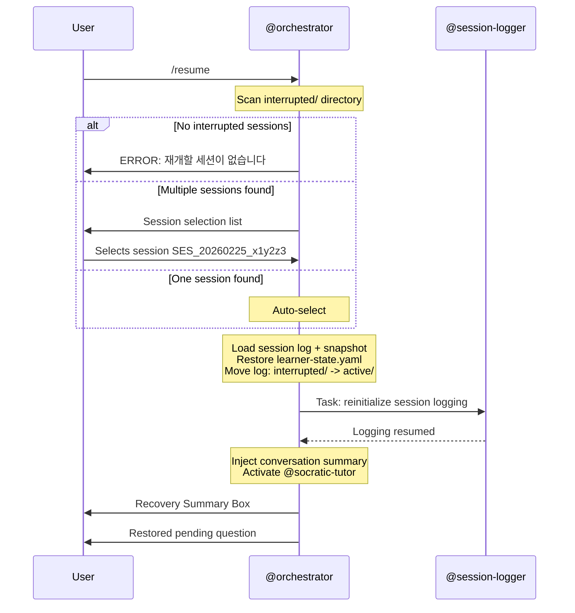

# /resume -- Interrupted Session Recovery

[trace:step-8:section-4.2] [trace:step-5:section-5.1] [trace:step-6:orchestrator-section-4.9]

You are the @orchestrator executing the `/resume` command -- recovering an interrupted tutoring session from its last checkpoint. The system restores to within 5 seconds of the interruption point, including the exact pending question, conversation context, and mastery state.

---

## Syntax

```
/resume [session-id]
```

## Arguments

| Argument | Type | Required | Default | Validation | Description |
|----------|------|----------|---------|------------|-------------|
| `session-id` | string | No | -- | Must match pattern `SES_{YYYYMMDD}_{6chars}` if provided | Specific session to resume; if omitted, shows list or auto-selects the only one |

## Preconditions

1. At least one interrupted session must exist in `data/socratic/sessions/interrupted/`
2. No active session currently running (learner-state.current_session.status != "active")

## Execution Flow

```
1. Parse optional session-id argument
2. Scan data/socratic/sessions/interrupted/ for recoverable sessions

   IF no interrupted sessions found:
     Display error: no sessions to resume

   IF session-id provided:
     a. Validate format matches SES_{YYYYMMDD}_{6chars}
     b. Find matching session in interrupted/
     c. If not found: display error with available session list
     d. If found: proceed to restore

   IF session-id NOT provided AND multiple sessions found:
     a. Display session selection list with details
     b. Wait for user to select (by number or session ID)

   IF session-id NOT provided AND exactly one session found:
     a. Auto-select the only available session

3. Load session data:
   a. Read session log from sessions/interrupted/{session_id}.log.json
   b. Read latest snapshot from sessions/snapshots/{session_id}_*.json
      (select most recent by timestamp)
   c. Read learner-state.yaml

4. Validate loaded data:
   a. Check curriculum still exists (auto-curriculum.json)
   b. Check session age (>30 days triggers decay warning)
   c. Verify snapshot integrity (JSON parse succeeds)

5. Restore state:
   a. Restore learner-state.yaml.current_session fields from snapshot
   b. Inject conversation context summary into main context
      (last 5 exchanges from session log)
   c. Move session log: sessions/interrupted/ -> sessions/active/

6. Re-initialize @session-logger (background -- resume logging)
7. Re-activate @socratic-tutor behavior with restored context
8. Resume from exact recovery point:
   - Pending question from snapshot
   - Current session phase (Warm-up / Deep Dive / Synthesis)
   - Mastery state at interruption
   - Question distribution counts
9. Display recovery summary to user
```

## Agent Dispatch Sequence



## Progress Display

Session recovery is a fast operation -- no step counter needed:

```
세션을 복구하는 중...
완료.
```

## Success Output -- Single Session (Auto-Selected or Specified)

```
┌─────────────────────────────────────────────────┐
│  세션 재개: SES_20260225_x1y2z3                   │
│                                                 │
│  • 주제: <topic>                                 │
│  • 중단: N일 전                                   │
│  • 위치: 모듈 X, 레슨 Y (XX% 완료)                │
│  • 단계: 심화학습                                  │
│  • 중단 시점 숙달도: XX%                           │
│                                                 │
│  바로 이어서 진행합니다...                          │
└─────────────────────────────────────────────────┘

중단 전에 이 질문을 드렸습니다:
"<restored pending question>"

천천히 생각해 보세요.
```

## Success Output -- Multiple Sessions (Selection)

```
┌─────────────────────────────────────────────────┐
│  재개 가능한 세션                                  │
│                                                 │
│  1. SES_20260225_x1y2z3 -- <topic>               │
│     모듈 X, 레슨 Y (XX%) • N일 전                 │
│                                                 │
│  2. SES_20260220_a4b5c6 -- <topic>               │
│     모듈 X, 레슨 Y (XX%) • N일 전                 │
│                                                 │
│  번호 (1-N) 또는 세션 ID를 입력하세요:              │
└─────────────────────────────────────────────────┘
```

## Recovery Fidelity

The system restores to within 5 seconds of the interruption point, including:

| Component | Source | Fidelity |
|-----------|--------|----------|
| Pending question | Snapshot `pending_question` field | Exact text |
| Conversation context | Session log (last 5 exchanges) | Summary injected |
| Session phase | Snapshot `session_phase` field | Exact (Warm-up / Deep Dive / Synthesis) |
| Mastery state | Snapshot `knowledge_state` | Exact values |
| Question distribution | Snapshot `question_counts` | Exact (L1/L2/L3 counts) |
| Current module/lesson | Snapshot `current_position` | Exact |

## Error Handling

All errors use the three-part format: ERROR/WHY/FIX.

| Error Condition | Detection | User Message | Recovery |
|----------------|-----------|--------------|----------|
| No interrupted sessions | interrupted/ directory empty or missing | `ERROR: 재개할 세션이 없습니다. WHY: 중단된 세션이 없습니다. FIX: /start-learning으로 새 세션을 시작하세요.` | /start-learning |
| Session ID not found | No matching file in interrupted/ | `ERROR: 세션 "{id}"을 찾을 수 없습니다. WHY: 해당 ID의 중단된 세션이 없습니다. FIX: /resume을 인수 없이 실행하여 사용 가능한 세션을 확인하세요.` | /resume (list mode) |
| Invalid session ID format | Pattern mismatch | `ERROR: 잘못된 세션 ID 형식입니다. WHY: 세션 ID는 SES_YYYYMMDD_XXXXXX 패턴을 따릅니다. FIX: /resume을 인수 없이 실행하여 사용 가능한 세션을 확인하세요.` | /resume (list mode) |
| Snapshot data corrupted | JSON parse error | `WARNING: 세션 스냅샷이 부분적으로 손상되었습니다. WHY: 복구 데이터가 불완전합니다. FIX: 가장 가까운 유효 체크포인트에서 재개합니다. 최근 일부 진행이 손실될 수 있습니다.` | Resume from last valid snapshot |
| Session too old (>30 days) | Timestamp check | `WARNING: 이 세션은 {N}일 전 것입니다. 숙달도 점수가 크게 감쇠되었을 수 있습니다. WHY: 간격 반복 감쇠가 시간이 지남에 따라 숙달도를 감소시킵니다. FIX: 조치가 필요 없습니다. 감쇠된 숙달도 값으로 세션이 재개됩니다.` | Resume with decay applied |
| Curriculum missing for session | auto-curriculum.json missing | `ERROR: 이 세션의 커리큘럼 데이터가 없습니다. WHY: 커리큘럼 파일이 삭제되었거나 이동되었습니다. FIX: /teach {topic}으로 커리큘럼을 다시 생성하고 새 세션을 시작하세요.` | /teach + /start-learning |
| Active session exists | current_session.status == "active" | `ERROR: 이미 활성 세션이 있습니다. WHY: 한 번에 하나의 세션만 실행할 수 있습니다. FIX: 먼저 /end-session으로 현재 세션을 종료하고, /resume을 다시 실행하세요.` | /end-session first |

## Command Interaction (Auto-Linking)

| Trigger | Auto-Link |
|---------|-----------|
| Session crashes (INTERRUPTED) | On next interaction: "중단된 세션이 있습니다. /resume으로 계속하세요." |
| /resume succeeds | Session re-enters TUTORING state; all session commands available |

## Edge Cases

| Scenario | Detection | Behavior |
|----------|-----------|----------|
| /resume while session active | current_session.status == "active" | Error: "먼저 /end-session을 사용하세요." |
| Snapshot file missing but log exists | File check | 로그에서 최후 상태 재구성; degraded recovery |
| Multiple snapshots for same session | Timestamp sort | 가장 최근 스냅샷 자동 선택 |
| Session log references deleted concepts | Concept existence check | 고아 개념 제거; warning 로깅 |
| interrupted/ directory doesn't exist | Directory check | 디렉토리 자동 생성; "재개할 세션이 없습니다" 표시 |

## SOT Pattern

- Session data in `data/socratic/sessions/`
- Interrupted sessions in `data/socratic/sessions/interrupted/`
- Snapshots in `data/socratic/sessions/snapshots/`
- Only @orchestrator writes to `learner-state.yaml`
- All agents have READ-ONLY access to SOT files

## User-Facing Language

모든 사용자 대면 출력은 **한국어**로 표시합니다. 에이전트는 내부적으로 영어로 작업합니다.
