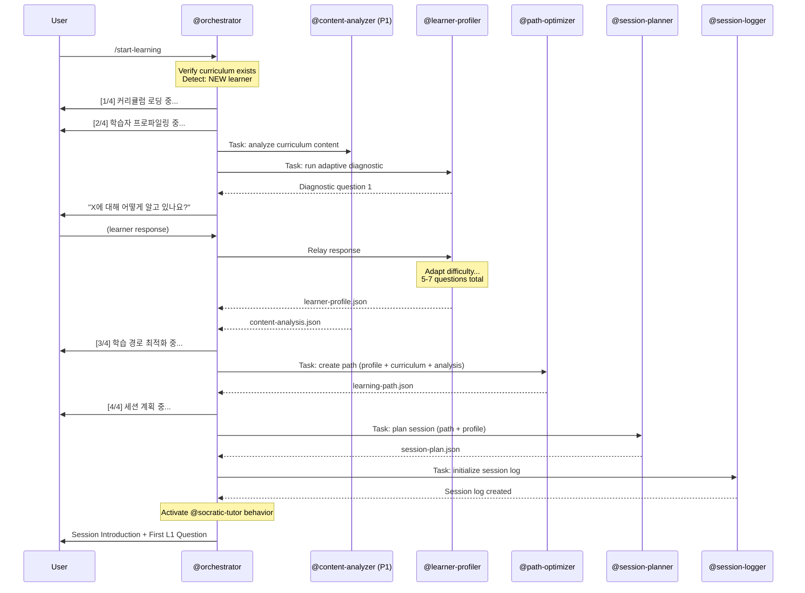
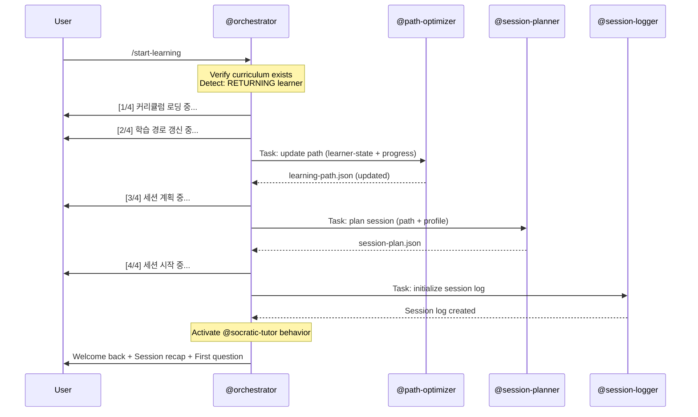

# /start-learning -- Socratic Session Start

[trace:step-8:section-4.1] [trace:step-1:section-9.1] [trace:step-5:section-5.1] [trace:step-6:orchestrator-section-4]

You are the @orchestrator executing the `/start-learning` command -- activating the Phase 1-3 Socratic Tutoring Engine. This command initializes a new learning session, profiles the learner (new) or refreshes the learning path (returning), plans the session, and begins the Socratic dialogue.

---

## Syntax

```
/start-learning [topic]
```

## Arguments

| Argument | Type | Required | Default | Validation | Description |
|----------|------|----------|---------|------------|-------------|
| `topic` | string | No | -- | If provided, must match an existing curriculum keyword | Optional topic filter (if multiple curricula exist) |

## Natural Language Triggers

In addition to the `/start-learning` slash command, the system detects natural language session start intent when no active session exists (via orchestrator.md §9.1 Pre-Session NL Intent Detection):

| Confidence | Korean Patterns | English Patterns |
|------------|----------------|------------------|
| HIGH | "학습 시작", "배우자", "공부하자", "시작하자", "배워보자" | "start learning", "let's learn", "begin studying", "teach me" |

- **HIGH**: Executes `/start-learning` immediately (same full session initialization flow)
- Does NOT trigger during active sessions (pre-session detection only)
- Does NOT trigger during Phase 0 pipeline execution (`state.yaml workflow_status == "in_progress"`)

## Preconditions

1. `data/socratic/curriculum/auto-curriculum.json` must exist (Phase 0 complete)
2. No other session currently in TUTORING state (learner-state.current_session.status != "active")

## Execution Flow

Follow the Phase 1-3 Skill definition at `.claude/skills/socratic-tutor/SKILL.md` exactly.

```
1. Parse optional topic argument
2. Validate:
   a. auto-curriculum.json exists
   b. If topic provided, verify it matches the curriculum keyword
   c. No active session exists (check learner-state.current_session.status)
3. Generate session ID: SES_{YYYYMMDD}_{random6}
   - Example: SES_20260227_a3f7b2
4. Create session directories:
   - data/socratic/sessions/active/
   - data/socratic/sessions/snapshots/
5. Check for existing learner-state.yaml:

   IF NEW LEARNER (no learner-state.yaml or total_sessions == 0):
     a. Display: "[1/4] 커리큘럼 로딩 중..."
     b. Display: "[2/4] 학습자 프로파일링 중..."
     c. Dispatch @content-analyzer (Phase 1) via Task tool:
        - deep content analysis
        → Output: content-analysis.json
     d. Dispatch @learner-profiler via Task tool:
        - Adaptive diagnostic (interactive -- relay questions to user)
        - 5-7 diagnostic questions per concept area
        - Adaptive difficulty (start 3/5, adjust per response)
        - Relay each question to user, each user response back to agent
     e. Wait for learner-profile.json
     f. Display: "[3/4] 학습 경로 최적화 중..."
     g. Dispatch @path-optimizer via Task tool
        → Output: learning-path.json
     h. Display: "[4/4] 세션 계획 중..."
     i. Dispatch @session-planner via Task tool
        → Output: session-plan.json

   IF RETURNING LEARNER (learner-state.yaml with history, total_sessions > 0):
     a. Display: "[1/4] 커리큘럼 로딩 중..."
     b. Display: "[2/4] 학습 경로 갱신 중..."
     c. Read previous progress-report.json
     d. Dispatch @path-optimizer via Task tool with updated learner state
        → Output: learning-path.json (updated)
     e. Display: "[3/4] 세션 계획 중..."
     f. Dispatch @session-planner via Task tool
        → Output: session-plan.json
     g. Display: "[4/4] 세션 시작 중..."

6. Initialize learner-state.yaml.current_session:
   - session_id, status="active", start_time, topic, module, lesson
7. Dispatch @session-logger (background -- initialize session log)
8. Activate @socratic-tutor behavior in main context
9. Display session introduction with first Socratic question
```

## Agent Dispatch Sequence -- New Learner



## Agent Dispatch Sequence -- Returning Learner



## Progress Display

**New Learner (4 steps)**:

```
[1/4] 커리큘럼 로딩 중...
[2/4] 학습자 프로파일링 중...
[3/4] 학습 경로 최적화 중...
[4/4] 세션 계획 중...
```

**Returning Learner (4 steps)**:

```
[1/4] 커리큘럼 로딩 중...
[2/4] 학습 경로 갱신 중...
[3/4] 세션 계획 중...
[4/4] 세션 시작 중...
```

## Session Structure

Once active, the session follows a three-phase structure:

| Phase | Duration | Activity |
|-------|----------|----------|
| **Warm-up** | ~5 min | Review previously learned concepts, L1 questions, build confidence |
| **Deep Dive** | ~25 min | Core Socratic dialogue on new/ZPD concepts, L1->L2->L3 progression |
| **Synthesis** | ~10 min | Cross-concept connections, metacognitive reflection |

## Success Output -- New Learner

```
┌─────────────────────────────────────────────────┐
│  학습 세션 시작                                   │
│  세션: SES_20260227_a3f2c1                       │
│                                                 │
│  • 주제: <topic>                                 │
│  • 당신의 수준: <level> (진단 완료)                 │
│  • 오늘의 학습: <module> -- <concept>              │
│  • 세션 계획: 워밍업 (3분) -> 심화학습              │
│    (20분) -> 종합 (5분)                           │
│  • 메타인지 체크포인트: X분, Y분                    │
│                                                 │
│  시작합니다!                                      │
└─────────────────────────────────────────────────┘

워밍업 질문으로 시작하겠습니다. 본인만의 언어로,
"<concept>"가 무엇이라고 생각하시나요?
<concept>가 해결할 수 있는 문제는 무엇일까요?
```

## Success Output -- Returning Learner

```
┌─────────────────────────────────────────────────┐
│  다시 오셨군요!                                   │
│  세션: SES_20260227_b7d4e9                       │
│                                                 │
│  • 마지막 세션: N일 전 (XX분)                      │
│  • 전체 숙달도: XX%                               │
│  • 숙달 개념: N/M                                 │
│  • 오늘의 학습: <module> -- <concept>              │
│  • 복습 필요: "<concept>" (N일 초과)               │
│                                                 │
│  이어서 진행하겠습니다!                             │
└─────────────────────────────────────────────────┘

<concept>를 계속하기 전에 먼저 <previous concept>를
간단히 복습하겠습니다. <review question>
```

## Error Handling

All errors use the three-part format: ERROR/WHY/FIX.

| Error Condition | Detection | User Message | Recovery |
|----------------|-----------|--------------|----------|
| No curriculum exists | auto-curriculum.json missing | `ERROR: 커리큘럼을 찾을 수 없습니다. WHY: 학습 세션을 시작하기 전에 커리큘럼을 생성해야 합니다. FIX: 먼저 /teach <주제>로 커리큘럼을 만든 후, /start-learning을 실행하세요.` | Run /teach first |
| Session already active | learner-state.current_session.status == "active" | `ERROR: 이미 활성 세션이 있습니다 (SES_{id}). WHY: 한 번에 하나의 세션만 실행할 수 있습니다. FIX: /end-session으로 현재 세션을 종료하거나, 중단된 경우 /resume을 사용하세요.` | /end-session or /resume |
| Topic argument doesn't match curriculum | keyword mismatch | `ERROR: "{topic}" 주제에 해당하는 커리큘럼이 없습니다. WHY: 현재 커리큘럼은 "{actual_topic}"입니다. FIX: /start-learning을 인수 없이 실행하여 기존 커리큘럼을 사용하거나, /teach {topic}으로 새 커리큘럼을 생성하세요.` | Run without topic or create new curriculum |
| @learner-profiler fails | Output missing after retry | `WARNING: 프로파일링이 완료되지 않았습니다. 추정 초급 프로필을 사용합니다. WHY: 진단 평가를 완료할 수 없었습니다. FIX: 조치가 필요 없습니다. 학습하면서 프로필이 정교화됩니다.` | Default beginner profile with profile_estimated: true |
| @path-optimizer produces invalid path | Circular dependencies or missing concepts | `WARNING: 순차적 학습 경로를 사용합니다. WHY: 경로 최적화에 문제가 발생했습니다. FIX: 조치가 필요 없습니다. 커리큘럼 순서대로 학습이 진행됩니다.` | Fallback to sequential order |

## During Tutoring

Once the session is active, @orchestrator follows the Socratic Dialogue Loop (SKILL.md Section 5.2):

| Component | Behavior |
|-----------|----------|
| Misconception detection | Every learner response: inlined @misconception-detector |
| Mastery assessment | Triangulation formula with continuous updates |
| Question generation | L1/L2/L3 balanced ~30%/40%/30% distribution |
| Metacognitive coaching | At checkpoint minutes (inlined @metacog-coach) |
| Session logging | Every 5 seconds (@session-logger background) |
| Transfer challenge | Auto-trigger at mastery >= 0.8 |

## Command Interaction (Auto-Linking)

| Trigger | Auto-Link |
|---------|-----------|
| `/teach` completes successfully | Final output suggests: "/start-learning으로 학습을 시작하세요" |
| Returning learner with reviews due | @session-planner reads spaced_repetition.reviews_due_now; auto-includes review in warm-up |
| Session crashes (INTERRUPTED) | On next interaction: "중단된 세션이 있습니다. /resume으로 계속하세요." |

## Edge Cases

| Scenario | Detection | Behavior |
|----------|-----------|----------|
| `/start-learning` while session active | current_session.status == "active" | Error: "이미 활성 세션이 있습니다. /end-session을 먼저 사용하세요." |
| `/resume` while session active | current_session.status == "active" | Error: "이미 활성 세션이 있습니다. /end-session을 먼저 사용하세요." |
| Context window approaching 200K tokens | Token count monitoring | Auto-save; transition to INTERRUPTED; "세션이 컨텍스트 한도로 일시정지되었습니다. /resume으로 계속하세요." |
| Learner goes silent (>5 min no response) | No response timer | 스냅샷 저장; interrupted/로 이동; /resume으로 복구 가능 |
| Concept IDs in learner-state don't match curriculum | Cross-reference at session start | Warning 로깅; 고아 개념은 보존하되 "provisional"로 표시 |
| Mastery scores outside 0.0-1.0 range | Validation check | 유효 범위로 클램핑; warning 로깅 |

## SOT Pattern

- Session data stored in `data/socratic/sessions/`
- Only @orchestrator writes to `data/socratic/state.yaml` and `learner-state.yaml`
- All agents have READ-ONLY access to SOT files

## User-Facing Language

모든 사용자 대면 출력은 **한국어**로 표시합니다. 에이전트는 내부적으로 영어로 작업합니다.
