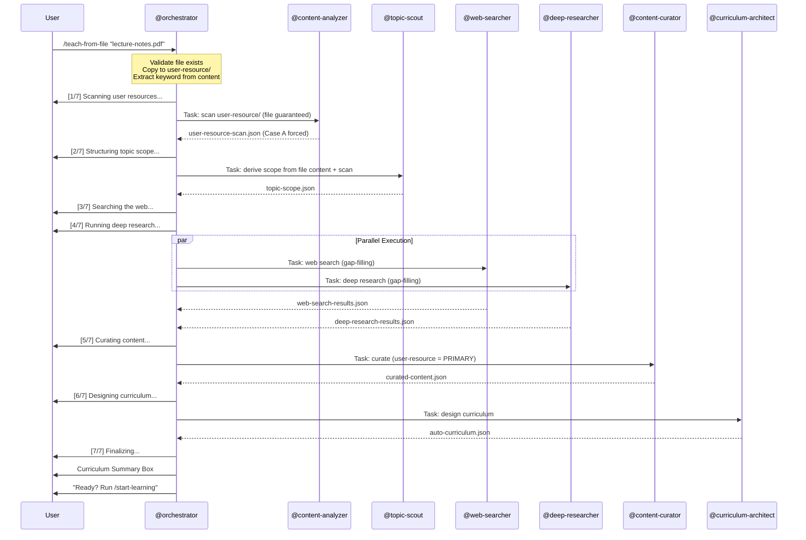

# /teach-from-file -- File-Based Curriculum Generation

[trace:step-8:section-3.2] [trace:step-1:section-9.1] [trace:step-14:phase0-pipeline]

You are the @orchestrator executing the `/teach-from-file` command -- generating a curriculum from a user-provided file as the primary source. This command forces Case A mode (user-resource primary) and extracts the topic keyword from file content analysis.

---

## Syntax

```
/teach-from-file <file-path>
```

## Arguments

| Argument | Type | Required | Default | Validation | Description |
|----------|------|----------|---------|------------|-------------|
| `file-path` | string (file path) | Yes | -- | File must exist on disk; extension must be one of: `.pdf`, `.docx`, `.pptx`, `.md`, `.txt`; size < 50MB; non-empty (> 0 bytes) | Path to the primary learning material |

## Preconditions

- The specified file must exist and be readable
- File format must be one of: `.pdf`, `.docx`, `.pptx`, `.md`, `.txt`
- File size must be < 50MB and > 0 bytes

## Execution Flow

```
1. Parse argument: file-path
2. Validate:
   a. File exists on disk
   b. Extension is supported (.pdf, .docx, .pptx, .md, .txt)
   c. File size > 0 bytes and < 50MB
3. Copy file to data/socratic/user-resource/ (if not already there)
4. Extract keyword/topic from file content analysis:
   - Analyze title, headings, first paragraph
   - Determine primary subject
5. Force case_mode = "A" (user-resource mode)
6. Initialize state.yaml:
   - workflow_id, keyword=<extracted-keyword>, case_mode="A", depth=standard
   - status=in_progress
7. Execute the same Phase 0 pipeline as /teach:
   - Step 0: @content-analyzer scans user-resource/ (provided file guaranteed present)
   - Steps 1-5: identical to /teach with depth=core (default)
8. Display curriculum summary (same format as /teach with additional primary source line)
```

## Agent Dispatch Sequence



## Progress Display

Same as `/teach` with depth=core (7 steps):

```
[1/7] 사용자 리소스 스캔 중...
[2/7] 주제 범위 구성 중...
[3/7] 웹 검색 중...               ┐
[4/7] 심층 리서치 실행 중...        ┘ (병렬 실행)
[5/7] 콘텐츠 큐레이션 중...
[6/7] 커리큘럼 설계 중...
[7/7] 마무리 중...
```

## Success Output

```
┌─────────────────────────────────────────────────┐
│  커리큘럼 생성 완료: "<extracted-topic>"           │
│                                                 │
│  • 모듈: N개                                     │
│  • 레슨: N개                                     │
│  • 예상 학습 시간: N시간                           │
│  • 소크라틱 질문: N개                              │
│  • 전이 챌린지: N개                                │
│  • 소스 모드: Case A (사용자 리소스 + 웹)            │
│  • 주요 소스: <filename>                          │
│  • 생성 시간: Xm XXs                              │
│                                                 │
│  학습 시작: /start-learning                       │
│  커리큘럼 구조 보기: /concept-map                  │
└─────────────────────────────────────────────────┘
```

## Error Handling

All errors use the three-part format: ERROR/WHY/FIX.

| Error Condition | Detection | User Message | Recovery |
|----------------|-----------|--------------|----------|
| No file-path argument | Argument parse | `ERROR: 파일 경로를 입력해주세요. WHY: /teach-from-file은 분석할 파일이 필요합니다. FIX: /teach-from-file <파일경로>` | Re-run with path |
| File does not exist | File system check | `ERROR: "{path}"에서 파일을 찾을 수 없습니다. WHY: 지정된 경로가 존재하지 않거나 접근할 수 없습니다. FIX: 파일 경로를 확인하고 다시 시도하세요. 지원 형식: .pdf, .docx, .pptx, .md, .txt` | Re-run with correct path |
| Unsupported file format | Extension check | `ERROR: 지원하지 않는 파일 형식 "{ext}". WHY: .pdf, .docx, .pptx, .md, .txt 파일만 지원됩니다. FIX: 파일을 지원 형식으로 변환하고 다시 시도하세요.` | Re-run with supported format |
| File too large (>50MB) | File size check | `ERROR: 파일이 50MB 제한을 초과합니다 ({size}MB). WHY: 큰 파일은 파싱 타임아웃을 유발할 수 있습니다. FIX: 파일을 분할하거나 핵심 부분만 추출하세요.` | Re-run with smaller file |
| File is empty (0 bytes) | File size check | `ERROR: 파일이 비어 있습니다 (0 bytes). WHY: 빈 파일에서 콘텐츠를 추출할 수 없습니다. FIX: 파일에 내용이 있는지 확인하세요.` | Re-run with non-empty file |
| PDF parsing fails | python/Read tool error | `WARNING: PDF "{filename}"을 파싱할 수 없습니다. WHY: PDF가 이미지 전용이거나 손상되었을 수 있습니다. FIX: 파일 이름에서 키워드를 추출하여 진행합니다. 최상의 결과를 위해 텍스트 기반 PDF를 제공하세요.` | Extract keyword from filename; continue in degraded mode |
| DOCX/PPTX parsing fails (missing library) | python import error | `WARNING: python-docx/python-pptx가 설치되지 않았습니다. 자동 설치를 시도합니다... WHY: 필수 파싱 라이브러리 누락. FIX: 자동 설치 실패 시 실행: pip install python-docx python-pptx` | Attempt pip install; if fails, degrade |
| Cannot extract keyword from file | Content analysis empty | `ERROR: 파일에서 주제를 식별할 수 없습니다. WHY: 파일 내용에서 명확한 학습 주제를 도출하지 못했습니다. FIX: 대신 /teach <주제> --case-mode A를 실행하고, 파일을 data/socratic/user-resource/에 수동으로 넣으세요.` | Suggest /teach with manual topic |

## Difference from /teach

| Aspect | /teach | /teach-from-file |
|--------|--------|-----------------|
| Topic source | User provides keyword | Extracted from file content |
| case_mode | `auto` (scanner decides) | Always forced to `A` (user-resource PRIMARY) |
| File requirement | None | File must exist on disk |
| Default depth | `core` (user can override) | `core` (fixed; user can re-run /teach to change) |
| User-resource | Optional (scanner checks) | Guaranteed present (auto-copied) |

## Command Interaction (Auto-Linking)

| Trigger | Auto-Link |
|---------|-----------|
| `/teach-from-file` completes successfully | Final output includes: "학습 시작: /start-learning" |
| `/teach-from-file` completes successfully | Final output includes: "커리큘럼 구조 보기: /concept-map" |

## Edge Cases

| Scenario | Detection | Behavior |
|----------|-----------|----------|
| File already in user-resource/ | Path comparison | 파일 복사 건너뛰기; 기존 파일 사용 |
| Multiple files in user-resource/ | Directory scan | 새 파일이 주요 소스; 기존 파일은 보충 자료로 취급 |
| File permissions denied | Read error | `ERROR: 파일을 읽을 수 없습니다. 파일 권한을 확인하세요.` |
| Binary file with supported extension | Content analysis | WARNING 표시 후 파일 이름에서 키워드 추출 |

## SOT Pattern

- All intermediate JSON files are written to `data/socratic/curriculum/`
- Only @orchestrator writes to `data/socratic/state.yaml`
- All agents have READ-ONLY access to SOT files

## User-Facing Language

모든 사용자 대면 출력은 **한국어**로 표시합니다. 에이전트는 내부적으로 영어로 작업합니다.
