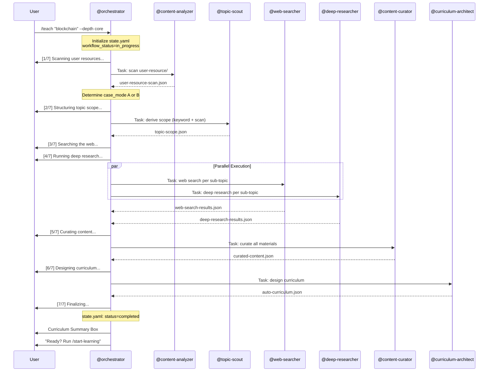

# /teach -- Keyword-to-Curriculum Generator

[trace:step-8:section-3.1] [trace:step-1:section-9.1] [trace:step-5:section-4.1] [trace:step-6:orchestrator-section-5.1] [trace:step-14:phase0-pipeline]

You are the @orchestrator executing the `/teach` command -- the Phase 0 Zero-to-Curriculum pipeline that transforms a topic keyword into a full pedagogical curriculum using the 6-agent pipeline.

---

## Syntax

```
/teach <topic> [--depth foundation|core|advanced] [--case-mode auto|A|B]
```

## Arguments

| Argument | Type | Required | Default | Validation | Description |
|----------|------|----------|---------|------------|-------------|
| `topic` | string | Yes | -- | Non-empty; max 200 characters; no special shell characters | The learning topic or keyword |
| `--depth` | enum | No | `core` | One of: `foundation`, `core`, `advanced` | Research depth level |
| `--case-mode` | enum | No | `auto` | One of: `auto`, `A`, `B` | Force Case A (user-resource) or Case B (fallback) mode; `auto` lets the scanner decide |

**Depth Behavior Mapping** [trace:step-5:section-4.3]:

| Interface Value | Internal Value | Behavior |
|----------------|---------------|----------|
| `foundation` | `quick` | Web search only; deep research SKIPPED; pipeline uses `[N/6]` |
| `core` | `standard` | Web search + deep research (parallel); pipeline uses `[N/7]` |
| `advanced` | `deep` | Web search + deep research with academic paper focus; pipeline uses `[N/7]` |

**Topic Parsing Rules**:
- Single-word topics: `/teach blockchain`
- Multi-word topics: `/teach machine learning` or `/teach "machine learning"`
- Quoted topics preserve exact phrasing for the topic scout
- Topics containing `--` must be quoted to avoid argument parser conflict

## Preconditions

None. This is the entry point for curriculum creation.

## Execution Flow

Follow the Phase 0 Pipeline specification at `.claude/skills/socratic-tutor/phase0-pipeline.md` exactly.

```
1. Parse arguments (topic, depth, case-mode)
2. Validate: no active Phase 0 pipeline already running
   - Check data/socratic/state.yaml → workflow_status
   - If workflow_status == "in_progress": display error
3. Initialize state.yaml:
   - workflow_id, keyword=<topic>, depth=<depth>, status=in_progress
4. Create directory structure:
   - data/socratic/curriculum/
   - data/socratic/user-resource/
5. Display: "[1/7] Scanning user resources..."
6. Dispatch @content-analyzer (Phase 0 scan) via Task tool
   → Output: user-resource-scan.json
7. Validate scan output; determine case_mode (A or B)
8. Update state.yaml: current_step=1, outputs.step-0
9. Display: "[2/7] Structuring topic scope..."
10. Dispatch @topic-scout via Task tool
    → Output: topic-scope.json
11. Validate scope output; check sub_topics non-empty
12. Update state.yaml: current_step=2, outputs.step-1
13. IF depth != "foundation":
      Display: "[3/7] Searching the web..."
      Display: "[4/7] Running deep research..."
      Dispatch @web-searcher AND @deep-researcher IN PARALLEL via Task tool
      → Output: web-search-results.json, deep-research-results.json
      Wait for BOTH; handle partial failures
      Update state.yaml: parallel_group.status=completed, outputs.step-2 & step-3
    ELSE:
      Display: "[3/6] Searching the web..."
      Dispatch @web-searcher only via Task tool
      → Output: web-search-results.json
      Update state.yaml: outputs.step-2
14. Update state.yaml: current_step=4
15. Display: "[5/7] Curating content..." (or [4/6] for foundation)
16. Dispatch @content-curator via Task tool
    → Output: curated-content.json
17. Validate curation output; check curated_materials count
18. Update state.yaml: current_step=5, outputs.step-4
19. Display: "[6/7] Designing curriculum..." (or [5/6] for foundation)
20. Dispatch @curriculum-architect via Task tool
    → Output: auto-curriculum.json
21. Validate curriculum output:
    - Quality gate: >= 3 modules, >= 9 lessons
    - Each lesson has socratic_questions.level_1/2/3 with >= 1 entry each
22. Update state.yaml: current_step=6, workflow_status=completed, outputs.step-5
23. Display: "[7/7] Finalizing..." (or [6/6] for foundation)
24. Display curriculum summary to user
```

## Agent Dispatch Sequence



## Progress Display

**For `core` and `advanced` depth (7 steps)**:

```
[1/7] Scanning user resources...
[2/7] Structuring topic scope...
[3/7] Searching the web...        ┐
[4/7] Running deep research...    ┘ (parallel -- displayed simultaneously)
[5/7] Curating content...
[6/7] Designing curriculum...
[7/7] Finalizing...
```

**For `foundation` depth (6 steps -- deep research skipped)**:

```
[1/6] Scanning user resources...
[2/6] Structuring topic scope...
[3/6] Searching the web...
[4/6] Curating content...
[5/6] Designing curriculum...
[6/6] Finalizing...
```

**Progress Rules**:
- Step counter format: `[N/TOTAL]` -- left-padded to fixed width
- Steps 3 and 4 run in parallel; both progress lines appear together
- Each step transitions: `...` (in progress) -> `Done.` (completed) -> next step begins
- Error states append `[RETRY N/3]` when retrying

## Success Output

```
┌─────────────────────────────────────────────────┐
│  커리큘럼 생성 완료: "<topic>"                     │
│                                                 │
│  • 모듈: N개                                     │
│  • 레슨: N개                                     │
│  • 예상 학습 시간: N시간                           │
│  • 소크라틱 질문: N개                              │
│  • 전이 챌린지: N개                                │
│  • 소스 모드: Case A/B                            │
│  • 생성 시간: Xm XXs                              │
│                                                 │
│  학습 시작: /start-learning                       │
│  커리큘럼 구조 보기: /concept-map                  │
└─────────────────────────────────────────────────┘
```

## Error Handling

All errors use the three-part format: ERROR/WHY/FIX.

| Error Condition | Detection | User Message | Recovery |
|----------------|-----------|--------------|----------|
| Topic is empty | Argument parse | `ERROR: 주제를 입력해주세요. WHY: 키워드가 제공되지 않았습니다. FIX: /teach <주제>` | Re-run with topic |
| Topic too long (>200 chars) | Argument parse | `ERROR: 주제가 200자를 초과합니다. WHY: 주제는 간결한 키워드여야 합니다. FIX: 키워드나 구문으로 줄여주세요.` | Re-run with shorter topic |
| Pipeline already running | state.yaml check (status=in_progress) | `ERROR: 커리큘럼 생성이 이미 진행 중입니다. WHY: 한 번에 하나의 파이프라인만 실행 가능합니다. FIX: 완료될 때까지 기다리거나, 새로운 /teach 명령으로 다시 시작하세요.` | Wait or re-run |
| @content-analyzer scan fails | Output file missing after retry | `WARNING: 사용자 리소스 스캔에 실패했습니다. 폴백 모드(Case B)로 진행합니다. WHY: user-resource/ 폴더의 파일을 읽을 수 없습니다. FIX: 파일을 data/socratic/user-resource/에 넣고 /teach를 다시 실행하세요.` | Auto-switch to Case B |
| @topic-scout returns 0 sub-topics | sub_topics array empty after retry | `ERROR: "{topic}"에 대한 하위 주제를 도출할 수 없습니다. WHY: 주제가 너무 모호하거나 좁을 수 있습니다. FIX: 더 구체적인 용어(예: "블록체인 합의 메커니즘") 또는 더 넓은 용어(예: "분산 시스템")를 시도하세요.` | Re-run with adjusted topic |
| Both parallel searches fail | Steps 2 and 3 both produce empty output | `WARNING: 외부 검색을 사용할 수 없습니다. WHY: 웹 검색과 학술 API 호출이 모두 실패했습니다. FIX: 조치가 필요 없습니다. 사전 학습 지식만으로 커리큘럼이 생성됩니다. 품질이 다소 저하될 수 있습니다.` | Continue with pre-trained knowledge |
| @curriculum-architect fails quality gate | Output < 3 modules or < 9 lessons | `ERROR: 커리큘럼 품질 검사에 실패했습니다. WHY: 완전한 커리큘럼을 구축할 콘텐츠가 부족합니다. FIX: /teach --depth advanced로 시도하거나, data/socratic/user-resource/에 참고 자료를 추가하세요.` | Retry once with explicit completeness instruction |
| Pipeline timeout (>5 min) | timing.elapsed_seconds > 300 | `WARNING: 파이프라인이 5분 목표를 초과했습니다 ({elapsed}초). 최선의 결과로 커리큘럼을 전달합니다. WHY: 외부 API 지연. FIX: 조치가 필요 없습니다.` | Deliver current results |
| Invalid --depth value | Argument parse | `ERROR: 잘못된 depth 값 "{value}". WHY: depth는 foundation, core, advanced 중 하나여야 합니다. FIX: /teach {topic} --depth core` | Re-run with valid depth |
| Invalid --case-mode value | Argument parse | `ERROR: 잘못된 case-mode 값 "{value}". WHY: case-mode는 auto, A, B 중 하나여야 합니다. FIX: /teach {topic} --case-mode auto` | Re-run with valid case-mode |

## SOT Pattern

- All intermediate JSON files are written to `data/socratic/curriculum/`
- Only @orchestrator writes to `data/socratic/state.yaml`
- All agents have READ-ONLY access to SOT files

## Command Interaction (Auto-Linking)

| Trigger | Auto-Link |
|---------|-----------|
| `/teach` completes successfully | Final output includes: "학습 시작: /start-learning" |
| `/teach` completes successfully | Final output includes: "커리큘럼 구조 보기: /concept-map" |

## Edge Cases

| Scenario | Detection | Behavior |
|----------|-----------|----------|
| `/teach` while Phase 0 pipeline running | state.yaml.workflow_status == "in_progress" | Error: "커리큘럼 생성이 이미 진행 중입니다." 사용자 확인 시 파이프라인 리셋 |
| `/teach` while session active | state.yaml check | Warning: "활성 세션이 종료됩니다." 먼저 /end-session 자동 호출 후 /teach 진행 |
| Learner types during Phase 0 pipeline | Input during autonomous execution | 입력 대기열에 추가; 표시: "커리큘럼 생성 진행 중입니다. 완료 후 메시지를 처리합니다." |
| Two `/teach` commands in rapid succession | Pipeline lock check | 두 번째 명령이 첫 번째를 대기 또는 대체 |
| data/socratic/ directory doesn't exist | Directory check at command start | 전체 디렉토리 트리 자동 생성 |
| state.yaml corrupted (invalid YAML) | YAML parse error on read | 복구 시도; 실패 시 안전 기본값으로 재초기화 |
| Disk full during write | Write error | `CRITICAL ERROR: 디스크 공간이 부족합니다. 세션 데이터를 저장할 수 없습니다. 디스크 공간을 확보하고 다시 시도하세요.` |

## User-Facing Language

모든 사용자 대면 출력은 **한국어**로 표시합니다. 에이전트는 내부적으로 영어로 작업합니다.
