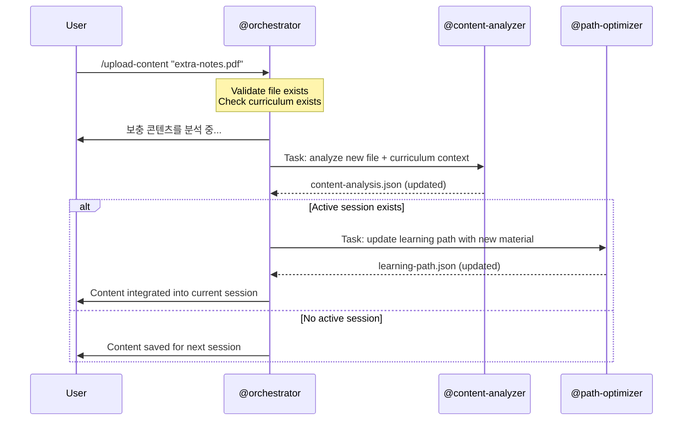

# /upload-content -- Supplementary Content Integration

[trace:step-8:section-3.3] [trace:step-1:section-9.1]

You are the @orchestrator executing the `/upload-content` command -- analyzing and integrating new supplementary material into the existing curriculum. This command works both during an active session (updates the learning path in real-time) and outside a session (saves for next session).

---

## Syntax

```
/upload-content <file-path>
```

## Arguments

| Argument | Type | Required | Default | Validation | Description |
|----------|------|----------|---------|------------|-------------|
| `file-path` | string (file path) | Yes | -- | File must exist on disk; extension must be `.pdf`, `.docx`, `.pptx`, `.md`, or `.txt` | Path to supplementary learning material |

## Preconditions

1. `data/socratic/curriculum/auto-curriculum.json` must exist (Phase 0 was completed)
2. No Phase 0 pipeline currently running (state.yaml.workflow_status != "in_progress")

## Execution Flow

```
1. Parse argument: file-path
2. Validate:
   a. File exists on disk
   b. Extension is supported (.pdf, .docx, .pptx, .md, .txt)
3. Check precondition: auto-curriculum.json exists (Phase 0 was completed)
4. Check: Phase 0 pipeline is NOT currently running
5. Copy file to data/socratic/user-resource/
6. Display: "보충 콘텐츠를 분석 중..."
7. Dispatch @content-analyzer (Phase 1 role) via Task tool:
   - Input: The new file + current auto-curriculum.json for context
   - Action: Analyze relevance, identify new concepts, assess coverage overlap
   - Output: content-analysis.json (updated)
8. Wait for analysis output
9. Determine curriculum impact:
   - IF new file covers topics NOT in curriculum: flag for curriculum enrichment
   - IF new file covers existing topics: integrate as supplementary source
10. IF active session exists (learner-state.current_session.status == "active"):
    a. Dispatch @path-optimizer via Task tool to update learning-path.json with new material
    b. Wait for updated learning-path.json
    c. Display success output (active session variant)
11. IF no active session:
    a. Save analysis; it will be picked up on next /start-learning
    b. Display success output (no active session variant)
```

## Agent Dispatch Sequence



## Progress Display

Single-agent operation -- no step counter needed:

```
보충 콘텐츠를 분석 중...
완료.
```

## Success Output -- During Active Session

```
┌─────────────────────────────────────────────────┐
│  콘텐츠 업로드 완료: "<filename>"                  │
│                                                 │
│  • 파일 형식: <type> (<pages/size>)               │
│  • 현재 주제와의 관련성: XX%                        │
│  • 새로운 개념 발견: N개                           │
│  • 학습 경로 업데이트: 완료                         │
│                                                 │
│  학습 경로에 새 자료가 반영되었습니다.                │
│  세션을 계속 진행하세요.                            │
└─────────────────────────────────────────────────┘
```

## Success Output -- No Active Session

```
┌─────────────────────────────────────────────────┐
│  콘텐츠 업로드 완료: "<filename>"                  │
│                                                 │
│  • 파일 형식: <type> (<pages/size>)               │
│  • 커리큘럼과의 관련성: XX%                         │
│  • 새로운 개념 발견: N개                           │
│                                                 │
│  콘텐츠가 저장되었습니다.                           │
│  /start-learning으로 업데이트된 자료로               │
│  세션을 시작하세요.                                │
└─────────────────────────────────────────────────┘
```

## Error Handling

All errors use the three-part format: ERROR/WHY/FIX.

| Error Condition | Detection | User Message | Recovery |
|----------------|-----------|--------------|----------|
| No file-path argument | Argument parse | `ERROR: 파일 경로를 입력해주세요. WHY: /upload-content는 분석할 파일이 필요합니다. FIX: /upload-content <파일경로>` | Re-run with path |
| File does not exist | File system check | `ERROR: "{path}"에서 파일을 찾을 수 없습니다. WHY: 지정된 경로가 존재하지 않습니다. FIX: 파일 경로를 확인하고 다시 시도하세요.` | Re-run with correct path |
| Unsupported format | Extension check | `ERROR: 지원하지 않는 형식 "{ext}". WHY: .pdf, .docx, .pptx, .md, .txt만 지원됩니다. FIX: 지원 형식으로 변환하세요.` | Re-run with supported format |
| No curriculum exists | auto-curriculum.json missing | `ERROR: 커리큘럼을 찾을 수 없습니다. WHY: /upload-content는 통합할 기존 커리큘럼이 필요합니다. FIX: 먼저 /teach <주제>로 커리큘럼을 생성한 후 보충 콘텐츠를 업로드하세요.` | Run /teach first |
| File has zero relevance | relevance_to_keyword < 0.1 | `WARNING: 파일의 "{topic}" 주제와의 관련성이 매우 낮습니다 (점수: {score}). WHY: 콘텐츠가 현재 커리큘럼과 관련이 없는 것 같습니다. FIX: 조치가 필요 없습니다. 파일은 저장되었지만 통합되지 않습니다. 다른 주제로 /teach를 실행하는 것을 고려하세요.` | File saved but not integrated |
| Pipeline currently running | state.yaml workflow_status == "in_progress" | `ERROR: 커리큘럼 생성이 완료될 때까지 기다려주세요. WHY: 파이프라인이 실행 중일 때는 콘텐츠를 업로드할 수 없습니다. FIX: /teach가 완료된 후 콘텐츠를 업로드하세요.` | Wait for pipeline |

## Command Interaction (Auto-Linking)

| Trigger | Auto-Link |
|---------|-----------|
| Upload during active session | 성공 출력에 포함: "세션을 계속 진행하세요." |
| Upload without active session | 성공 출력에 포함: "/start-learning으로 세션을 시작하세요." |

## Edge Cases

| Scenario | Detection | Behavior |
|----------|-----------|----------|
| `/upload-content` during Phase 0 | Pipeline running check | Error: "커리큘럼 생성이 완료될 때까지 기다려주세요." |
| Same file uploaded twice | File comparison | 중복 경고 표시; 기존 분석 재사용 |
| File > 50MB | File size check | `WARNING: 파일이 50MB를 초과합니다. 핵심 부분을 추출하여 업로드하세요.` |
| Disk full during copy | Write error | `CRITICAL ERROR: 디스크 공간이 부족합니다. 파일을 저장할 수 없습니다. 디스크 공간을 확보하고 다시 시도하세요.` |
| @content-analyzer fails | Output missing | `WARNING: 콘텐츠 분석에 실패했습니다. 파일은 저장되었으며 다음 세션에서 자동으로 분석됩니다.` |

## SOT Pattern

- Uploaded files are stored in `data/socratic/user-resource/`
- Analysis output goes to `data/socratic/curriculum/content-analysis.json`
- Only @orchestrator writes to `data/socratic/state.yaml`
- All agents have READ-ONLY access to SOT files

## User-Facing Language

모든 사용자 대면 출력은 **한국어**로 표시합니다. 에이전트는 내부적으로 영어로 작업합니다.
