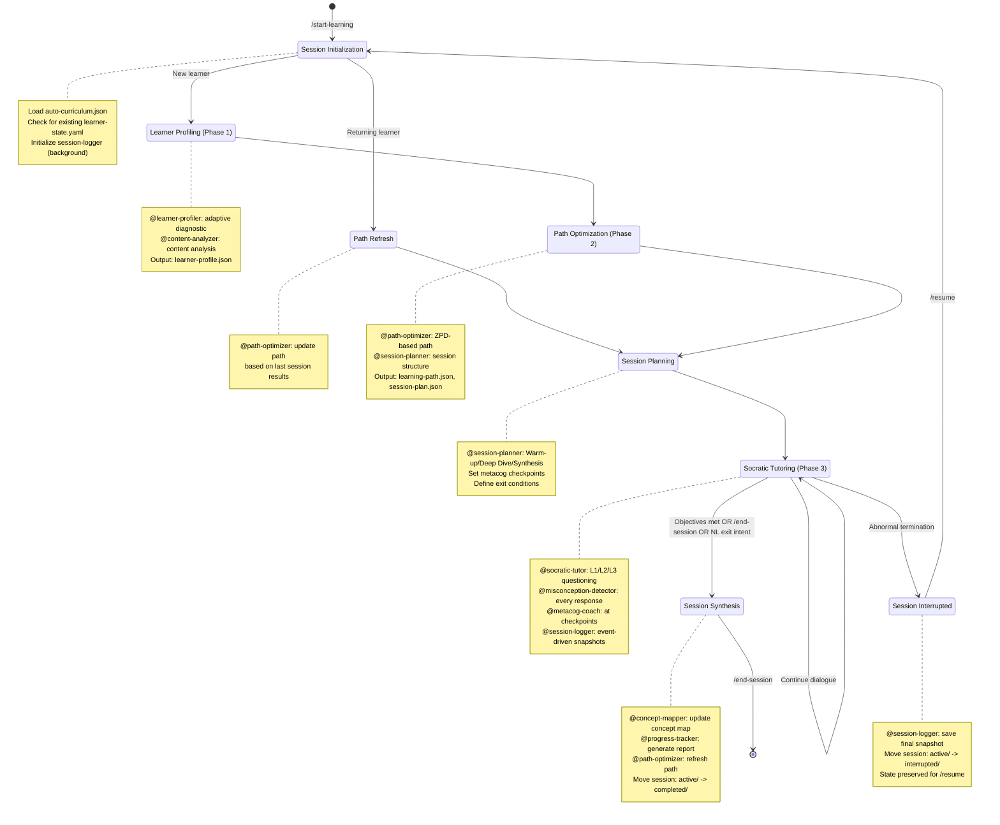

# Socratic Tutoring Engine — Phase 1-3 Skill Definition

[trace:step-5:phase13-flow] [trace:step-6:tutor-persona] [trace:step-8:start-learning-command] [trace:step-7:schemas]

## Overview

This Skill implements the complete Phase 1-3 Socratic Tutoring Engine — the interactive system that conducts real-time Socratic dialogue with learners. It manages the full session lifecycle: learner profiling, adaptive path optimization, session planning, Socratic tutoring with misconception detection and metacognitive coaching, session logging with recovery, and progress tracking.

**Entry Point**: `/start-learning [topic]` command
**End Point**: `/end-session` command, natural language exit intent (e.g., "그만", "끝내자"), session success (all objectives met), or timeout (45 min)
**Recovery**: `/resume` command for interrupted sessions
**Orchestrator**: `@orchestrator` manages all dispatch, state tracking, and session lifecycle

---

## 1. Session Lifecycle State Machine

The Skill manages an 8-state session lifecycle:



### State Descriptions

| State | Phase | Agent(s) | Duration | Output |
|-------|-------|----------|----------|--------|
| INIT | -- | @orchestrator | ~5s | Session ID, directories |
| PROFILING | 1 | @content-analyzer, @learner-profiler | ~5 min | content-analysis.json (S9), learner-profile.json (S10) |
| PATH_REFRESH | 2 | @path-optimizer | ~30s | learning-path.json (S11, updated) |
| PATH_OPTIMIZATION | 2 | @path-optimizer | ~30s | learning-path.json (S11) |
| SESSION_PLANNING | 2 | @session-planner | ~15s | session-plan.json (S12) |
| TUTORING | 3 | @socratic-tutor (inline), @session-logger (background) | 25-45 min | Session dialogue, mastery updates, session-log.json (S13) |
| SYNTHESIS | 3 | @concept-mapper, @progress-tracker, @path-optimizer | ~60s | concept-map.json (S16), progress-report.json (S17), learning-path.json (S11) |
| INTERRUPTED | -- | @session-logger | ~5s | Final snapshot saved |

---

## 2. Initialization (INIT State)

When `@orchestrator` receives `/start-learning`, execute:

### 2.1 Precondition Validation

1. **Curriculum exists**: Verify `data/socratic/curriculum/auto-curriculum.json` exists. If not:
   ```
   ERROR: No curriculum found.
   WHY: The /teach command must be run before /start-learning to generate a curriculum.
   FIX: Run `/teach <topic>` first, then `/start-learning`.
   ```

2. **No active session**: Check `data/socratic/sessions/active/` for existing sessions. If found:
   ```
   ERROR: An active session already exists (SES_XXXXXXXX).
   FIX: Run `/end-session` to close it, or `/resume` to continue.
   ```

### 2.2 Session ID Generation

```
Format: SES_{YYYYMMDD}_{random6}
Example: SES_20260227_a3f7b2
```

### 2.3 Deferred Research Resolution

Before learner detection, scan `learner-state.yaml.knowledge_state` for any concepts with `needs_external_research: true` (set by the §5.5 Timeout & Fallback Protocol in a previous session):

1. For each concept with `needs_external_research: true`:
   - Dispatch @knowledge-researcher via Task tool with the `pending_misconception_type` context
   - This runs **non-blocking** — the session proceeds regardless of research outcome
   - On success: inject supplementary knowledge into session context, clear the flag
   - On failure: leave flag; will retry in next session
2. If no pending research: skip this step (most sessions)

### 2.4 Learner Detection

Read `data/socratic/learner-state.yaml`:
- If file does not exist OR `total_sessions == 0` --> **NEW LEARNER** --> go to PROFILING
- If file exists AND `total_sessions > 0` --> **RETURNING LEARNER** --> go to PATH_REFRESH

### 2.5 SOT Initialization

Update `data/socratic/learner-state.yaml` (via @orchestrator):
```yaml
current_session:
  session_id: "SES_XXXXXXXX"
  status: "INIT"                # Canonical field name per learner-state.yaml spec
  started_at: "<ISO-8601>"
  current_module: null           # Set during planning
  current_lesson: null           # Set during planning
  current_phase: null            # Set during planning (warm_up|deep_dive|synthesis)
  question_level: 1              # 1-3
  lesson_progress_pct: 0         # 0-100
  pending_question: null
  metacog_checkpoints_hit: []
  misconceptions_this_session: 0
  socratic_depth_reached: 1
```

---

## 3. Phase 1: Learner Profiling (PROFILING State)

**Triggered for**: New learners only (first session, no existing profile)

### 3.1 Content Analysis

**Dispatch @content-analyzer (Phase 1 role) via Task tool**:
```
Task prompt to @content-analyzer:

You are operating in Phase 1 (Learner Research) content analysis mode.

INPUT:
- Read data/socratic/curriculum/auto-curriculum.json

ACTION:
1. Analyze the curriculum structure: modules, lessons, concepts
2. Identify prerequisite chains and concept difficulty progression
3. Create a content analysis that informs learner profiling:
   - Key concept clusters
   - Difficulty distribution across the curriculum
   - Recommended diagnostic question areas (one per concept cluster)
   - Estimated total learning hours

OUTPUT:
Write data/socratic/analysis/content-analysis.json with S9 schema:
{
  "analysis_timestamp": "<ISO-8601>",
  "curriculum_version": "<auto-curriculum.curriculum_id>",
  "structural_analysis": {
    "total_concepts": <integer>,
    "concept_depth_distribution": {"foundation": N, "core": N, "application": N, "advanced": N},
    "prerequisite_chain_length": <integer>,
    "orphan_concepts": ["concept_id"]
  },
  "pedagogical_assessment": {
    "socratic_question_coverage": <0.0-1.0>,
    "transfer_challenge_coverage": <0.0-1.0>,
    "bloom_taxonomy_alignment": {"remember": N, "understand": N, "apply": N, "analyze": N, "evaluate": N, "create": N},
    "difficulty_progression_valid": <boolean>
  },
  "gap_analysis": {
    "missing_prerequisites": [],
    "content_coverage_gaps": [],
    "recommended_additions": [{"concept": "string", "reason": "string", "priority": "high|medium|low"}]
  },
  "learner_alignment": {
    "estimated_difficulty_curve": "gentle|moderate|steep",
    "prerequisite_risk_concepts": [],
    "recommended_entry_point": "<module_id>"
  }
}

CONSTRAINTS:
- You have READ-ONLY access to SOT files. Do NOT write to state.yaml or learner-state.yaml.
- Output validates against data/socratic/schemas/content-analysis.json [trace:step-7:S9]
```

### 3.2 Learner Profiling (Interactive)

**Dispatch @learner-profiler via Task tool**:
```
Task prompt to @learner-profiler:

You are the learner profiling agent for the Socratic AI Tutor.

INPUT:
- Read data/socratic/curriculum/auto-curriculum.json
- Read data/socratic/analysis/content-analysis.json

ACTION:
1. Generate 5-7 adaptive diagnostic questions per concept area identified in content-analysis.json
2. Start at difficulty 3/5 for each concept area
3. For each learner response:
   - Score the response (0.0-1.0 mastery estimate)
   - Adjust next question difficulty: correct -> increase, incorrect -> decrease
   - Track confidence signals (hedging language, certainty markers)
4. After all questions: compute initial mastery estimates per concept
5. Detect preferred learning style signals from response patterns
6. Identify danger zones (high confidence + low mastery)

OUTPUT:
Write data/socratic/analysis/learner-profile.json with S10 schema:
{
  "learner_id": "LRN_{YYYYMMDD}_{id}",
  "assessment_timestamp": "<ISO-8601>",
  "assessment_method": "adaptive_diagnostic",
  "questions_asked": <integer>,
  "convergence_achieved": <boolean>,
  "knowledge_state": {
    "<concept_id>": {
      "mastery": <0.0-1.0>,
      "confidence": <0.0-1.0>
    }
  },
  "learning_style": "visual|auditory|reading|kinesthetic",
  "response_pattern": {
    "avg_response_time_seconds": <float>,
    "confidence_accuracy_gap": <0.0-1.0>,
    "common_error_types": ["overgeneralization", ...]
  },
  "motivation_level": "high|medium|low",
  "danger_zones": [
    {
      "concept_id": "<concept_id>",
      "risk": "High confidence (0.9) with low mastery (0.3)",
      "recommended_action": "Prioritize L3 challenges early"
    }
  ],
  "diagnostic_notes": "Free-text diagnostic summary"
}

CONSTRAINTS:
- You have READ-ONLY access to SOT files. Do NOT write to state.yaml or learner-state.yaml.
- Return diagnostic questions as structured output for @orchestrator to relay to the user.
- Minimum 5 questions, maximum 7 per concept area (AR-3 convergence).
- Adapt difficulty within the same concept area -- do not skip to another area mid-sequence.
- knowledge_state keys MUST be valid concept IDs from auto-curriculum.json.
- Output validates against data/socratic/schemas/learner-profile.json [trace:step-7:S10]
```

**Interactive relay pattern**: @orchestrator relays diagnostic questions from @learner-profiler to the user, and user responses back to @learner-profiler.

### 3.3 Post-Profiling SOT Update

After `learner-profile.json` is created, @orchestrator updates `learner-state.yaml`:
```yaml
learner_id: "LRN_{YYYYMMDD}_{id}"
knowledge_state:
  concept_001:
    mastery: 0.3
    confidence: 0.5
    last_assessed: "<ISO-8601>"
    assessment_count: 1
    misconceptions_history: []
  concept_002:
    mastery: 0.6
    confidence: 0.7
    last_assessed: "<ISO-8601>"
    assessment_count: 1
    misconceptions_history: []
learning_style: "visual"
motivation_level: "high"
response_pattern:
  avg_response_time_seconds: 15
  confidence_accuracy_gap: 0.20
  common_error_types:
    - "overgeneralization"
current_session:
  status: "PATH_OPTIMIZATION"
```

**Progress display**: `[1/4] Loading curriculum...` --> `[2/4] Profiling learner...`

---

## 4. Phase 2: Path Optimization & Session Planning

### 4.1 Path Optimization

**Dispatch @path-optimizer via Task tool**:
```
Task prompt to @path-optimizer:

You are the learning path optimization agent.

INPUT:
- Read data/socratic/curriculum/auto-curriculum.json
- Read data/socratic/analysis/learner-profile.json (if new learner)
  OR data/socratic/reports/progress-report.json (if returning learner)
- Read data/socratic/analysis/content-analysis.json (if available)
- Read data/socratic/learner-state.yaml (READ-ONLY) — for returning learner mastery state

ACTION:
1. Classify all concepts by learner state:
   - MASTERED (mastery > 0.7): schedule transfer challenge; then spaced review only
   - ZPD_TARGET (mastery 0.3-0.7): primary learning target
   - FOUNDATION_GAP (mastery < 0.3): prerequisite reinforcement needed
   - NOT_ASSESSED (null): schedule for initial assessment
   - TRANSFER_READY (mastery > 0.8, transfer not yet attempted): schedule transfer challenge
2. Build dependency-aware sequence via topological sort
3. Apply ZPD (Zone of Proximal Development) targeting:
   - High priority: concepts with mastery 0.3-0.7 (ZPD sweet spot)
   - Within each tier: prioritize danger_zone flags, then detected misconceptions
4. Estimate time per concept based on learner state
5. Schedule spaced repetition reviews (mastery >= 0.5)
6. Place transfer challenges (mastery >= 0.8, same-field before far transfer)
7. Handle danger zones (high confidence + low mastery): schedule early, recommend L3 depth

OUTPUT:
Write data/socratic/planning/learning-path.json with S11 schema:
{
  "path_id": "PATH_{learner_id}_{timestamp}",
  "generated_at": "<ISO-8601>",
  "path_type": "initial|refresh|intervention",
  "learner_id": "LRN_{id}",
  "curriculum_ref": "data/socratic/curriculum/auto-curriculum.json",
  "learner_profile_ref": "data/socratic/analysis/learner-profile.json",
  "summary": {
    "total_concepts": <integer>,
    "estimated_sessions": <integer>,
    "estimated_total_hours": <float>,
    "skipped_concepts": ["concept_id"]
  },
  "concept_sequence": [
    {
      "concept_id": "string",
      "concept_name": "string",
      "module_id": "M1",
      "lesson_id": "L1.1",
      "target_mastery": 0.80,
      "current_mastery": 0.0,
      "estimated_time": "18 minutes",
      "difficulty": <1-5>,
      "prerequisites_met": <boolean>,
      "zpd_zone": "below|within|above"
    }
  ],
  "transfer_challenges": [
    {
      "after_concept": "concept_id",
      "type": "same_field|far_transfer",
      "prompt": "string",
      "target_domain": "string"
    }
  ],
  "review_schedule": [
    {
      "concept_id": "concept_id",
      "review_at": "<ISO-8601>",
      "interval_days": <1|3|7|14|21>,
      "review_number": <1-5>
    }
  ],
  "session_recommendations": [
    {
      "session_number": <integer>,
      "concepts": ["concept_id"],
      "warm_up_reviews": ["concept_id"],
      "estimated_duration": "30min"
    }
  ],
  "path_metadata": {
    "zpd_calibration": "Targeting mastery 0.3-0.7 as primary ZPD range",
    "difficulty_curve": "gentle|moderate|steep",
    "adaptive_triggers": ["mastery_plateau", "confidence_gap_widening", "session_timeout_frequent"]
  }
}

CONSTRAINTS:
- You have READ-ONLY access to SOT files. Do NOT write to state.yaml or learner-state.yaml.
- Dependency ordering is inviolable (AR-2): never schedule a concept before its prerequisites.
- No path cycles (AR-4): verify DAG property before output.
- Every concept with mastery >= 0.5 MUST have at least one review entry (AR-6).
- Mastery cap: effective_mastery capped at 0.7 until transfer validated (AR-5).
- Output validates against data/socratic/schemas/learning-path.json [trace:step-7:S11]
```

### 4.2 Session Planning

**Dispatch @session-planner via Task tool**:
```
Task prompt to @session-planner:

You are the session planning agent.

INPUT:
- Read data/socratic/planning/learning-path.json
- Read data/socratic/analysis/learner-profile.json
- Read data/socratic/curriculum/auto-curriculum.json

ACTION:
1. Identify session scope from learning-path.json next session recommendation
2. Design the three-phase session structure:
   - Warm-up (3-5 minutes): L1 confirmation review of previously learned material
   - Deep Dive (15-25 minutes): Core Socratic learning with L1-L2-L3 progression
   - Synthesis (5-7 minutes): Concept connection and transfer preview
3. Place metacognitive checkpoints (at least 1; 2+ if session > 20 min)
4. Define exit conditions (success, user_exit, timeout)
5. Set question difficulty progression per concept
6. Assign learner adaptations based on profile

OUTPUT:
Write data/socratic/planning/session-plan.json with S12 schema:
{
  "plan_id": "PLAN_{session_id}",
  "session_id": "SES_{date}_{id}",
  "generated_at": "<ISO-8601>",
  "learner_id": "LRN_{id}",
  "learning_path_ref": "data/socratic/planning/learning-path.json",
  "session_overview": {
    "session_number": <integer>,
    "target_concepts": ["concept_NNN"],
    "estimated_duration": "30 minutes",
    "difficulty_range": {"min": 1, "max": 3}
  },
  "phases": {
    "warm_up": {
      "duration": "3 minutes",
      "activity": "L1 confirmation review of previously learned material",
      "question_level": 1,
      "review_concepts": ["concept_NNN"]
    },
    "deep_dive": {
      "duration": "22 minutes",
      "activity": "Core Socratic learning with L1-L2-L3 progression",
      "question_levels": [1, 2, 3],
      "target_concepts": ["concept_NNN"],
      "socratic_questions_bank": [
        {"level": 1, "question": "string", "concept_id": "concept_NNN"},
        {"level": 2, "question": "string", "concept_id": "concept_NNN"},
        {"level": 3, "question": "string", "concept_id": "concept_NNN"}
      ]
    },
    "synthesis": {
      "duration": "5 minutes",
      "activity": "Concept connection and transfer preview",
      "transfer_preview": null
    }
  },
  "metacog_checkpoints": [5, 15],
  "exit_conditions": {
    "success": "All per-concept progress targets met",
    "user_exit": "Learner issues /end-session -> skip to synthesis",
    "timeout": "45 minutes soft limit, 60 minutes absolute max"
  },
  "learner_adaptations": {
    "initial_question_level": 1,
    "misconception_watch": ["overgeneralization"],
    "confidence_calibration_needed": false,
    "preferred_style": "visual|auditory|reading|kinesthetic"
  }
}

CONSTRAINTS:
- You have READ-ONLY access to SOT files. Do NOT write to state.yaml or learner-state.yaml.
- Three-phase structure mandatory (AR-2): warm_up >= 2 min, deep_dive >= 10 min, synthesis >= 3 min.
- At least 1 metacognition checkpoint required (AR-3).
- Exit conditions must include success, user_exit, timeout (AR-4).
- Questions bank: at least 3 entries with level (int), question (string), concept_id (string).
- Phase duration total <= 45 minutes.
- Output validates against data/socratic/schemas/session-plan.json [trace:step-7:S12]
```

**Progress display**: `[3/4] Optimizing learning path...` --> `[4/4] Planning session...`

---

## 5. Phase 3: Socratic Tutoring (TUTORING State)

### 5.1 Session Activation

After session planning completes:

1. **Initialize @session-logger** via Task tool:

   ```
   Task prompt to @session-logger:

   ACTION: Initialize session logging.

   {
     "action": "initialize",
     "session_id": "SES_{date}_{id}",
     "learner_id": "LRN_{id}",
     "session_plan_ref": "data/socratic/planning/session-plan.json",
     "learning_path_ref": "data/socratic/planning/learning-path.json",
     "start_timestamp": "<ISO-8601>",
     "initial_state": {
       "module_id": "M1",
       "lesson_id": "L1.1",
       "current_phase": "warm_up",
       "current_question_level": 1,
       "lesson_progress_pct": 0
     }
   }

   Create session log at data/socratic/sessions/active/{session_id}.log.json
   with S13 schema including:
   - current_state (all 11 fields: module_id, lesson_id, lesson_title, current_phase,
     current_question_level, lesson_progress_pct, awaiting_response, pending_question,
     last_ai_message, last_user_response, dialogue_history_summary)
   - recovery_checkpoint (checkpoint_id, recoverable, resume_instruction)
   - events array (append-only)
   - stats object (total_questions_asked, questions_by_level {L1,L2,L3},
     misconceptions_detected, misconceptions_corrected,
     metacog_checkpoints_completed, mastery_updates, total_duration_seconds)

   CONSTRAINTS:
   - Write ONLY to data/socratic/sessions/ directory tree.
   - Atomic writes: tmp file then rename.
   - Output validates against data/socratic/schemas/session-log.json [trace:step-7:S13]
   ```

2. **Activate @socratic-tutor behavior in main context**:
   - Load `session-plan.json` into orchestrator context
   - @orchestrator switches to Socratic dialogue mode
   - The `@socratic-tutor` agent definition (`.claude/agents/socratic-tutor.md`) defines the behavioral rules that @orchestrator follows in this mode

3. **Display session introduction**:
   ```
   ============================================
   Socratic Tutoring Session: SES_XXXXXXXX
   Topic: <keyword>
   Session Focus: <concept names from session plan>
   Duration: ~40 minutes (soft limit)
   ============================================

   Let's begin! I'll be guiding you through Socratic questioning --
   I won't give you answers directly, but I'll help you discover them.

   [First Socratic question from session-plan warm-up]
   ```

### 5.2 Socratic Dialogue Loop

The core tutoring loop runs in the **main orchestrator context** (not as a sub-agent, due to Claude Code sub-agent nesting prohibition [trace:step-2:section-8.1]). For every learner response:

```
LOOP (until exit condition met):
  1. RECEIVE learner response

  1.5. IN-SESSION NL INTENT DETECTION:
     Before processing the response as a dialogue turn, check if the learner
     is expressing a session management intent rather than answering a question.

     Classification (check in order):
       - END_SESSION patterns:
         KR: "그만", "여기까지", "끝내자", "다음에 하자", "오늘은 여기까지", "그만하자"
         EN: "stop", "exit", "quit", "done for today", "let's stop"
         → HIGH confidence: EXIT LOOP → transition to SYNTHESIS (same as /end-session)

       - SHOW_PROGRESS patterns:
         KR: "진도율", "얼마나 배웠어?"
         EN: "my progress", "how am I doing"
         → Display lightweight progress summary from already-loaded SOT data
           (knowledge_state mastery levels + current_session progress —
            NOT full @progress-tracker dispatch, to avoid breaking dialogue flow)
         → RETURN TO STEP 1 (re-present pending Socratic question, await next response)

       - SHOW_CONCEPTS patterns:
         KR: "개념 맵", "배운 것 보여줘"
         EN: "concept map", "what have I learned"
         → Dispatch @concept-mapper via Task tool (non-blocking)
         → RETURN TO STEP 1 (re-present pending Socratic question, await next response)

       - CHALLENGE patterns:
         KR: "테스트", "실력 확인", "챌린지"
         EN: "test me", "quiz me", "challenge"
         → Execute /challenge (transfers control to §5.4 Transfer Challenge Protocol)

     Disambiguation Rule:
       Intent keywords must be the PRIMARY PURPOSE of the utterance.
       If the keyword is EMBEDDED in a subject-matter discussion, classify as NO INTENT.

       Examples:
         "그만"                          → END_SESSION (HIGH) — standalone utterance
         "오늘은 여기까지만 하자"           → END_SESSION (HIGH) — session-scoped boundary
         "이 부분은 여기까지 이해했어"       → NO INTENT — "여기까지" modifies comprehension
         "좀 쉬자"                        → END_SESSION (MEDIUM) → ask confirmation
         "잠깐"                           → END_SESSION (MEDIUM) → ask confirmation
         "이 개념을 테스트해 보면..."       → NO INTENT — "테스트" embedded in topic discussion

     END_SESSION MEDIUM patterns (explicit list):
       KR: "좀 쉬자", "잠깐"
       EN: "take a break", "pause"
       → Ask confirmation before executing (see confirmation flow below)

     MEDIUM confidence confirmation flow:
       Display: "세션을 종료하시겠어요?"
         1. "네, 오늘은 여기까지" → EXIT LOOP → transition to SYNTHESIS
         2. "아니요, 계속할게요"  → Re-present the pending Socratic question
            and RETURN TO STEP 1 (await next response; do NOT re-run Steps 2-7)

     IF NO INTENT detected → proceed to Step 2 (normal dialogue processing)

  2. MISCONCEPTION DETECTION (inlined @misconception-detector behavior):
     - Extract claims from response
     - Compare against correct model (from auto-curriculum.json)
     - IF misconception detected:
       - Classify type: MC-OVG|MC-CON|MC-CRV|MC-SAN|MC-MCN|MC-FPR|MC-CAT|MC-TRM
       - Assign severity: minor|moderate|critical
       - Record alert data per S14 schema:
         {timestamp, session_id, concept_id, type, type_name, severity,
          learner_claim, correct_model, evidence, recommended_action,
          corrected: false, correction_attempts: 0, correction_method: null}
       - IF critical:
         - Output dispatch flag for @knowledge-researcher
         - @orchestrator catches flag, dispatches @knowledge-researcher via Task tool
         - Inject supplementary knowledge into context
       - IF moderate or critical:
         - MANDATORY: Generate L3 refutation question
         - Anti-sycophancy protocol: MUST NOT validate incorrect reasoning

  3. MASTERY ASSESSMENT:
     - Score learner's response quality (0.0-1.0 dialogue_score)
     - Update mastery estimate using triangulation formula:
       new_mastery = 0.4 * dialogue_score + 0.3 * (1 - confidence_accuracy_gap) + 0.3 * transfer_score
     - Apply mastery floor: final_mastery = max(previous_mastery - 0.05, new_mastery)
     - Track confidence_accuracy_gap: |learner_confidence - actual_mastery|
     - IF mastery >= 0.8 AND transfer not yet validated:
       - Apply mastery cap: effective_mastery = min(mastery, 0.7)
       - Auto-trigger transfer challenge

  4. QUESTION GENERATION:
     - Select next question level (L1/L2/L3) based on:
       - Current mastery level
       - Question distribution balance (~30% L1 / ~40% L2 / ~30% L3)
       - Recent performance trend
       - Misconception status (force L3 if active misconception)
     - Generate Socratic question (NEVER a direct answer)

  5. METACOGNITIVE COACHING (at checkpoint minutes from session-plan):
     - Pause Socratic flow
     - Insert 1-2 metacognitive prompts from appropriate category:
       Category A: Strategy Awareness (after correct reasoning)
       Category B: Difficulty Awareness (after struggle)
       Category C: Confidence Calibration (any checkpoint)
       Category D: Connection Awareness (topic transition)
       Category E: Transfer Readiness (concept completion)
     - Process learner's metacognitive response
     - Score quality (1-10 E4 metric, target >= 7)
     - Resume Socratic flow

  6. SESSION LOGGING (dispatch @session-logger via Task tool after each interaction):
     - Send snapshot dispatch with micro_state (all 11 fields per S13):
       {module_id, lesson_id, lesson_title, current_phase,
        current_question_level, lesson_progress_pct, awaiting_response,
        pending_question, last_ai_message, last_user_response,
        dialogue_history_summary}
     - Include event data: type, concept_id, question_level,
       response_classification, misconception_detected, mastery_update
     - @session-logger appends event to events array, updates current_state,
       writes snapshot to sessions/snapshots/

  7. EXIT CONDITION CHECK:
     - Success: All session objectives met (all target concept masteries reached)
     - User exit (explicit): Learner types /end-session
     - User exit (NL intent): Step 1.5 detected END_SESSION (HIGH or MEDIUM-confirmed)
     - Timeout soft (40 min): "We're approaching the end. Let's wrap up with a synthesis."
     - Timeout hard (45 min): Force transition to SYNTHESIS
```

### 5.3 Anti-Sycophancy Protocol

The @socratic-tutor behavior enforces 5 anti-sycophancy rules:

1. **Misconception Override**: When misconception detected (moderate/critical), the NEXT response MUST be an L3 refutation question. No validation, no "partly right."
2. **Temperature Discipline**: Praise is rationed. Max 1 affirmation per 3 exchanges. Affirm correctness of REASONING, never just the answer.
3. **Refutation Compliance**: L3 questions MUST create cognitive conflict. Present evidence that contradicts the learner's incorrect model.
4. **Praise Budget**: Total praise tokens < 15% of tutor output per session.
5. **Confident-but-Wrong Handling**: When learner confidence > 0.8 AND mastery < 0.4 (danger zone): immediately escalate to L3, increase challenge intensity.

### 5.4 Transfer Challenge Protocol

When concept mastery reaches >= 0.8:

1. **Mastery cap applies**: effective_mastery remains at 0.7 until transfer validated
2. **Auto-trigger transfer challenge**:
   - Select from `auto-curriculum.json` transfer_challenges for this concept
   - Present same-field transfer first (familiar domain, different application)
   - If same-field succeeds: present far-field transfer (unfamiliar domain)
3. **Scoring**:
   - Transfer success --> remove mastery cap, set mastery to actual value
   - Transfer failure --> mastery stays capped at 0.7, flag for @concept-mapper gap analysis
4. **Update learner-state.yaml** via @orchestrator:
   ```yaml
   knowledge_state:
     concept_001:
       mastery: 0.85  # Now uncapped
       transfer_validated: true
       transfer_result: { same_field: true, far_field: true, validated_session: "SES_XXXXXXXX" }
   ```

### 5.5 @knowledge-researcher Dispatch

When @socratic-tutor (inlined behavior) flags a **critical misconception**:

1. @orchestrator catches the dispatch flag:
   ```json
   { "dispatch": "@knowledge-researcher", "reason": "critical misconception", "concept_id": "concept_NNN", "misconception_type": "MC-CAT", "context": "..." }
   ```
2. Dispatch @knowledge-researcher via Task tool:
   ```
   Task prompt to @knowledge-researcher:

   Research authoritative sources on the following topic and misconception.

   Topic: <concept name>
   Misconception type: <MC-XXX type code and name>
   Learner's claim: <what the learner said>
   Current lesson: <lesson_id and title>
   Context: <dialogue context summary>

   Find evidence and explanations that create cognitive conflict with the
   incorrect understanding. Output to data/socratic/supplementary-knowledge.md.

   CONSTRAINTS:
   - Use WebSearch and WebFetch for research.
   - Output is a markdown file (not JSON) with structured sections.
   - Do NOT interact with the learner directly.
   ```
3. @knowledge-researcher returns supplementary knowledge
4. @orchestrator injects it into the Socratic dialogue context
5. @socratic-tutor uses it to craft more targeted L3 refutation questions

#### Timeout & Fallback Protocol

If @knowledge-researcher does not return within the timeout window, the tutoring session must NOT stall. The following graceful degradation protocol ensures educational continuity:

| Phase | Timeout | Action |
|-------|---------|--------|
| **Normal** | 0-60s | Wait for @knowledge-researcher result |
| **Soft timeout** | 60s | Log warning; prepare fallback content from auto-curriculum.json |
| **Hard timeout** | 90s | Abandon external research; activate fallback |

**Fallback activation (on timeout or Task tool error):**

1. **Log the failure** in session log:
   ```json
   { "event": "knowledge_researcher_fallback", "reason": "timeout|error", "concept_id": "concept_NNN", "misconception_type": "MC-XXX", "elapsed_seconds": 90, "timestamp": "..." }
   ```

2. **Mark concept for deferred research** in learner-state.yaml:
   ```yaml
   knowledge_state:
     concept_NNN:
       needs_external_research: true
       pending_misconception_type: "MC-XXX"
       fallback_activated_at: "2026-02-27T10:45:00Z"
   ```

3. **Construct fallback refutation** using available sources (priority order):
   a. **auto-curriculum.json** — the concept's `key_points`, `common_misconceptions`, and `socratic_questions` (L3 level)
   b. **Previous session data** — any related misconception corrections from `misconceptions/` directory
   c. **General LLM knowledge** — @socratic-tutor's trained understanding (lowest priority)

4. **Continue Socratic dialogue** with the fallback content:
   - @socratic-tutor generates L3 refutation questions using fallback sources
   - Quality may be slightly lower than external-research-enhanced refutation, but educational flow is preserved
   - Anti-sycophancy rules STILL APPLY — no softening of the refutation

5. **Deferred research resolution** (next session or /resume):
   - When @orchestrator enters INIT state, scan learner-state for `needs_external_research: true` concepts
   - Dispatch @knowledge-researcher for each pending concept (non-blocking, before TUTORING state)
   - Clear `needs_external_research` flag after successful research
   - Inject the deferred research results into the next session's context

**NEVER DO** (Fallback-specific):
- NEVER stall the tutoring dialogue waiting for @knowledge-researcher beyond 90 seconds
- NEVER skip the misconception correction entirely — fallback content MUST be used
- NEVER lower the L3 question level to L1 because external research failed
- NEVER mark the misconception as "resolved" when using fallback — it remains "pending_external_verification"

### 5.6 Misconception Taxonomy

8-type taxonomy consistent across @socratic-tutor and @misconception-detector (per S14):

| Code | Type Name | Description |
|------|-----------|-------------|
| `MC-OVG` | Overgeneralization | Applying a rule too broadly beyond its valid scope |
| `MC-CON` | Conflation | Confusing two distinct but related concepts |
| `MC-CRV` | Causal Reversal | Reversing cause and effect relationship |
| `MC-SAN` | Surface Analogy | Relying on superficial similarity instead of structural |
| `MC-MCN` | Missing Constraint | Ignoring important boundary conditions or constraints |
| `MC-FPR` | False Prerequisite | Assuming a dependency that does not exist |
| `MC-CAT` | Category Error | Applying properties of one category to another (Chi 2005) |
| `MC-TRM` | Terminological Confusion | Using technical terms incorrectly or interchangeably |

---

## 6. Session Logging & Recovery

### 6.1 @session-logger Dispatch Protocol

The @session-logger operates event-driven (not true 5-second polling, per architecture Section 8.12). Two complementary mechanisms provide session state persistence:

1. **Stop Hook (Primary)**: `save_session_snapshot.py` runs after EVERY orchestrator response, creating a snapshot every 15-30 seconds (matching actual interaction frequency).
2. **Explicit Dispatch (Secondary)**: @orchestrator dispatches @session-logger via Task tool after every learner interaction.

**Snapshot dispatch format** (sent after each interaction):
```json
{
  "action": "snapshot",
  "session_id": "SES_{id}",
  "timestamp": "<ISO-8601>",
  "micro_state": {
    "module_id": "string",
    "lesson_id": "string",
    "lesson_title": "string",
    "current_phase": "warm_up|deep_dive|synthesis",
    "current_question_level": <1-3>,
    "lesson_progress_pct": <0-100>,
    "awaiting_response": <boolean>,
    "pending_question": "string|null",
    "last_ai_message": "string",
    "last_user_response": "string|null",
    "dialogue_history_summary": "string"
  },
  "session_plan_phase": "warm_up|deep_dive|synthesis",
  "elapsed_minutes": <float>,
  "event": {
    "type": "question_asked|response_received|misconception_detected|misconception_corrected|metacog_checkpoint|mastery_update|phase_transition|transfer_challenge",
    "concept_id": "string",
    "question_level": <1-3>,
    "response_classification": "correct|partial|incorrect",
    "misconception_detected": null,
    "mastery_update": {}
  }
}
```

**Session log schema** (S13): `data/socratic/sessions/active/{session_id}.log.json`
```json
{
  "session_id": "SES_{id}",
  "learner_id": "LRN_{id}",
  "started_at": "<ISO-8601>",
  "ended_at": null,
  "session_plan_ref": "data/socratic/planning/session-plan.json",
  "learning_path_ref": "data/socratic/planning/learning-path.json",
  "status": "active|paused|completed|interrupted",
  "current_state": {
    "module_id": "M2",
    "lesson_id": "L2.3",
    "lesson_title": "Loop Basics",
    "current_phase": "deep_dive",
    "current_question_level": 2,
    "lesson_progress_pct": 45,
    "awaiting_response": true,
    "pending_question": "How does i change in a for loop?",
    "last_ai_message": "In for i in range(5)...",
    "last_user_response": "It repeats 5 times?",
    "dialogue_history_summary": "Exploring loop mechanics"
  },
  "recovery_checkpoint": {
    "checkpoint_id": "CP_{YYYYMMDD}_{HHMMSS}",
    "recoverable": true,
    "resume_instruction": "L2.3 (Loop Basics) - deep_dive phase, Level 2 question pending"
  },
  "events": [
    {
      "timestamp": "<ISO-8601>",
      "type": "question_asked|response_received|misconception_detected|...",
      "data": {}
    }
  ],
  "stats": {
    "total_questions_asked": 12,
    "questions_by_level": {"L1": 4, "L2": 5, "L3": 3},
    "misconceptions_detected": 2,
    "misconceptions_corrected": 1,
    "metacog_checkpoints_completed": 1,
    "mastery_updates": [{"concept_id": "concept_003", "old": 0.4, "new": 0.6}],
    "total_duration_seconds": 1425
  }
}
```

### 6.2 Session Recovery (`/resume`)

Recovery flow when user invokes `/resume`:

```
1. SCAN for recoverable sessions:
   - Check data/socratic/sessions/active/ (sessions that are still active)
   - Check data/socratic/sessions/interrupted/ (sessions that were interrupted)

2. IF no recoverable sessions:
   Display: "No sessions to resume. Run /start-learning to begin a new session."

3. IF recoverable sessions found:
   Display list with:
   - Session ID
   - Last active timestamp
   - Topic
   - Progress percentage
   - Last concept being discussed
   - recovery_checkpoint.resume_instruction (human-readable)

4. User selects session (or auto-select if only one)

5. LOAD recovery data:
   a. Read session log: sessions/{active|interrupted}/{session_id}.log.json
   b. Read latest snapshot: find most recent in sessions/snapshots/ matching session_id
   c. Read learner-state.yaml for knowledge state
   d. Extract recovery_checkpoint for resume context

6. RESTORE session state:
   a. Update learner-state.yaml.current_session from snapshot
   b. Move session from interrupted/ back to active/ (if applicable)
   c. Set current_session.status = "active"

7. INJECT context:
   a. Load session-plan.json
   b. Load conversation context from snapshot.micro_state.dialogue_history_summary
   c. Resume @socratic-tutor behavior with injected context

8. DISPLAY:
   "Resuming session SES_XXXXXXXX..."
   "Last topic: <concept_name>"
   "Resuming: <recovery_checkpoint.resume_instruction>"
   "Let's continue where we left off."
   [Resume with pending question from snapshot OR next question in sequence]
```

**Recovery fidelity**: The system restores to within one interaction of the interruption point, including the exact pending question, conversation context, and session phase.

---

## 7. Session Synthesis (SYNTHESIS State)

Triggered when all session objectives are met OR on timeout:

### 7.1 Concept Map Update

**Dispatch @concept-mapper via Task tool**:
```
Task prompt to @concept-mapper:

You are the concept map agent. Update the concept map with this session's results.

action: "update"
session_id: "{session_id}"
project_dir: "data/socratic/"
concepts_updated: [<list of concept IDs covered this session>]

INPUT:
- Read data/socratic/curriculum/auto-curriculum.json (concept dependency graph)
- Read data/socratic/learner-state.yaml (READ-ONLY — per-concept mastery/confidence)
- Read data/socratic/sessions/active/{session_id}.log.json (session events)
- Read data/socratic/reports/concept-map.json (existing map, if present — update incrementally)

ACTION:
1. Update concept nodes with current mastery/confidence values
2. Determine node status per S16 rules:
   - mastered (>= 0.8, transfer validated)
   - near_mastery (>= 0.8, transfer NOT validated — mastery capped at 0.7 effective)
   - developing (0.5-0.79)
   - introduced (0.3-0.49)
   - not_started (< 0.3)
   - pending (in curriculum, not yet encountered)
   - misconception_active (any mastery + active misconceptions > 0 — OVERRIDES)
3. Add learner-discovered edges from session transcript
4. Identify gaps (missing cross-links, mastery inversions)
5. Generate Mermaid visualization (graph LR syntax)

OUTPUT:
Write data/socratic/reports/concept-map.json with S16 schema:
{
  "version": <integer, increment on each update>,
  "last_updated": "<ISO-8601>",
  "session_id": "{session_id}",
  "nodes": [
    {
      "id": "concept_001",
      "label": "Supply and Demand",
      "module_id": "module_01",
      "mastery": 0.85,
      "confidence": 0.80,
      "status": "mastered|near_mastery|developing|introduced|not_started|pending|misconception_active",
      "first_encountered": "SES_001|null",
      "mastery_achieved_session": "SES_002|null"
    }
  ],
  "edges": [
    {
      "source": "concept_001",
      "target": "concept_002",
      "type": "prerequisite|contrast|similar|part_of|transfers_to|far_transfers_to|provisional",
      "evidence_source": "curriculum|learner|transfer_result",
      "label": "foundation for",
      "discovered_session": "SES_001|null"
    }
  ],
  "suggested_explorations": [
    {"concept_a": "id", "concept_b": "id", "reason": "string", "priority": "high|medium|low"}
  ],
  "graph_stats": {
    "total_nodes": N,
    "total_edges": N,
    "mastered_count": N,
    "developing_count": N,
    "introduced_count": N,
    "pending_count": N,
    "isolated_nodes": 0,
    "cross_module_edges": N,
    "learner_discovered_edges": N,
    "isolation_score": <0.0-1.0, target < 0.15>,
    "graph_density": <0.0-1.0>
  },
  "mermaid_diagram": "graph LR\n  ...",
  "warnings": [
    {"type": "string", "message": "string", "action": "string"}
  ]
}

CONSTRAINTS:
- You have READ-ONLY access to SOT files. Do NOT write to state.yaml or learner-state.yaml.
- Every node must have at least one edge (AR-4 no orphans).
- Evidence-based edges only (AR-2): curriculum, learner reasoning, or transfer results.
- Incremental update (AR-3): if concept-map.json exists, update it; do not rebuild from scratch.
- Output validates against data/socratic/schemas/concept-map.json [trace:step-7:S16]
```

### 7.2 Progress Report

**Dispatch @progress-tracker via Task tool**:
```
Task prompt to @progress-tracker:

You are the progress tracking agent. Generate a session report.

action: "session_report"
session_id: "{session_id}"
project_dir: "data/socratic/"
learner_id: "{learner_id}"

INPUT:
- Read data/socratic/learner-state.yaml (READ-ONLY)
- Read data/socratic/sessions/active/{session_id}.log.json (session log with events and stats)
- Read data/socratic/curriculum/auto-curriculum.json
- Read data/socratic/planning/session-plan.json
- Read data/socratic/misconceptions/{session_id}_misconceptions.json (if available)
- Read data/socratic/reports/metacog-assessment.json (if available)
- Read data/socratic/reports/concept-map.json (if available)

ACTION:
1. Compute per-concept mastery updates using triangulation formula:
   new_mastery = 0.4 * dialogue_score + 0.3 * (1 - confidence_accuracy_gap) + 0.3 * transfer_score
   final_mastery = max(previous_mastery - 0.05, new_mastery)
2. Apply recency decay for concepts not assessed this session (see Section 8.5)
3. Calculate session metrics (questions asked by level, accuracy, misconceptions)
4. Compute learning velocity: total_mastery_gain / session_duration_minutes
5. Update spaced repetition schedule (SM-2-inspired intervals)
6. Check intervention triggers (plateau, persistent misconception, confidence gap, etc.)
7. Estimate effect size (d target = 0.79, VanLehn 2011)

OUTPUT:
Write data/socratic/reports/progress-report.json with S17 schema:
{
  "report_type": "session",
  "session_id": "{session_id}",
  "timestamp": "<ISO-8601>",
  "learner_id": "{learner_id}",
  "session_summary": {
    "duration_minutes": <integer>,
    "concepts_covered": ["concept_id"],
    "questions_asked": {"L1": N, "L2": N, "L3": N},
    "socratic_depth": <1.0-3.0>,
    "misconceptions": {
      "detected": N, "corrected": N, "fix_rate": <0.0-1.0>,
      "by_severity": {"minor": N, "moderate": N, "critical": N},
      "avg_correction_attempts": <float>
    },
    "mastery_changes": [
      {"concept_id": "id", "pre": 0.55, "post": 0.72, "delta": 0.17}
    ],
    "transfer_challenges": {"attempted": N, "passed": N, "failed": N},
    "metacognitive_score": <1.0-10.0 or null>,
    "completion_status": "completed|interrupted|timed_out"
  },
  "learning_velocity": {
    "current_session": <float or null>,
    "rolling_average_3": <float or null>,
    "trend": "accelerating|stable|decelerating|plateau|insufficient_data",
    "velocity_history": [<float>]
  },
  "mastery_overview": {
    "overall_mastery": <0.0-1.0>,
    "mastered_concepts": N,
    "developing_concepts": N,
    "introduced_concepts": N,
    "not_started_concepts": N,
    "total_concepts": N,
    "completion_rate": <0.0-1.0>,
    "mastery_cap_active": ["concept_id"]
  },
  "spaced_repetition": {
    "reviews_due_now": ["concept_id"],
    "reviews_upcoming_24h": ["concept_id"],
    "review_results_this_session": [
      {"concept_id": "id", "recall_accuracy": 0.85, "interval_change": "extended", "next_review": "<ISO-8601>"}
    ],
    "retention_rate": <0.0-1.0>
  },
  "interventions": [
    {
      "type": "plateau_alert|persistent_misconception|confidence_gap_alert|engagement_risk|mastery_regression|depth_stagnation|transfer_barrier",
      "severity": "high|medium",
      "concept_id": "string|null",
      "detail": "string",
      "recommendation": "string",
      "target_agent": "@metacog-coach|@path-optimizer|@socratic-tutor"
    }
  ],
  "effect_size_estimate": {
    "estimated_d": <float>,
    "target_d": 0.79,
    "status": "below_expectations|on_track|strong_progress|target_zone|exceptional",
    "label": "estimated (< 5 sessions)",
    "sessions_used": N
  },
  "recommendations": ["string"],
  "data_quality": {
    "session_log": "present|missing",
    "transcript": "present|missing",
    "misconception_log": "present|missing",
    "metacog_assessment": "present|missing",
    "concept_map": "present|missing"
  }
}

CONSTRAINTS:
- You have READ-ONLY access to SOT files. Do NOT write to state.yaml or learner-state.yaml.
- Use mastery triangulation formula (AR-5), not dialogue quality alone.
- Report honestly (AR-3): do not soften metrics.
- Effect size label MUST include "estimated" if fewer than 5 sessions (S17 constraint).
- Output validates against data/socratic/schemas/progress-report.json [trace:step-7:S17]
```

### 7.3 Path Refresh (Feedback Loop)

**Dispatch @path-optimizer via Task tool**:
```
Task prompt to @path-optimizer:

Re-optimize learning path based on progress-report.json results.
This closes the Phase 3 -> Phase 2 feedback loop.

path_type: "refresh"
Read data/socratic/reports/progress-report.json for session outcomes.
Read data/socratic/learner-state.yaml (READ-ONLY) for current mastery state.
Read data/socratic/curriculum/auto-curriculum.json for concept dependency graph.
Read data/socratic/analysis/learner-profile.json for original profile.

Update data/socratic/planning/learning-path.json with refreshed concept sequence,
updated review schedule, and new session recommendations based on progress.

Output validates against data/socratic/schemas/learning-path.json [trace:step-7:S11]
```

### 7.4 Session Closure

After all synthesis agents complete:

1. **Save session transcript** (S19 format) [trace:step-7:S19]:
   Write `data/socratic/transcripts/{session_id}_transcript.json` with the full structured dialogue record.
   - Extract all tutor/learner turns from the session dialogue
   - Tag each turn with `concept_id`, `question_level`, `session_phase`, `misconception_flag`
   - Compute `summary.learner_articulated_connections` by scanning learner turns for explicit concept-linking language
   - Compute `summary.question_level_distribution` from tutor question levels
   - This file is consumed by @concept-mapper (Source B edges) and @progress-tracker (dialogue quality)

2. **Move session files**: `sessions/active/{session_id}.log.json` --> `sessions/completed/`

3. **Consolidate misconception data** (via @orchestrator — AR-1 single writer):

   Read `data/socratic/misconceptions/{session_id}_misconceptions.json` (S14 format). For each misconception alert in the session file:

   a. **Merge into `knowledge_state.{concept_id}.misconceptions_history[]`**:
      ```yaml
      knowledge_state:
        concept_NNN:
          misconceptions_history:
            # Append each S14 alert as a compact record:
            - type: "MC-OVG"               # from S14 alert.type
              severity: "moderate"          # from S14 alert.severity
              corrected: true              # from S14 alert.corrected
              session: "SES_XXXXXXXX"      # from S14 alert.session_id
              correction_attempts: 2       # from S14 alert.correction_attempts
      ```

   b. **Update `response_pattern.common_error_types[]`**:
      - Count misconception types across ALL `misconceptions_history` entries (all concepts, all sessions)
      - Keep top-3 most frequent types in `common_error_types`
      - This informs `@session-planner`'s misconception watch list in future sessions

   c. **Handle fallback misconceptions** (from §5.5 Timeout & Fallback Protocol):
      - If any misconception has `corrected: false` AND the concept has `needs_external_research: true`:
        leave both flags intact — deferred research will resolve in next INIT state
      - If `corrected: false` but NO `needs_external_research` flag:
        the misconception was not corrected within the session but is not pending research
        — `@path-optimizer` will prioritize this concept in the next session (via progress-report interventions)

   d. **Deduplication rule**: If the same `{concept_id, type}` pair already exists in `misconceptions_history` from a previous session:
      - Do NOT remove the old entry (history is append-only for audit trail)
      - The new entry shows whether re-occurrence was corrected this time
      - `@progress-tracker` uses the full history to detect "persistent misconception" intervention triggers

4. **Update learner-state.yaml** (via @orchestrator):
   ```yaml
   current_session: null
   history:
     total_sessions: N+1
     total_study_time_minutes: <accumulated>
     sessions:
       - { id: "SES_XXXXXXXX", date: "YYYY-MM-DD", duration: <minutes>,
           concepts: ["concept_id"], mastery_gained: <float>,
           misconceptions_detected: N, misconceptions_corrected: N }
     overall_mastery_trend: "improving|stable|declining"
     transfer_challenges_completed: N
     transfer_challenges_passed: N
   ```
5. **Display session summary**:
   ```
   ============================================
   Session Complete: SES_XXXXXXXX
   ============================================
   Duration: XX minutes
   Concepts covered: N
   Mastery improvements:
     - Concept A: 0.3 -> 0.65 (+0.35)
     - Concept B: 0.5 -> 0.82 (+0.32) [Transfer validated!]
   Questions asked: N (L1: X, L2: Y, L3: Z)
   Misconceptions addressed: N
   Metacognitive reflections: N

   Next steps:
     - Concept C is ready for deep dive (mastery: 0.4)
     - Concept A needs review in 3 days
   ============================================
   Run /start-learning to begin another session.
   Run /my-progress for detailed progress report.
   Run /concept-map to visualize your knowledge.
   ============================================
   ```

---

## 8. Mastery Tracking System

### 8.1 Mastery Triangulation Formula

```
new_mastery = 0.4 * dialogue_score
            + 0.3 * (1 - confidence_accuracy_gap)
            + 0.3 * transfer_score
```

Where:
- `dialogue_score`: Quality of learner's reasoning in Socratic exchanges (0.0-1.0)
- `confidence_accuracy_gap`: |self_reported_confidence - actual_mastery| (0.0-1.0)
- `transfer_score`: Performance on transfer challenges (0.0-1.0, default 0.0 if not attempted)

### 8.2 Mastery Update Rule

```
final_mastery = max(previous_mastery - 0.05, new_mastery)
```

Mastery can decrease by max 0.05 per session if performance degrades (prevents historical peak anchoring).

### 8.3 Mastery Cap (Perkins & Salomon)

- Concepts with mastery >= 0.8 but NO validated transfer challenge --> effective_mastery capped at 0.7
- Transfer validation required to unlock full mastery score
- This ensures deep understanding, not just surface recall
- Same-field transfer BEFORE far transfer (low-road before high-road, Perkins & Salomon 1988)

### 8.4 Confidence-Accuracy Gap

```
gap = |confidence - mastery|
```

| Gap Range | Status | Action |
|-----------|--------|--------|
| 0.0 - 0.15 | Well-calibrated | Acknowledge |
| 0.15 - 0.30 | Mild miscalibration | Gentle probe |
| 0.30+ | Dangerous miscalibration (Dunning-Kruger zone) | Direct intervention, prioritize L3 |

Tracked per concept in `learner-state.yaml`. Updated after each interaction.

### 8.5 Recency Decay

For concepts not assessed in the current session, @progress-tracker applies recency decay [trace:step-7:S17]:

| Days Since Assessment | Decay Factor |
|---|---|
| <= 1 | 1.0 |
| <= 3 | 0.95 |
| <= 7 | 0.85 |
| <= 14 | 0.70 |
| <= 30 | 0.50 |
| > 30 | 0.30 |

```
effective_mastery = raw_mastery * decay_factor(days_since_last_assessment)
```

Both `raw_mastery` and `effective_mastery` are reported in progress reports.

### 8.6 Spaced Repetition Schedule (SM-2 Inspired)

| Review # | Interval | Calculation |
|----------|----------|-------------|
| 1 | +1 day | First review |
| 2 | +3 days | After first review |
| 3 | +7 days | After second review |
| 4 | +14 days | After third review |
| 5+ | +21 days | Subsequent reviews |

Review outcomes adjust intervals:
- Recall accuracy >= 0.8: extend interval (next = current * 2, max 21 days)
- Recall accuracy 0.5-0.79: maintain current interval
- Recall accuracy < 0.5: reset to review 1 (1 day), reduce mastery by 0.1

Concepts with mastery >= 0.5 are flagged for review. @path-optimizer prioritizes these in the next session's learning path.

---

## 9. Exit Conditions

| Condition | Trigger | Action |
|-----------|---------|--------|
| **Success** | All session objectives met (all concept target masteries reached) | Transition to SYNTHESIS --> session summary --> close |
| **User exit (explicit)** | Learner invokes `/end-session` command | Save progress --> abbreviated synthesis --> session summary --> close |
| **User exit (NL intent)** | Step 1.5 detects END_SESSION with HIGH confidence, or MEDIUM confirmed | Same flow as explicit: save progress --> abbreviated synthesis --> session summary --> close |
| **Soft timeout** | 40 minutes elapsed | Display: "We're approaching the end. Let's wrap up." --> synthesis begins |
| **Hard timeout** | 45 minutes elapsed | Force transition to SYNTHESIS --> session summary --> close |
| **Interruption** | Unexpected termination (context overflow, API error) | @session-logger saves final snapshot --> move to `interrupted/` --> recoverable via `/resume` |

---

## 10. Agent Dispatch Summary

| Agent | Dispatch Point | Method | Input Schema | Output Schema |
|-------|---------------|--------|-------------|---------------|
| @content-analyzer (P1) | PROFILING state, new learner | Task tool | auto-curriculum.json | content-analysis.json (S9) |
| @learner-profiler | PROFILING state, new learner | Task tool (interactive relay) | auto-curriculum.json, content-analysis.json | learner-profile.json (S10) |
| @path-optimizer | PATH_OPTIMIZATION or PATH_REFRESH | Task tool | learner-profile.json/progress-report.json, auto-curriculum.json, content-analysis.json | learning-path.json (S11) |
| @session-planner | SESSION_PLANNING | Task tool | learning-path.json, learner-profile.json | session-plan.json (S12) |
| @socratic-tutor | TUTORING state | Inline (main context behavior) | session-plan.json, auto-curriculum.json | Socratic dialogue |
| @misconception-detector | Every learner response | Inlined in @socratic-tutor | learner response, correct model | Detection results per S14 (internal) |
| @metacog-coach | Checkpoint minutes | Inlined in @socratic-tutor | dialogue context, checkpoint minute | Coaching prompts per S15 (internal) |
| @session-logger | Session start + after each interaction | Task tool (event-driven) | micro_state (11 fields), event data | session-log.json (S13), snapshots |
| @knowledge-researcher | Critical misconception | Task tool (on-demand) | topic, misconception, learner claim | supplementary-knowledge.md |
| @concept-mapper | SYNTHESIS state | Task tool | auto-curriculum.json, learner-state.yaml, session-log.json | concept-map.json (S16) |
| @progress-tracker | SYNTHESIS state | Task tool | session-log.json, learner-state.yaml, auto-curriculum.json | progress-report.json (S17) |
| @path-optimizer | SYNTHESIS state (feedback loop) | Task tool | progress-report.json, learner-state.yaml | learning-path.json (S11, updated) |

---

## 11. Dual SOT Management

### 11.1 SOT Files

| SOT | Manager | Phase 1-3 Usage |
|-----|---------|----------------|
| `data/socratic/state.yaml` | @orchestrator | Phase 0 workflow status (read-only during Phase 1-3) |
| `data/socratic/learner-state.yaml` | @orchestrator | Knowledge state, mastery, session history (active during Phase 1-3) |

### 11.2 learner-state.yaml Key Fields During Session

```yaml
learner_id: "LRN_20260227_abc123"
created_at: "<ISO-8601>"
last_active: "<ISO-8601>"
curriculum_ref: "data/socratic/curriculum/auto-curriculum.json"

knowledge_state:
  concept_001:
    mastery: 0.82                    # 0.0-1.0
    confidence: 0.75                 # 0.0-1.0
    last_assessed: "<ISO-8601>"
    assessment_count: 3
    misconceptions_history:
      - { type: "overgeneralization", severity: "moderate", corrected: true, session: "SES_001" }

learning_style: "visual"             # visual | auditory | reading | kinesthetic
motivation_level: "high"             # high | medium | low

response_pattern:
  avg_response_time_seconds: 15
  confidence_accuracy_gap: 0.20
  common_error_types:
    - "overgeneralization"

current_session:
  session_id: "SES_002"
  status: "active"                   # active | paused | completed | interrupted
  started_at: "<ISO-8601>"
  current_module: "M2"
  current_lesson: "L2.3"
  current_phase: "deep_dive"         # warm_up | deep_dive | synthesis
  question_level: 2                  # 1 | 2 | 3
  lesson_progress_pct: 45            # 0-100
  pending_question: "How does i change in a for loop?"
  metacog_checkpoints_hit: [5]
  misconceptions_this_session: 1
  socratic_depth_reached: 2

path:
  current_position: "concept_003"
  next_concepts:
    - { concept: "concept_004", target_mastery: 0.8, estimated_time: "20min" }
  review_schedule:
    - { concept: "concept_001", review_at: "<ISO-8601>" }

history:
  total_sessions: 2
  total_study_time_minutes: 56
  sessions:
    - { id: "SES_001", date: "2026-02-27", duration: 28, concepts: ["concept_001", "concept_002"], mastery_gained: 0.42 }
  overall_mastery_trend: "improving"
  transfer_challenges_completed: 0
  transfer_challenges_passed: 0

bloom_calibration:
  target_effect_size: 0.79           # VanLehn (2011) corrected value
  baseline: "no_tutoring"
  estimated_current_effect: null     # computed after sufficient sessions
```

**Field Constraints**:
- `mastery` and `confidence`: float 0.0-1.0
- `question_level`: integer 1-3
- `lesson_progress_pct`: integer 0-100
- `current_session.status`: enum `active | paused | completed | interrupted`
- `learning_style`: enum `visual | auditory | reading | kinesthetic`
- `bloom_calibration.target_effect_size`: fixed at 0.79 (not 2.0)

### 11.3 SOT Write Rules

- ONLY @orchestrator writes to SOT files
- Sub-agents write to their own output files (S9-S17) and return
- @orchestrator reads sub-agent output, validates, and updates SOT
- Hook `guard_learner_state.py` provides L2 warning enforcement
