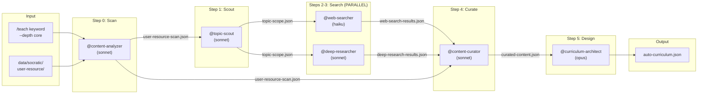

# Phase 0 Pipeline: Zero-to-Curriculum Engine

[trace:step-5:phase0-flow] [trace:step-8:teach-command] [trace:step-7:schemas] [trace:step-13:agent-definitions]

## Overview

This document defines the complete Phase 0 pipeline — the automated engine that transforms a topic keyword into a full pedagogical curriculum suitable for Socratic tutoring. The pipeline orchestrates 6 specialized agents in sequence (with a parallel segment) and produces `auto-curriculum.json` as its final output.

**Entry Point**: `/teach <topic>` command (see `.claude/commands/teach.md`)
**Alternative Entry**: `/teach-from-file <file-path>` (see `.claude/commands/teach-from-file.md`)
**Orchestrator**: `@orchestrator` manages all dispatch, state tracking, and error recovery
**Duration Target**: < 5 minutes for `core` depth

---

## 1. Pipeline Architecture

### 1.1 Agent Sequence



### 1.2 Data Flow Summary

| Pipeline Step | Agent | Input | Output | Location |
|---------------|-------|-------|--------|----------|
| Step 0: Scan | `@content-analyzer` [trace:step-13:content-analyzer] | `user-resource/` folder | `user-resource-scan.json` [trace:step-7:S3] | `data/socratic/curriculum/` |
| Step 1: Scout | `@topic-scout` [trace:step-13:topic-scout] | keyword + `user-resource-scan.json` | `topic-scope.json` [trace:step-7:S4] | `data/socratic/curriculum/` |
| Step 2: Web Search | `@web-searcher` [trace:step-13:web-searcher] | `topic-scope.json` | `web-search-results.json` [trace:step-7:S5] | `data/socratic/curriculum/` |
| Step 3: Deep Research | `@deep-researcher` [trace:step-13:deep-researcher] | `topic-scope.json` | `deep-research-results.json` [trace:step-7:S6] | `data/socratic/curriculum/` |
| Step 4: Curate | `@content-curator` [trace:step-13:content-curator] | scan + web + deep results | `curated-content.json` [trace:step-7:S7] | `data/socratic/curriculum/` |
| Step 5: Design | `@curriculum-architect` [trace:step-13:curriculum-architect] | `curated-content.json` | `auto-curriculum.json` [trace:step-7:S8] | `data/socratic/curriculum/` |

---

## 2. Initialization Protocol

When `@orchestrator` receives a `/teach` command, the following initialization sequence executes BEFORE any agent dispatch:

### 2.1 Argument Parsing

```
Input: /teach <topic> [--depth foundation|core|advanced] [--case-mode auto|A|B]

Defaults:
  depth: core
  case-mode: auto

Depth mapping (user-facing → internal):
  foundation → quick   (web search only, deep research SKIPPED)
  core       → standard (web + deep research, parallel execution)
  advanced   → deep    (web + deep research with academic paper focus)
```

### 2.2 Validation Checks

1. **No active pipeline**: Check `state.yaml` — if `workflow_status == "in_progress"`, reject with error message: "A curriculum generation pipeline is already running. Use `/end-session` to terminate it first."
2. **Topic non-empty**: Topic string must be non-empty and <= 200 characters.
3. **Directory structure exists**: Verify `data/socratic/curriculum/` and `data/socratic/user-resource/` directories exist. Create if missing.

### 2.3 SOT Initialization

Write to `data/socratic/state.yaml`:

```yaml
workflow:
  keyword: "<topic>"
  depth: "<quick|standard|deep>"
  case_mode: "auto"  # Will be set to A or B after Step 0
  current_step: 0
  workflow_status: "in_progress"
  outputs: {}
  timing:
    started_at: "<ISO-8601>"
    elapsed_seconds: 0
```

---

## 3. Pipeline Execution — Step by Step

### Step 0: User Resource Scan

**Agent**: `@content-analyzer` (sonnet) [trace:step-13:content-analyzer]
**Purpose**: Scan the `user-resource/` directory for user-provided learning materials and assess their relevance to the topic.
**Output schema**: `UserResourceScan` [trace:step-7:S3]

**Dispatch via Task tool**:
```
Task prompt to @content-analyzer:

You are operating in Phase 0 (Curriculum Genesis) scan mode.

INPUT:
- keyword: "<topic>"
- depth: "<quick|standard|deep>"
- folder_path: "data/socratic/user-resource/"

ACTION:
1. Read all files in data/socratic/user-resource/ using Glob and Read tools
2. For each supported file (.pdf, .docx, .pptx, .md, .txt):
   a. Parse the file content
   b. Extract key topics (3-7 prominent concepts)
   c. Assess relevance_score to "<topic>" (0.0-1.0)
   d. Write relevance_to_keyword as a string explanation
   e. Assign priority: "primary" if relevance_score >= 0.6, "supplementary" otherwise
3. Calculate avg_relevance = mean(relevance_score) across all files
4. Determine case_mode: if avg_relevance >= 0.3 AND at least 1 file → "A", else → "B"

OUTPUT:
Write data/socratic/curriculum/user-resource-scan.json matching the UserResourceScan schema:
{
  "scan_timestamp": "<ISO-8601>",
  "keyword": "<topic>",
  "depth": "<quick|standard|deep>",
  "folder_path": "data/socratic/user-resource/",
  "case_mode": "A" | "B",
  "files_found": <total file count>,
  "relevant_files": [
    {
      "file_name": "string",
      "file_type": "pdf|docx|pptx|md|txt",
      "file_size": "string (e.g., '2.3 MB')",
      "relevance_score": 0.0-1.0,
      "relevance_to_keyword": "string explanation of relevance",
      "key_topics_found": ["string"],
      "priority": "primary|supplementary",
      "analysis_status": "pending|analyzed|failed"
    }
  ],
  "non_relevant_files": ["string"],
  "skipped_files": ["string"],
  "parse_failures": [{"file_name": "string", "error": "string"}],
  "total_relevant_content_size": "string (e.g., '15.2 MB')",
  "avg_relevance": 0.0-1.0,
  "error": null
}

CONSTRAINTS:
- You have READ-ONLY access to SOT files. Do NOT write to state.yaml or learner-state.yaml.
- If user-resource/ is empty, output case_mode "B" with files_found 0 and avg_relevance 0.0.
- Every file must be accounted for in exactly one of: relevant_files, non_relevant_files, skipped_files, or parse_failures.
- files_found must equal the sum of all four arrays.
- Supported file types: .pdf, .docx, .pptx, .md, .txt
```

**Post-dispatch validation**:
1. Verify `user-resource-scan.json` exists and is valid JSON
2. Verify required fields present: `scan_timestamp`, `keyword`, `depth`, `folder_path`, `case_mode`, `files_found`, `relevant_files`, `non_relevant_files`, `skipped_files`, `parse_failures`, `total_relevant_content_size`, `avg_relevance`, `error`
3. Extract `case_mode` from output
4. Update SOT: `current_step: 1`, `outputs.step-0: "data/socratic/curriculum/user-resource-scan.json"`, `case_mode: <A|B>`

**Error recovery**:
- Retry up to 2 times on failure
- If user-resource/ is empty: auto-produce Case B scan with zero files (no retry needed)

**Progress display**: `[1/7] Scanning user resources...` (or `[1/6]` for foundation depth)

---

### Step 1: Topic Scouting

**Agent**: `@topic-scout` (sonnet) [trace:step-13:topic-scout]
**Purpose**: Derive the topic scope — sub-topics organized by depth level, learning prerequisites, related fields, difficulty range, and time estimates.
**Output schema**: `TopicScope` [trace:step-7:S4]

**Dispatch via Task tool**:
```
Task prompt to @topic-scout:

You are the topic scouting agent for the Socratic AI Tutor.

INPUT:
- keyword: "<topic>"
- depth: "<quick|standard|deep>"
- scan_file: "data/socratic/curriculum/user-resource-scan.json"

ACTION:
1. Read user-resource-scan.json for case_mode and context about available user materials
2. Define the topic scope (scope_definition: 50-500 chars narrative)
3. Break the topic into sub-topics organized by depth levels:
   - foundation: prerequisites and terminology
   - core: central concepts
   - application: practical use cases
   - advanced: nuances, edge cases, research frontiers
   - synthesis: cross-domain connections
4. For each sub-topic: provide name, depth level, estimated_hours, description, 2-3 search_queries, user_resource_coverage (full|partial|none)
5. Identify learning prerequisites and related fields
6. Compute total_estimated_hours and difficulty_range

OUTPUT:
Write data/socratic/curriculum/topic-scope.json matching the TopicScope schema:
{
  "keyword": "<topic>",
  "depth": "<quick|standard|deep>",
  "case_mode": "A" | "B",
  "scope_definition": "string (50-500 chars)",
  "sub_topics": [
    {
      "name": "string",
      "depth": "foundation|core|application|advanced|synthesis",
      "estimated_hours": number,
      "description": "string",
      "search_queries": ["string (2-3 per sub-topic)"],
      "user_resource_coverage": "full|partial|none"
    }
  ],
  "prerequisites": ["string"],
  "related_fields": ["string"],
  "difficulty_range": {"min": 1, "max": 5},
  "total_estimated_hours": number,
  "knowledge_gaps": ["string (Case A only — gaps in user materials)"]
}

CONSTRAINTS:
- You have READ-ONLY access to SOT files. Do NOT write to state.yaml or learner-state.yaml.
- Case A: Structure sub-topics around user-resource content as PRIMARY source. Cross-reference with user materials and annotate user_resource_coverage.
- Case B: Structure sub-topics from pre-trained knowledge as PRIMARY source. Set user_resource_coverage to "none" for all.
- Must produce at least 5 sub-topics. If topic is too narrow, expand to related concepts.
- All 5 depth levels should be represented (for standard/deep).
- Each sub-topic MUST include search_queries for downstream agents.
- total_estimated_hours must equal sum of sub-topic hours.
```

**Post-dispatch validation**:
1. Verify `topic-scope.json` exists and is valid JSON
2. Verify required fields: `keyword`, `depth`, `case_mode`, `scope_definition`, `sub_topics`, `prerequisites`, `related_fields`, `difficulty_range`, `total_estimated_hours`, `knowledge_gaps`
3. Check `sub_topics` array has >= 5 entries (or >= 3 minimum with error field for narrow topics)
4. Verify each sub-topic has all 6 required fields
5. Update SOT: `current_step: 2`, `outputs.step-1: "data/socratic/curriculum/topic-scope.json"`

**Error recovery**:
- If < 5 sub-topics and no error field: retry with instruction "Broaden keyword interpretation. Consider the keyword as a general domain. Ensure at least 5 sub-topics."
- Max 2 retries. If still insufficient: user escalation — "Could not determine sub-topics for '<topic>'. Try a broader keyword."

**Progress display**: `[2/7] Structuring topic scope...` (or `[2/6]` for foundation)

---

### Steps 2-3: Web Search + Deep Research (PARALLEL)

**Concurrency model**: `@orchestrator` dispatches BOTH agents simultaneously via two Task tool calls in the SAME message. Each agent has an independent context window. No shared state between them during execution.

**Depth-dependent behavior**:

| Depth | @web-searcher | @deep-researcher | Execution |
|-------|--------------|-----------------|-----------|
| `quick` (foundation) | Runs | **SKIPPED** | Sequential only |
| `standard` (core) | Runs | Runs | Full parallel |
| `deep` (advanced) | Runs | Runs (academic focus) | Full parallel |

#### Step 2: Web Search

**Agent**: `@web-searcher` (haiku) [trace:step-13:web-searcher]
**Purpose**: Search the web for educational content per sub-topic.
**Output schema**: `WebSearchResults` [trace:step-7:S5]

**Dispatch via Task tool**:
```
Task prompt to @web-searcher:

You are the web search agent for the Socratic AI Tutor.

INPUT:
- Read data/socratic/curriculum/topic-scope.json

ACTION:
1. For each sub-topic in topic-scope.json:
   a. Execute 2-3 of the search_queries using WebSearch tool
   b. For promising results, use WebFetch to verify content and extract metadata
   c. Classify each result by type and score relevance_score (0.0-1.0)
   d. Assess recency: "current" (< 1 year), "recent" (1-3 years), "dated" (> 3 years)
2. Detect trending topics and recent developments
3. Compile search statistics

OUTPUT:
Write data/socratic/curriculum/web-search-results.json matching the WebSearchResults schema:
{
  "keyword": "<topic>",
  "search_timestamp": "<ISO-8601>",
  "case_mode": "<A|B>",
  "sub_topic_results": [
    {
      "sub_topic": "string",
      "search_queries": ["string (actual queries executed)"],
      "results": [
        {
          "title": "string",
          "source": "string (domain/org identification)",
          "type": "official_doc|tutorial|blog|video|analysis|case_study|exercise",
          "relevance_score": 0.0-1.0,
          "recency": "current|recent|dated",
          "url": "string (real, fetchable URL)",
          "content_verified": true|false
        }
      ]
    }
  ],
  "trending_topics": ["string"],
  "recent_developments": ["string"],
  "search_stats": {
    "total_queries": number,
    "total_results": number,
    "avg_relevance": 0.0-1.0,
    "search_duration_seconds": number
  }
}

CONSTRAINTS:
- You have READ-ONLY access to SOT files. Do NOT write to state.yaml or learner-state.yaml.
- NEVER fabricate URLs. Every result must have a real, fetchable URL.
- content_verified: true only for actually WebFetch-ed pages.
- Prioritize educational sources: Khan Academy, Wikipedia, Coursera, MIT OCW, official documentation.
- Maximum 3 search queries per sub-topic (speed-optimized).
- Search for EVERY sub-topic. No skipping or merging.
```

#### Step 3: Deep Research

**Agent**: `@deep-researcher` (sonnet) [trace:step-13:deep-researcher]
**Purpose**: Conduct deep research using academic papers, textbooks, MOOCs, and expert debates.
**Output schema**: `DeepResearchResults` [trace:step-7:S6]

**Dispatch via Task tool**:
```
Task prompt to @deep-researcher:

You are the deep research agent for the Socratic AI Tutor.

INPUT:
- Read data/socratic/curriculum/topic-scope.json
- The depth and case_mode fields are inside topic-scope.json.

ACTION:
1. For each sub-topic in topic-scope.json:
   a. Search for academic papers via WebSearch (Google Scholar, arXiv, Semantic Scholar)
   b. Find textbook references (book, chapter, key_concepts)
   c. Find MOOC resources (platform, course, relevant_module)
   d. Identify expert debates with contrasting pro/con perspectives and socratic_potential
   e. Write a brief historical_context narrative for the sub-topic
2. If depth == "deep": prioritize peer-reviewed academic papers, aim for 2+ per sub-topic

OUTPUT:
Write data/socratic/curriculum/deep-research-results.json matching the DeepResearchResults schema:
{
  "keyword": "<topic>",
  "depth": "<standard|deep>",
  "case_mode": "<A|B>",
  "research_timestamp": "<ISO-8601>",
  "sub_topic_results": [
    {
      "sub_topic": "string",
      "academic_sources": [
        {
          "title": "string",
          "authors": ["string"],
          "source": "journal/conference name",
          "year": number,
          "citations": number,
          "key_insights": ["string (1-2 sentences each)"],
          "relevance_score": 0.0-1.0
        }
      ],
      "textbook_references": [
        {
          "book": "string",
          "chapter": "string",
          "key_concepts": ["string"]
        }
      ],
      "mooc_resources": [
        {
          "platform": "string",
          "course": "string",
          "relevant_module": "string"
        }
      ],
      "expert_debates": [
        {
          "topic": "string",
          "perspectives": {
            "pro": "string",
            "con": "string"
          },
          "socratic_potential": "high|medium|low"
        }
      ],
      "historical_context": "string (brief narrative of topic development)"
    }
  ],
  "research_stats": {
    "academic_papers_found": number,
    "textbooks_referenced": number,
    "mooc_resources_found": number,
    "expert_debates_identified": number,
    "research_duration_seconds": number
  }
}

CONSTRAINTS:
- You have READ-ONLY access to SOT files. Do NOT write to state.yaml or learner-state.yaml.
- NEVER fabricate academic citations, DOIs, or author names.
- Every sub-topic must have all 5 required sub-fields: academic_sources, textbook_references, mooc_resources, expert_debates, historical_context.
- If academic database APIs fail: gracefully degrade, use WebSearch for general authoritative sources, and add a top-level "errors" array.
- research_stats counts must be arithmetically correct.
```

**Parallel execution protocol**:
1. Dispatch both agents simultaneously (two Task tool calls in the SAME message — MANDATORY)
2. Wait for both to complete
3. If one fails but the other succeeds: proceed with partial results, flag degradation in `@content-curator` input
4. If BOTH fail: critical error — "External source search failed. Proceeding with pre-trained knowledge only."

**Post-dispatch validation** (after both complete):
1. Verify output files exist and are valid JSON
2. For `web-search-results.json`: verify `keyword`, `search_timestamp`, `case_mode`, `sub_topic_results`, `trending_topics`, `recent_developments`, `search_stats` present
3. For `deep-research-results.json`: verify `keyword`, `depth`, `case_mode`, `research_timestamp`, `sub_topic_results`, `research_stats` present
4. For foundation depth: only verify `web-search-results.json`
5. Update SOT: `current_step: 4`, `outputs.step-2: "data/socratic/curriculum/web-search-results.json"`, `outputs.step-3: "data/socratic/curriculum/deep-research-results.json"` (or omit step-3 for foundation)

**Error recovery**:
- `@web-searcher` 0 results: retry up to 3 times with fallback to known educational URLs
- `@deep-researcher` API failures: retry up to 2 times; degrade gracefully
- Error propagation: Steps 2 and 3 are independent — one failing does NOT block the other

**Progress display**:
- Standard/Advanced: `[3/7] Searching the web...` + `[4/7] Running deep research...` (displayed together since parallel)
- Foundation: `[3/6] Searching the web...` (no deep research line)

---

### Step 4: Content Curation

**Agent**: `@content-curator` (sonnet) [trace:step-13:content-curator]
**Purpose**: Aggregate, deduplicate, quality-filter, and rank all collected materials into a unified curated corpus organized by depth level.
**Output schema**: `CuratedContent` [trace:step-7:S7]

**Dispatch via Task tool**:
```
Task prompt to @content-curator:

You are the content curation agent for the Socratic AI Tutor.

INPUT:
- scan_file: "data/socratic/curriculum/user-resource-scan.json"
- web_file: "data/socratic/curriculum/web-search-results.json"
- deep_file: "data/socratic/curriculum/deep-research-results.json"

Read ALL THREE files using the Read tool. If deep-research-results.json does not exist (foundation depth), proceed with scan + web results only.

ACTION:
1. Merge all materials into a unified pool with unique IDs (mat_001, mat_002, ...)
2. Track source_type for each: "user_resource", "web", "academic", "textbook", "mooc", or "pretrained"
3. Deduplicate by URL match and title similarity
4. Quality score each material (0.0-1.0) using weighted rubric:
   - Source authority (0.25), Relevance (0.25), Recency (0.20), Educational structure (0.15), Citation/reputation (0.15)
   - Exception: User-resource materials (Case A) bypass scoring → quality_score: 1.0
5. Score socratic_suitability for each material: "high" | "medium" | "low"
6. Quality filter:
   - Case A: Include ALL user-resource materials (quality 1.0); external materials >= 0.4
   - Case B: Include materials >= 0.6; if after_quality_filter < 5, lower to 0.4
7. Organize materials by depth level: foundation, core, application, advanced
8. Identify knowledge gaps per depth level
9. Document any conflict resolutions explicitly

OUTPUT:
Write data/socratic/curriculum/curated-content.json matching the CuratedContent schema:
{
  "keyword": "<topic>",
  "case_mode": "A" | "B",
  "curation_timestamp": "<ISO-8601>",
  "curation_summary": {
    "total_collected": number,
    "after_quality_filter": number,
    "final_selected": number,
    "quality_threshold": 0.6,
    "sources_breakdown": {
      "user_resource": number,
      "web_search": number,
      "deep_research": number,
      "pretrained": number
    }
  },
  "curated_materials": {
    "foundation": [
      {
        "id": "mat_001",
        "title": "string",
        "source": "string",
        "source_type": "user_resource|web|academic|textbook|mooc|pretrained",
        "quality_score": 0.0-1.0,
        "key_concepts": ["string"],
        "socratic_suitability": "high|medium|low",
        "content_summary": "string (50-500 chars)"
      }
    ],
    "core": [],
    "application": [],
    "advanced": []
  },
  "knowledge_gaps_identified": ["string"],
  "conflict_resolutions": [
    {
      "topic": "string",
      "conflict": "string",
      "resolution": "string"
    }
  ],
  "degradation_flags": {
    "web_search_degraded": false,
    "academic_sources_unavailable": false,
    "quality_threshold_lowered": false
  }
}

CONSTRAINTS:
- You have READ-ONLY access to SOT files. Do NOT write to state.yaml or learner-state.yaml.
- curated_materials is an OBJECT with keys: foundation, core, application, advanced. NOT a flat array.
- Each material must have unique id in mat_NNN format.
- socratic_suitability MUST be assigned to EVERY material.
- content_summary: 50-500 characters for every material.
- curation_summary arithmetic must be correct: total_collected >= after_quality_filter >= final_selected.
- sources_breakdown counts must sum to final_selected.
- If after_quality_filter < 5: lower threshold to 0.4, set degradation_flags.quality_threshold_lowered: true, supplement with pretrained knowledge.
```

**Post-dispatch validation**:
1. Verify `curated-content.json` exists and is valid JSON
2. Verify required fields: `keyword`, `case_mode`, `curation_timestamp`, `curation_summary`, `curated_materials`, `knowledge_gaps_identified`, `conflict_resolutions`, `degradation_flags`
3. Verify `curated_materials` is an object with keys `foundation`, `core`, `application`, `advanced`
4. Check `curation_summary.final_selected >= 5` (if not, log warning but proceed)
5. Update SOT: `current_step: 5`, `outputs.step-4: "data/socratic/curriculum/curated-content.json"`

**Error recovery**:
- If quality too low (< 5 materials after filter): retry once with instruction to lower threshold (0.6 → 0.4) and supplement with pre-trained knowledge
- Max 1 retry

**Progress display**: `[5/7] Curating content...` (or `[4/6]` for foundation)

---

### Step 5: Curriculum Design

**Agent**: `@curriculum-architect` (opus) [trace:step-13:curriculum-architect]
**Purpose**: Transform the curated content corpus into a complete, pedagogically sound curriculum with modules, lessons, 3-level Socratic questions, concept dependency graph, transfer challenges, assessment points, and adaptive paths.
**Output schema**: `AutoCurriculum` [trace:step-7:S8]

**Dispatch via Task tool**:
```
Task prompt to @curriculum-architect:

You are the curriculum architect for the Socratic AI Tutor — the final step in the Phase 0 pipeline. Your task is to transform curated educational content into a complete Socratic curriculum.

INPUT:
- Read data/socratic/curriculum/curated-content.json

ACTION:
1. Analyze curated materials (organized by depth: foundation/core/application/advanced)
2. Prioritize materials with socratic_suitability "high" for question generation
3. Use knowledge_gaps_identified and conflict_resolutions from input
4. Design module hierarchy: 3+ modules, 3+ lessons per module
5. For each lesson:
   a. Define learning objectives (using Bloom's taxonomy verbs)
   b. Create concept nodes with IDs (concept_NNN format)
   c. Generate Socratic questions as an object with three arrays:
      - level_1: [L1 Confirmation questions — tests recall and understanding]
      - level_2: [L2 Exploration questions — probes reasoning, connections]
      - level_3: [L3 Refutation questions — challenges with edge cases, misconceptions]
      At least 1 question per level per lesson.
   d. Design transfer challenges (same_field and far_transfer types)
6. Build the concept dependency graph as a DAG:
   - nodes: ["concept_NNN", ...] — all concept IDs
   - edges: [{"from": "concept_NNN", "to": "concept_NNN"}, ...]
7. Create assessment points after each module
8. Create adaptive paths:
   - accelerated: description of fast-track path
   - foundation_support: description of remediation path
   - deep_dive_options: ["topic for deep exploration", ...]

OUTPUT:
Write data/socratic/curriculum/auto-curriculum.json matching the AutoCurriculum schema:
{
  "curriculum_id": "CURR_<keyword>_<date>",
  "title": "string",
  "generated_from_keyword": "<topic>",
  "case_mode": "A" | "B",
  "generation_timestamp": "<ISO-8601>",
  "generation_method": {
    "pretrained_knowledge": "N%",
    "web_search": "N%",
    "deep_research": "N%"
  },
  "learning_objectives": ["string (Bloom's verb + measurable outcome)"],
  "structure": {
    "total_modules": number,
    "total_lessons": number,
    "total_hours": number,
    "modules": [
      {
        "module_id": "M1",
        "title": "string",
        "duration": "string",
        "learning_objectives": ["string"],
        "lessons": [
          {
            "lesson_id": "L1.1",
            "title": "string",
            "concepts": ["concept_NNN"],
            "socratic_questions": {
              "level_1": ["string"],
              "level_2": ["string"],
              "level_3": ["string"]
            },
            "type": "standard|synthesis|capstone",
            "transfer_challenge": {"type": "same_field|far_transfer", "prompt": "string"} | null,
            "expert_debate_integration": true|false,
            "content_freshness": "string"
          }
        ]
      }
    ]
  },
  "concept_dependency_graph": {
    "nodes": ["concept_NNN"],
    "edges": [{"from": "concept_NNN", "to": "concept_NNN"}]
  },
  "assessment_points": [
    {"after": "M1", "type": "concept_check|synthesis_challenge|application_project|capstone_debate", "socratic_depth": 1-3}
  ],
  "transfer_challenges": [
    {"concept_id": "concept_NNN", "type": "same_field|far_transfer", "prompt": "string", "target_domain": "string"}
  ],
  "adaptive_paths": {
    "accelerated": "string",
    "foundation_support": "string",
    "deep_dive_options": ["string"]
  },
  "quality_metadata": {
    "total_socratic_questions": number,
    "avg_questions_per_lesson": number,
    "transfer_challenges_count": number,
    "expert_debates_integrated": number,
    "content_sources_used": number
  }
}

QUALITY GATES (self-verify before completing):
- >= 3 modules
- >= 9 lessons total (at least 3 per module)
- Every lesson has at least 1 L1, 1 L2, and 1 L3 Socratic question
- L3 questions genuinely CHALLENGE (counterexamples, edge cases, contrarian positions)
- Concept dependency graph is a valid DAG (no cycles)
- Every concept referenced in lessons appears in the graph nodes
- At least 1 transfer challenge per module
- All three adaptive path variants defined
- generation_method percentages sum to ~100%
- quality_metadata.total_socratic_questions matches actual count

CONSTRAINTS:
- You have READ-ONLY access to SOT files. Do NOT write to state.yaml or learner-state.yaml.
- Socratic questions must NEVER contain answers. They must be open-ended questions that guide discovery.
- Questions at L3 level should target known misconceptions from the research phase.
- The curriculum should be completable in 5-15 hours for standard depth.
- Use conflict_resolutions from curated content as L3 question material.
```

**Post-dispatch validation**:
1. Verify `auto-curriculum.json` exists and is valid JSON
2. Verify all required top-level fields: `curriculum_id`, `title`, `generated_from_keyword`, `case_mode`, `generation_timestamp`, `generation_method`, `learning_objectives`, `structure`, `concept_dependency_graph`, `assessment_points`, `transfer_challenges`, `adaptive_paths`, `quality_metadata`
3. Quality gate checks:
   - `structure.modules` array length >= 3
   - Total lessons across all modules >= 9
   - Each lesson has `socratic_questions` object with non-empty `level_1`, `level_2`, `level_3` arrays
   - `concept_dependency_graph.nodes` and `concept_dependency_graph.edges` exist and are non-empty
   - `transfer_challenges` array length >= 1
   - `assessment_points` array length >= 1
4. Update SOT: `current_step: 6`, `workflow_status: "completed"`, `outputs.step-5: "data/socratic/curriculum/auto-curriculum.json"`

**Error recovery**:
- Quality gate failures: retry up to 2 times with explicit completeness instruction specifying which gate(s) failed
- Supplement from pre-trained knowledge if curated content was thin
- Max 2 retries

**Progress display**: `[6/7] Designing curriculum...` (or `[5/6]` for foundation)

---

## 4. Finalization

After `@curriculum-architect` completes successfully:

1. **Update SOT**:
   ```yaml
   workflow_status: "completed"
   timing:
     completed_at: "<ISO-8601>"
     elapsed_seconds: <calculated>
   ```

2. **Display curriculum summary to user** (in Korean):
   ```
   ========================================
   커리큘럼 생성 완료: <topic>
   ========================================
   모듈: N
   레슨: N
   예상 학습 시간: N시간
   소크라테스 질문: N
   전이 도전: N
   소스 모드: Case A/B
   생성 시간: Xm XXs
   ----------------------------------------
   모듈 1: <name>
     - 레슨 1.1: <name>
     - 레슨 1.2: <name>
     ...
   모듈 2: <name>
     ...
   ========================================
   학습 시작: /start-learning
   커리큘럼 구조 확인: /concept-map
   ========================================
   ```

3. **Progress display**: `[7/7] Finalizing...` (or `[6/6]` for foundation)

---

## 5. Error Handling & Resilience

### 5.1 Error Levels

| Level | Description | Example | Recovery |
|-------|-------------|---------|----------|
| L1: Agent Error | Single agent failure | @web-searcher returns 0 results | Retry agent (max per-agent retries); if still fails, continue with degraded data |
| L2: Step Error | Pipeline step blocked | Both parallel agents fail (Steps 2-3) | Fallback to pre-trained knowledge only; flag `external_sources_unavailable` |
| L3: Phase Error | Entire phase fails | Phase 0 produces empty curriculum | Abort with user-facing error; suggest: check internet, try simpler keyword |
| L4: Data Error | SOT corruption | state.yaml invalid YAML | Validate SOT on every read; backup before write; restore from last valid backup |

### 5.2 Partial Failure Resilience

```mermaid
flowchart TD
    START["Pipeline Running"]
    WS_FAIL{"@web-searcher fails?"}
    DR_FAIL{"@deep-researcher fails?"}
    BOTH_FAIL{"Both fail?"}
    PARTIAL["Continue with partial results<br/>Flag: web_search_degraded/academic_sources_unavailable"]
    FALLBACK["Fallback: pre-trained knowledge<br/>Flag: external_sources_unavailable"]
    CONTINUE["Continue to Step 4"]

    START --> WS_FAIL
    WS_FAIL -->|Yes| DR_FAIL
    WS_FAIL -->|No| CONTINUE
    DR_FAIL -->|Yes (this path only)| BOTH_FAIL
    DR_FAIL -->|No| PARTIAL
    BOTH_FAIL -->|Yes| FALLBACK
    BOTH_FAIL -->|No| PARTIAL
    PARTIAL --> CONTINUE
    FALLBACK --> CONTINUE
```

### 5.3 Retry Budget Per Agent

| Agent | Max Retries | Retry Trigger |
|-------|-------------|---------------|
| `@content-analyzer` | 2 | Output missing/invalid; empty folder auto-Case-B (no retry) |
| `@topic-scout` | 2 | < 5 sub-topics; unrecognized keyword |
| `@web-searcher` | 3 | 0 results; search API failure |
| `@deep-researcher` | 2 | API failures; 0 academic sources |
| `@content-curator` | 1 | < 5 materials after filter (lower threshold) |
| `@curriculum-architect` | 2 | Quality gate failure (modules/lessons/questions) |

### 5.4 Timeout Management

- **Per-agent timeout**: Each Task dispatch has an implicit timeout (managed by Claude Code Task tool)
- **Pipeline total timeout**: 5 minutes (300 seconds) for standard depth
- **Timeout action**: Complete current step; skip remaining optional enrichment; deliver best-effort curriculum
- `@orchestrator` tracks `timing.elapsed_seconds` in SOT and checks before each dispatch

---

## 6. SOT Write Pattern During Pipeline

`@orchestrator` is the ONLY writer to `data/socratic/state.yaml`. The write pattern follows a strict protocol:

```
For each pipeline step:
  1. BEFORE dispatch:
     - Display progress indicator
     - Record step start time

  2. AFTER dispatch (agent returns):
     - Validate output file: exists, valid JSON, non-empty (> 100 bytes)
     - If validation fails: execute error recovery (retry or degrade)
     - If validation passes:
       a. Read current state.yaml
       b. Update: outputs.step-N = "<output_file_path>"
       c. Update: current_step += 1
       d. Write state.yaml (atomic: write tmp → rename)
       e. Read back and verify
```

**Atomic write protocol** (every SOT write):
1. Write updated content to `state.yaml.tmp`
2. Rename `state.yaml.tmp` → `state.yaml`
3. Read back `state.yaml` and verify content matches

---

## 7. Context Injection Patterns

Each sub-agent receives context through its Task tool dispatch prompt, following Pattern A (Sequential) or Pattern B (Parallel):

| Agent | Pattern | Injection | Token Budget |
|-------|---------|-----------|-------------|
| `@content-analyzer` | A: Sequential | Task prompt: Read `user-resource/` folder | ~10,000 |
| `@topic-scout` | A: Sequential | Task prompt: Read `user-resource-scan.json` | ~15,000 |
| `@web-searcher` | B: Parallel | Task prompt: Read `topic-scope.json` | ~10,000 |
| `@deep-researcher` | B: Parallel | Task prompt: Read `topic-scope.json` | ~15,000 |
| `@content-curator` | A: Sequential | Task prompt: Read 3 input files (scan + web + deep) | ~20,000 |
| `@curriculum-architect` | A: Sequential | Task prompt: Read `curated-content.json` | ~25,000 |

**Key constraint**: Each sub-agent dispatched via Task tool gets an INDEPENDENT context window. They do NOT share context with `@orchestrator` or each other. All necessary data must be provided through file reads specified in the Task prompt.

---

## 8. Validation & Quality Gates

### 8.1 Per-Step Validation (L0 Anti-Skip)

Before advancing `current_step`, `@orchestrator` verifies:
1. Output file exists at the expected path
2. Output file is valid JSON (parseable)
3. Output file is non-empty (> 100 bytes)
4. Required top-level fields are present (per schema)

### 8.2 Final Quality Gate (auto-curriculum.json)

| Check | Threshold | Action on Fail |
|-------|-----------|----------------|
| Module count | `structure.modules` >= 3 | Retry @curriculum-architect (max 2) |
| Lesson count (total) | `structure.total_lessons` >= 9 | Retry @curriculum-architect (max 2) |
| Questions per lesson | Each lesson: `socratic_questions.level_1/2/3` each >= 1 | Retry @curriculum-architect (max 2) |
| Concept dependency graph | `concept_dependency_graph.nodes` non-empty, valid DAG | Retry @curriculum-architect (max 2) |
| Transfer challenges | `transfer_challenges` >= 1 per module | Warning only (proceed) |
| Assessment points | `assessment_points` non-empty | Warning only (proceed) |

### 8.3 Pipeline Timing

| Metric | Target | Measurement |
|--------|--------|-------------|
| Total pipeline duration | < 5 minutes (standard) | `timing.elapsed_seconds` |
| Per-agent execution | < 60 seconds each | Individual step timing |
| Parallel segment efficiency | < 90 seconds for both | Steps 2-3 wall-clock |

---

## 9. User-Resource Priority Policy (Case A/B)

### 9.1 Policy Summary

| Case | Trigger | User Resources | External Sources | Quality Floor |
|------|---------|---------------|-----------------|---------------|
| **A** (PRIMARY) | `avg_relevance >= 0.3` AND files present | PRIMARY — quality_score 1.0, always included | SUPPLEMENTARY — quality >= 0.4 | User: 1.0, External: 0.4 |
| **B** (FALLBACK) | `avg_relevance < 0.3` OR no files | N/A | PRIMARY | All: 0.6 (degradable to 0.4) |

### 9.2 Case A Behavior Across Pipeline

| Step | Case A Effect |
|------|--------------|
| Step 0 (Scan) | `case_mode: "A"`, files scored with `priority: "primary"` |
| Step 1 (Scout) | Sub-topics structured around user materials, `user_resource_coverage` annotated per sub-topic |
| Steps 2-3 (Search) | `case_mode: "A"` passed — searches supplement user materials |
| Step 4 (Curate) | User materials bypass quality filter (score 1.0), external materials supplementary |
| Step 5 (Design) | Curriculum anchored to user-provided content narrative |

### 9.3 /teach-from-file Forced Case A

When triggered via `/teach-from-file <file-path>`:
- `case_mode` is forced to `"A"` regardless of relevance score
- File is copied to `data/socratic/user-resource/` before scan
- Topic keyword is extracted from file content
- All subsequent pipeline steps see `case_mode: "A"`

---

## 10. Cross-Validation Report (Step 14)

### 10.1 Agent Dispatch — Definition Alignment

| Agent | Pipeline Dispatch | Agent Definition (Step 13) | Schema (Step 7) | Status |
|-------|------------------|---------------------------|-----------------|--------|
| `@content-analyzer` | Input: keyword, depth, folder_path; Output: UserResourceScan with relevant_files[], file_name, file_size (string), relevance_to_keyword, key_topics_found, priority, analysis_status, avg_relevance, error | Input: keyword, depth, folder_path; Output: matches [trace:step-7:S3] | S3: scan_timestamp, keyword, depth, folder_path, case_mode, files_found, relevant_files[], non_relevant_files, skipped_files, parse_failures, total_relevant_content_size, avg_relevance, error | **FIXED** — was using files_scanned[]/filename/size_bytes/key_topics/aggregate_relevance/rationale; now aligned |
| `@topic-scout` | Input: keyword, depth, scan_file; Output: TopicScope with scope_definition, sub_topics[].depth tier, user_resource_coverage, related_fields, difficulty_range, total_estimated_hours, knowledge_gaps | Input: keyword, depth, scan_file; Output: matches [trace:step-7:S4] | S4: keyword, depth, case_mode, scope_definition, sub_topics[], prerequisites, related_fields, difficulty_range, total_estimated_hours, knowledge_gaps | **FIXED** — was using main_topic/target_competencies/prerequisite_sub_topics/3-8 range; now aligned with 5+ sub-topics, depth tiers, schema fields |
| `@web-searcher` | Input: topic-scope.json; Output: WebSearchResults with case_mode, search_queries, type enum, relevance_score, recency, content_verified, trending_topics, recent_developments, search_stats | Input: topic-scope.json; Output: matches [trace:step-7:S5] | S5: keyword, search_timestamp, case_mode, sub_topic_results[], trending_topics, recent_developments, search_stats | **FIXED** — was using depth/queries_executed/source_type/educational_value/content_summary/key_concepts/difficulty_level; now aligned |
| `@deep-researcher` | Input: topic-scope.json (depth+case_mode inside); Output: DeepResearchResults with case_mode, citations, key_insights, textbook_references, mooc_resources, expert_debates, historical_context, research_stats | Input: topic-scope.json; Output: matches [trace:step-7:S6] | S6: keyword, depth, case_mode, research_timestamp, sub_topic_results[], research_stats | **FIXED** — was using key_findings/url/difficulty_level/common_misconceptions/prerequisite_chains/pedagogical_insights/total_sources; now aligned |
| `@content-curator` | Input: 3 files via explicit paths; Output: CuratedContent with curated_materials OBJECT (foundation/core/application/advanced), curation_summary, source_type, quality_score, socratic_suitability, content_summary, knowledge_gaps_identified, conflict_resolutions, degradation_flags | Input: scan_file, web_file, deep_file; Output: matches [trace:step-7:S7] | S7: keyword, case_mode, curation_timestamp, curation_summary, curated_materials (object), knowledge_gaps_identified, conflict_resolutions, degradation_flags | **FIXED** — was using flat array/source_origin/source_url/educational_value/sub_topics_covered/content_type/misconceptions_addressed/curation_stats/coverage_gaps; now aligned |
| `@curriculum-architect` | Input: curated-content.json; Output: AutoCurriculum with curriculum_id, structure wrapper, socratic_questions OBJECT (level_1/2/3), edges {from,to}, adaptive_paths (accelerated/foundation_support/deep_dive_options), assessment_points, quality_metadata | Input: curated-content.json; Output: matches [trace:step-7:S8] | S8: curriculum_id, title, generated_from_keyword, case_mode, generation_timestamp, generation_method, learning_objectives, structure, concept_dependency_graph, assessment_points, transfer_challenges, adaptive_paths, quality_metadata | **FIXED** — was using metadata/questions array/edges {source,target,type}/paths {quick,standard,deep}/misconceptions_bank; now aligned |

### 10.2 Schema Alignment

| Schema | Pipeline Field Names | Canonical (Step 7) | Status |
|--------|---------------------|-------------------|--------|
| `user-resource-scan.json` (S3) | All 13 required fields match | 13 required fields | **FIXED** |
| `topic-scope.json` (S4) | All 10 required fields match, sub-topic 6 required fields match | 10 required + 6 per sub-topic | **FIXED** |
| `web-search-results.json` (S5) | All 7 required fields match, result 7 required fields match | 7 required + 7 per result | **FIXED** |
| `deep-research-results.json` (S6) | All 6 required fields match, sub-topic 6 required sub-fields match | 6 required + 6 per sub-topic | **FIXED** |
| `curated-content.json` (S7) | All 8 required fields match, material 8 required fields match | 8 required + 8 per material | **FIXED** |
| `auto-curriculum.json` (S8) | All 13 required fields match | 13 required fields | **FIXED** |

### 10.3 Command Integration

| Component | Status | Notes |
|-----------|--------|-------|
| `teach.md` → `phase0-pipeline.md` delegation | **ALIGNED** | teach.md references pipeline spec, depth mapping matches |
| `teach-from-file.md` → forced Case A | **ALIGNED** | Forces case_mode="A", copies file, extracts keyword |
| Argument parsing alignment | **ALIGNED** | depth enum, case-mode enum, validation rules match |
| Error message format | **ALIGNED** | ERROR/WHY/FIX three-part format in teach.md |
| Progress display format | **ALIGNED** | [1/7] through [7/7] for standard, [1/6] through [6/6] for foundation |

### 10.4 Data Flow Chain Integrity

```
user-resource-scan.json (S3)
  → case_mode, relevant_files[].key_topics_found, avg_relevance
       ↓
topic-scope.json (S4)
  → keyword, depth, case_mode, sub_topics[].name, sub_topics[].search_queries, sub_topics[].depth
       ↓
  ┌────┴────┐
  ↓         ↓         [PARALLEL — two Task calls in SAME message]
web-search    deep-research
-results.json -results.json
(S5)          (S6)
  └────┬────┘
       ↓
curated-content.json (S7)
  → curated_materials.{foundation,core,application,advanced}[].key_concepts,
    socratic_suitability, knowledge_gaps_identified, conflict_resolutions
       ↓
auto-curriculum.json (S8) ← FINAL OUTPUT
```

**Chain integrity**: VERIFIED. Each downstream agent's expected input fields exist in the upstream agent's output schema. Specifically:
- `@topic-scout` reads `case_mode` and `relevant_files[].key_topics_found` from S3 — both present in S3
- `@web-searcher` reads `sub_topics[].search_queries` and `sub_topics[].depth` from S4 — both present in S4
- `@deep-researcher` reads same fields from S4 — present in S4
- `@content-curator` reads from S3 (case_mode, relevant_files), S5 (sub_topic_results[].results), S6 (sub_topic_results[].academic_sources/textbook_references/mooc_resources) — all present
- `@curriculum-architect` reads from S7 (curated_materials.*[], knowledge_gaps_identified, conflict_resolutions, case_mode) — all present in S7
