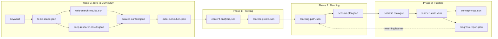
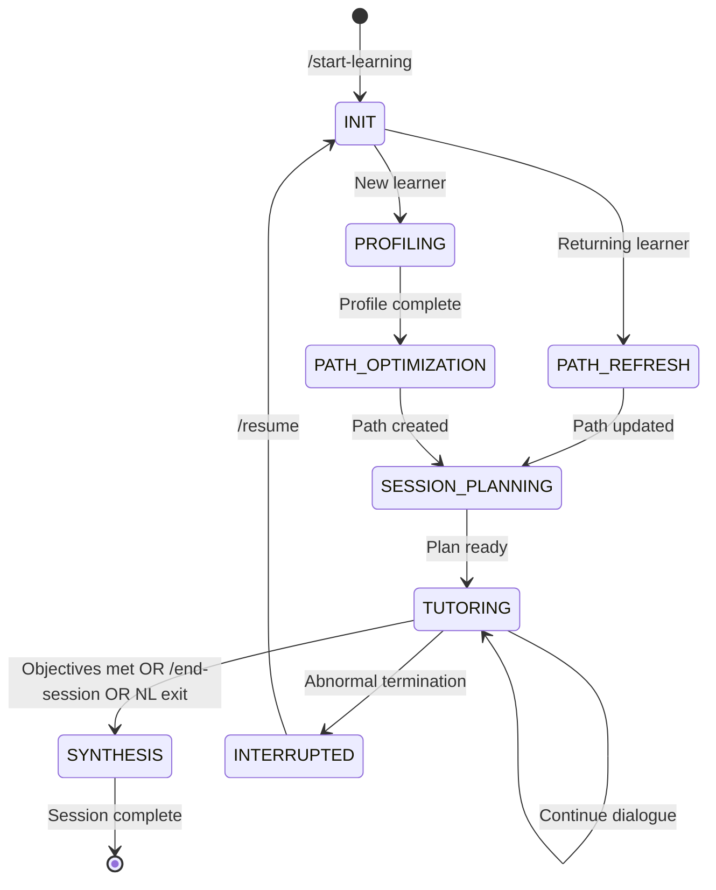

# Socratic AI Tutor: Architecture and Design Philosophy

이 문서는 Socratic AI Tutor 시스템의 **설계 철학**과 **아키텍처 전체 조감도**를 기술한다.
"무엇이 있는가"(SOCRATIC-TUTOR-README)와 "어떻게 쓰는가"(USER-MANUAL)를 넘어, **"왜 이렇게 설계했는가"**를 체계적으로 서술한다.

> **부모-자식 문서 분리**: 이 문서는 **자식 시스템(Socratic AI Tutor)** 고유의 아키텍처를 기술한다.
> 부모 프레임워크(AgenticWorkflow)의 설계 철학은 [`AGENTICWORKFLOW-ARCHITECTURE-AND-PHILOSOPHY.md`](AGENTICWORKFLOW-ARCHITECTURE-AND-PHILOSOPHY.md)를 참조한다.

---

## 1. 설계 철학

### 1.1 핵심 신념: 소크라테스 문답법은 AI 튜터링의 최적해이다

VanLehn(2011)의 메타 분석이 보여주듯, 인간 1:1 튜터링의 효과 크기(d=0.79)는 대형 강의(d≈0.0)를 압도적으로 능가한다. Socratic AI Tutor는 이 효과를 AI로 재현하되, **답을 직접 알려주지 않는** 소크라테스 문답법을 핵심 교육 전략으로 선택했다.

```
전통적 AI 튜터:   질문 → 정답 제시 → 다음 문제
소크라테스 방식:   질문 → 유도 질문 → 학습자 사고 → 더 깊은 질문 → 자기 발견
```

이 선택의 교육학적 근거:
- **Chi(2005)**: 구성주의 학습(constructive learning)이 수동적 수용(passive reception)보다 효과적
- **Bloom(1984)**: 2 시그마 문제 — 1:1 튜터링 접근이 대형 강의 대비 2 표준편차 우위
- **Flavell(1979)**: 메타인지(자신의 학습 과정에 대한 인식)가 학습 효과의 핵심 조절 변수

### 1.2 Never-Answer Protocol

소크라테스 문답법의 핵심 제약:

> **튜터는 절대로 직접 답을 제시하지 않는다.** 학습자가 스스로 답에 도달하도록 유도 질문만 한다.

이 프로토콜이 시스템 전체를 관통한다:
- `@socratic-tutor`의 모든 응답은 질문으로 끝남
- 3단계 질문 체계(L1→L2→L3)로 점진적 사고 깊이 증가
- 오개념 발견 시에도 직접 교정하지 않고, 인지적 갈등(cognitive conflict)을 유발하는 질문으로 학습자가 스스로 교정하도록 유도

### 1.3 분화 철학: 부모 DNA의 도메인 특화

AgenticWorkflow(부모)의 범용 설계 원칙이 교육 도메인으로 분화되는 방식:

| 부모 DNA | 자식 발현 | 도메인 특화 |
|---------|---------|-----------|
| 절대 기준 1 (품질) | 교육적 효과 = 품질 | VanLehn d=0.79를 수치 목표로 설정 |
| 절대 기준 2 (SOT) | 이중 SOT | Phase 0 진행(`state.yaml`) + 학습자 상태(`learner-state.yaml`) 분리 |
| 3-Phase 구조 | 3+1 Phase | Research→Planning→Implementation + Phase 0(Zero-to-Curriculum) 추가 |
| 위임 구조 | 17개 전문 에이전트 | 교육학 이론별 전문화 (오개념 8유형, ZPD, 메타인지) |
| Adversarial Review | 교육학 검증 | `@edu-analyst`가 에이전트-이론 매핑의 교육학적 건전성 검증 |

---

## 2. 3-Phase 아키텍처

### 2.1 전체 조감도

```
┌─────────────────────────────────────────────────────────────────────┐
│                        Phase 0: Zero-to-Curriculum                 │
│                        /teach [키워드] → 자동 실행                    │
│                                                                     │
│  ┌──────────┐  ┌───────────┐  ┌────────────┐  ┌─────────────────┐  │
│  │ @content  │  │ @topic    │  │ @web       │  │ @deep           │  │
│  │ -analyzer │→│ -scout    │→│ -searcher  │  │ -researcher     │  │
│  │ (scan)    │  │ (scope)   │  │ (parallel) │  │ (parallel)      │  │
│  └──────────┘  └───────────┘  └─────┬──────┘  └───────┬─────────┘  │
│                                      └────────┬────────┘            │
│                                      ┌────────▼────────┐            │
│                                      │ @content-curator │            │
│                                      │ (merge+quality)  │            │
│                                      └────────┬────────┘            │
│                                      ┌────────▼────────┐            │
│                                      │ @curriculum     │            │
│                                      │ -architect      │            │
│                                      │ (design)        │            │
│                                      └─────────────────┘            │
│  OUTPUT: auto-curriculum.json (modules, lessons, Socratic Qs, DAG) │
└─────────────────────────────────────────────────────────────────────┘
                                │
                                ▼
┌─────────────────────────────────────────────────────────────────────┐
│                   Phase 1: Learner Profiling                       │
│                   /start-learning → 신규 학습자만                     │
│                                                                     │
│  ┌───────────────┐  ┌─────────────────┐                             │
│  │ @content      │  │ @learner        │                             │
│  │ -analyzer(P1) │  │ -profiler       │  ← 적응형 진단 (5-7개 질문)   │
│  │ (curriculum   │  │ (interactive)   │                             │
│  │  analysis)    │  │                 │                             │
│  └───────────────┘  └─────────────────┘                             │
│  OUTPUT: content-analysis.json, learner-profile.json               │
└─────────────────────────────────────────────────────────────────────┘
                                │
                                ▼
┌─────────────────────────────────────────────────────────────────────┐
│                 Phase 2: Path Optimization & Planning               │
│                                                                     │
│  ┌────────────────┐  ┌──────────────────┐                           │
│  │ @path-optimizer│  │ @session-planner │                           │
│  │ (ZPD-based     │→│ (warm-up /       │                           │
│  │  sequencing)   │  │  deep-dive /     │                           │
│  │                │  │  synthesis)      │                           │
│  └────────────────┘  └──────────────────┘                           │
│  OUTPUT: learning-path.json, session-plan.json                     │
└─────────────────────────────────────────────────────────────────────┘
                                │
                                ▼
┌─────────────────────────────────────────────────────────────────────┐
│                    Phase 3: Socratic Tutoring                      │
│                    실시간 대화 세션 (25-45분)                          │
│                                                                     │
│  ┌──────────────────────────────────────────────────────────────┐   │
│  │                    @orchestrator                              │   │
│  │                    (as @socratic-tutor)                       │   │
│  │                                                              │   │
│  │  ┌─────────────────┐  ┌──────────────┐  ┌────────────────┐  │   │
│  │  │ @misconception  │  │ @metacog     │  │ @session       │  │   │
│  │  │ -detector       │  │ -coach       │  │ -logger        │  │   │
│  │  │ (every response)│  │ (checkpoints)│  │ (background)   │  │   │
│  │  └─────────────────┘  └──────────────┘  └────────────────┘  │   │
│  └──────────────────────────────────────────────────────────────┘   │
│                                                                     │
│  SYNTHESIS: @concept-mapper + @progress-tracker + @path-optimizer  │
│  OUTPUT: concept-map.json, progress-report.json, updated path      │
└─────────────────────────────────────────────────────────────────────┘
```

### 2.2 Phase 간 데이터 흐름



---

## 3. 에이전트 아키텍처

### 3.1 17개 에이전트 레지스트리

에이전트는 역할별로 3개 모델 티어에 배치된다:

```
                    ┌──────────────────────────────────────┐
                    │         Opus (3) — 핵심 지능         │
                    │  @curriculum-architect               │
                    │  @orchestrator                       │
                    │  @socratic-tutor                     │
                    └──────────────────┬───────────────────┘
                                       │
                    ┌──────────────────▼───────────────────┐
                    │       Sonnet (9) — 전문 분석          │
                    │  @content-analyzer  @topic-scout     │
                    │  @deep-researcher   @content-curator │
                    │  @learner-profiler                   │
                    │  @knowledge-researcher               │
                    │  @path-optimizer    @metacog-coach   │
                    │  @progress-tracker                   │
                    └──────────────────┬───────────────────┘
                                       │
                    ┌──────────────────▼───────────────────┐
                    │        Haiku (5) — 고속 반복          │
                    │  @web-searcher      @session-planner │
                    │  @session-logger                     │
                    │  @misconception-detector             │
                    │  @concept-mapper                     │
                    └──────────────────────────────────────┘
```

**모델 배치 원칙**:
- **Opus**: 복합 추론이 필요한 역할 — 커리큘럼 전체 설계, 세션 오케스트레이션, 소크라테스 질문 생성
- **Sonnet**: 전문적 분석과 의미론적 판단 — 콘텐츠 분석, 학습자 진단, 경로 최적화
- **Haiku**: 고속 반복 작업 — 웹 검색, 이벤트 로깅, 오개념 분류, 개념 매핑

### 3.2 에이전트 간 통신 패턴

모든 에이전트 간 통신은 **@orchestrator를 허브로 하는 중앙 집중형 패턴**을 따른다:

```
Agent A → 산출물 파일 → @orchestrator → SOT 갱신 → Agent B 디스패치
```

에이전트끼리 직접 통신하지 않는다. 이 제약의 이유:
1. **SOT 일관성**: 상태 갱신이 항상 @orchestrator를 거치므로 경합 조건(race condition) 없음
2. **디버깅 용이성**: 모든 상태 변경이 단일 경로를 따르므로 추적 가능
3. **부모 DNA 준수**: 절대 기준 2(단일 파일 SOT + 단일 쓰기 권한)의 직접적 발현

### 3.3 에이전트별 도구 접근 권한

| 에이전트 | Read | Write | Bash | Task | Web | Glob/Grep |
|---------|:----:|:-----:|:----:|:----:|:---:|:---------:|
| @orchestrator | O | O | O | O | - | O |
| @socratic-tutor | O | O | - | - | - | - |
| @content-analyzer | O | O | O | - | - | O |
| @deep-researcher | O | O | O | - | O | - |
| @web-searcher | O | O | - | - | O | - |
| @curriculum-architect | O | O | - | - | - | - |
| @knowledge-researcher | O | O | O | - | O | - |
| 나머지 10개 | O | O | - | - | - | - |

**최소 권한 원칙**: 각 에이전트는 자기 역할 수행에 필요한 최소한의 도구만 접근 가능. Task tool은 @orchestrator 전용(에이전트 디스패치 권한).

---

## 4. 상태 관리 아키텍처

### 4.1 이중 SOT 구조

```
┌─────────────────────────────────────────────────┐
│              state.yaml (Phase 0 SOT)           │
│                                                  │
│  workflow_id, keyword, depth, case_mode          │
│  current_step (0-6), workflow_status             │
│  outputs (step-N → file paths)                   │
│  parallel_group, error_state, timing             │
│                                                  │
│  Writer: @orchestrator ONLY                      │
│  Lifecycle: /teach 시작 → Phase 0 완료           │
└─────────────────────────────────────────────────┘

┌─────────────────────────────────────────────────┐
│         learner-state.yaml (Phase 1-3 SOT)      │
│                                                  │
│  learner_id, curriculum_ref                      │
│  knowledge_state (per-concept mastery/confidence)│
│  learning_style, motivation_level                │
│  response_pattern                                │
│  current_session (status, module, lesson, phase) │
│  path (current_position, next_concepts, review)  │
│  history (sessions, study_time, trends)          │
│  bloom_calibration (target d=0.79)               │
│                                                  │
│  Writer: @orchestrator ONLY                      │
│  Lifecycle: 첫 /start-learning → 영구 지속       │
└─────────────────────────────────────────────────┘
```

**이중 SOT 설계 근거**: Phase 0(커리큘럼 생성)과 Phase 1-3(실시간 튜터링)의 생명주기가 완전히 다르다. `state.yaml`은 1회성(커리큘럼 생성 완료 시 frozen), `learner-state.yaml`은 영구 지속(세션을 넘어 축적). 하나의 SOT로 통합하면 관심사 혼재로 복잡도가 급증한다.

### 4.2 SOT 보호 3계층

| 계층 | 메커니즘 | 강도 |
|------|---------|------|
| **L1** | 에이전트 프롬프트: "READ-ONLY access to SOT" | 행동적 (LLM 지시 준수) |
| **L2** | `guard_learner_state.py` Hook | 결정론적 경고 (exit 0 + stderr) |
| **L3** | `block_destructive_commands.py` (부모 Hook) | 결정론적 차단 (exit 2) |

**L2가 경고 모드(exit 0)인 이유**: Claude Code Hook은 현재 실행 컨텍스트가 @orchestrator인지 Sub-agent인지 구별할 수 없다. @orchestrator도 SOT에 써야 하므로 hard block(exit 2)을 걸면 정상 작동이 불가능하다. 대신 stderr 경고로 LLM이 자기 교정하도록 유도한다.

### 4.3 세션 복구 인프라

```
세션 생성 → ACTIVE → (정상 종료) → COMPLETED
                  ↘ (비정상 종료) → INTERRUPTED
                                       ↓
                               /resume → ACTIVE (복원)
```

복구 데이터 소스:
1. **Stop Hook** (`save_session_snapshot.py`): 매 응답 후 세션 스냅샷 자동 저장
2. **세션 로그**: `sessions/active/{session_id}.log.json` — 전체 이벤트 기록
3. **learner-state.yaml**: 마지막 저장 시점의 학습 상태

복구 충실도: 보류 질문(exact), 세션 위치(exact), 마스터리 점수(±1 interaction), 대화 맥락(요약 수준).

---

## 5. 세션 라이프사이클 상태 머신

### 5.1 8-상태 모델



### 5.2 상태별 에이전트 디스패치

| 상태 | 에이전트 | 소요 시간 | 산출물 |
|------|---------|----------|--------|
| INIT | @orchestrator | ~5초 | Session ID, 디렉터리 |
| PROFILING | @content-analyzer + @learner-profiler | ~5분 | content-analysis.json, learner-profile.json |
| PATH_REFRESH | @path-optimizer | ~30초 | learning-path.json (갱신) |
| PATH_OPTIMIZATION | @path-optimizer | ~30초 | learning-path.json (신규) |
| SESSION_PLANNING | @session-planner | ~15초 | session-plan.json |
| TUTORING | @socratic-tutor (inline) + @session-logger (background) | 25-45분 | 대화, 마스터리 갱신 |
| SYNTHESIS | @concept-mapper + @progress-tracker + @path-optimizer | ~60초 | concept-map.json, progress-report.json |
| INTERRUPTED | @session-logger | ~5초 | 최종 스냅샷 |

---

## 6. Hook 인프라

### 6.1 부모-자식 Hook 공존

Socratic AI Tutor는 부모 AgenticWorkflow의 Hook 인프라 위에 3개의 자식 전용 Hook을 추가한다. 두 시스템의 Hook은 **다른 데이터 도메인**에서 작동하므로 충돌이 없다.

```
부모 Hook (`.claude/context-snapshots/` 대상):
├── context_guard.py → generate_context_summary.py (Stop)
├── context_guard.py → update_work_log.py (PostToolUse)
├── context_guard.py → save_context.py (PreCompact, SessionEnd)
├── context_guard.py → restore_context.py (SessionStart)
├── block_destructive_commands.py (PreToolUse — Bash)
├── block_test_file_edit.py (PreToolUse — Edit|Write)
└── predictive_debug_guard.py (PreToolUse — Edit|Write)

자식 Hook (`data/socratic/` 대상):
├── guard_learner_state.py (PreToolUse — Edit|Write, SOT 보호)
├── track_session_activity.py (PostToolUse — Edit|Write|Bash|Task, 활동 추적)
└── save_session_snapshot.py (Stop — 세션 스냅샷)
```

### 6.2 이벤트별 실행 순서

| 이벤트 | 순서 | 스크립트 | 도메인 |
|--------|------|---------|--------|
| **PreToolUse (Edit\|Write)** | 1 | `block_test_file_edit.py` | 부모 (TDD) |
| | 2 | `predictive_debug_guard.py` | 부모 (위험 경고) |
| | 3 | `guard_learner_state.py` | **자식 (SOT 보호)** |
| **PostToolUse** | 1 | `update_work_log.py` | 부모 (작업 로그) |
| | 2 | `track_session_activity.py` | **자식 (활동 추적)** |
| **Stop** | 1 | `generate_context_summary.py` | 부모 (컨텍스트 스냅샷) |
| | 2 | `save_session_snapshot.py` | **자식 (세션 스냅샷)** |

---

## 7. 3단계 질문 체계 (Socratic Questioning Hierarchy)

### 7.1 L1 → L2 → L3 진행

```
L1: Recall & Comprehension (기억/이해)
    "블록체인에서 합의란 무엇인가요?"
    → 학습자가 기본 개념을 떠올리도록

L2: Application & Analysis (적용/분석)
    "만약 네트워크의 51%를 장악하면 어떤 일이 벌어질까요?"
    → 학습자가 개념을 새로운 상황에 적용하도록

L3: Synthesis & Evaluation (종합/평가)
    "PoW와 PoS의 보안 모델을 비교하면, 어떤 상황에서 어떤 방식이 더 적합할까요?"
    → 학습자가 여러 개념을 종합하고 판단하도록
```

### 7.2 질문 레벨 전환 기준

| 전환 | 조건 | 근거 |
|------|------|------|
| L1→L2 | L1에서 2회 연속 정확 응답 | 기본 이해 확인 후 적용 도전 |
| L2→L3 | L2에서 mastery ≥ 0.5 | 충분한 적용 능력 확인 후 종합 도전 |
| L2→L1 | L2에서 2회 연속 부정확 | 기본 이해 부족으로 되돌아감 |
| L3→L2 | L3에서 부정확 | 종합 수준 미달 — 적용 수준 강화 |

---

## 8. 스키마 시스템

### 8.1 33개 JSON 스키마

모든 에이전트 산출물은 `data/socratic/schemas/`에 정의된 JSON 스키마를 따른다:

| 카테고리 | 스키마 | 용도 |
|---------|--------|------|
| **Phase 0** | user-resource-scan.json (S1) | 사용자 자료 스캔 |
| | topic-scope.json (S2) | 주제 범위 도출 |
| | web-search-results.json (S3) | 웹 검색 결과 |
| | deep-research-results.json (S4) | 심층 리서치 결과 |
| | curated-content.json (S5) | 큐레이션 결과 |
| | auto-curriculum.json (S6) | 자동 생성 커리큘럼 |
| **Phase 1** | content-analysis.json (S9) | 콘텐츠 분석 |
| | learner-profile.json (S10) | 학습자 프로필 |
| **Phase 2** | learning-path.json (S11) | 학습 경로 |
| | session-plan.json (S12) | 세션 계획 |
| **Phase 3** | session-log.json (S13) | 세션 로그 |
| | misconception-record.json (S14) | 오개념 기록 |
| | metacognition-checkpoint.json (S15) | 메타인지 체크포인트 |
| | concept-dependency-graph.json (S16) | 개념 의존성 그래프 |
| | progress-report.json (S17) | 진척도 리포트 |
| | transfer-challenge.json (S18) | 전이 챌린지 |
| | session-transcript.json (S19) | 세션 트랜스크립트 |
| | mastery-update.json | 마스터리 갱신 |
| | spaced-repetition-schedule.json | 간격 반복 일정 |
| | transfer-challenge-result.json | 챌린지 결과 |
| | session-snapshot.json | 세션 스냅샷 |
| | quality-metrics.json | 품질 메트릭 |
| | learner-state-schema.json | 학습자 상태 |

### 8.2 스키마 체인 무결성

스키마 간 참조 관계의 무결성을 보장한다:

```
auto-curriculum.json
  └─ concept_id → learning-path.json.sequence[].concept_id
                    └─ → session-plan.json.objectives[].concept_id
                         └─ → misconception-record.json.concept_id
                              └─ → progress-report.json.concept_scores[].concept_id
```

모든 `concept_id`는 `auto-curriculum.json`의 `concepts[]`에서 파생되며, 다운스트림 스키마가 존재하지 않는 ID를 참조하는 것은 스키마 위반이다.

---

## 9. 자연어 인터랙션 아키텍처

### 9.1 2계층 의도 감지

자연어 인터랙션은 **Pre-Session**과 **In-Session** 두 계층에서 독립적으로 작동한다:

```
사용자 입력
    │
    ├── 슬래시로 시작? ── Yes → Slash Command 직접 실행
    │
    └── No
         │
         ├── 활성 세션 있음? ── Yes → In-Session 감지 (SKILL.md §5.2)
         │                            ├── EXIT_INTENT: "그만" → /end-session
         │                            ├── CHALLENGE: "테스트" → /challenge
         │                            ├── CONCEPT_MAP: "개념 맵" → @concept-mapper
         │                            ├── PROGRESS: "진도율" → 경량 요약
         │                            └── NO_MATCH → 일반 소크라테스 대화
         │
         └── 활성 세션 없음? ── Yes → Pre-Session 감지 (orchestrator §9.1)
                                       ├── START_LEARNING: "배우자" → /start-learning
                                       ├── RESUME: "이어서 하자" → /resume
                                       ├── SHOW_PROGRESS: "진도율" → /my-progress
                                       ├── SHOW_CONCEPTS: "개념 맵" → /concept-map
                                       └── NO_MATCH → 일반 대화
```

### 9.2 신뢰도 기반 실행

| 신뢰도 | 동작 | 예시 |
|--------|------|------|
| HIGH | 즉시 실행 | "배우자" → /start-learning |
| MEDIUM | 확인 질문 1회 | "좀 쉬자" → "세션을 종료하시겠어요?" |
| AMBIGUOUS | 분화 질문 | "다시 해볼까?" → "이전 세션을 이어서? 새로 시작?" |

---

## 10. 교육학 이론-에이전트 매핑

| 교육학 이론 | 에이전트 | 구현 방식 |
|-----------|---------|----------|
| **VanLehn(2011)** — 1:1 튜터링 효과 | @socratic-tutor | d=0.79 목표 효과 크기로 `bloom_calibration` 설정 |
| **Chi(2005)** — 오개념 8유형 분류 | @misconception-detector | 매 응답에서 8유형 패턴 매칭 + 3단계 심각도 분류 |
| **Flavell(1979)** — 메타인지 프레임워크 | @metacog-coach | 세션 진행률 25%/50%/75% 체크포인트에서 자동 개입 |
| **Vygotsky** — ZPD(근접발달영역) | @path-optimizer | mastery 0.3-0.7 범위의 개념을 우선 타겟으로 배치 |
| **Ebbinghaus** — 망각 곡선 | @path-optimizer | 시간 경과에 따른 mastery decay + 간격 반복 일정 |
| **Novak & Gowin(1984)** — 개념 맵 | @concept-mapper | 학습자 언어로 표현된 관계를 그래프로 구축 |
| **Bloom(1984)** — 2 시그마 문제 | 시스템 전체 | AI 1:1 튜터링으로 대형 강의 대비 효과 재현 목표 |

---

## 11. MCP 구성 및 대체 전략

원본 설계의 7개 MCP 서버는 모두 **설계 시점 발명품**이었다. 현재 구현:

| 원본 MCP | 대체 방식 | 추가 설정 |
|---------|----------|---------|
| web-search-mcp | 내장 WebSearch 도구 | 불필요 |
| deep-research-mcp | WebSearch + WebFetch 반복 패턴 | 불필요 |
| scholar-search-mcp | Semantic Scholar API + arXiv API (Bash) | API 키 불필요 |
| mooc-connector-mcp | WebSearch + WebFetch (공개 페이지) | 메타데이터만 |
| adaptive-test-mcp | LLM 내재 (@learner-profiler) | 불필요 |
| graph-renderer-mcp | Mermaid 인라인 텍스트 | 불필요 |
| analytics-mcp | 파일 기반 (@progress-tracker) | 불필요 |

**선택적 MCP 강화**: Brave Search, Perplexity Deep Research, Mermaid PNG 내보내기 — 모두 fallback이 있어 필수가 아님.

---

## 12. 빌더 워크플로우 구조

이 시스템은 AgenticWorkflow의 `socratic-builder` 스킬이 **21단계 빌더 워크플로우**로 구현했다:

| Phase | Step | 산출물 |
|-------|------|--------|
| **Research** | 1. Requirements Extraction | requirements-manifest.md |
| | 2. Tech Feasibility | tech-feasibility-report.md |
| | 3. Pedagogy Verification | pedagogy-verification-report.md |
| **Planning** | 4. Scope Approval (human) | scope-decision.md |
| | 5. Architecture Blueprint | architecture-blueprint.md |
| | 6. Agent Persona Design (team) | agent-personas/ |
| | 7. Schema Design | json-schemas.md |
| | 8. Command Interface Design | command-interfaces.md |
| | 9. Quality Framework | quality-framework.md |
| | 10. Design Review | design-review-report.md |
| | 11. Implementation Approval (human) | implementation-decision.md |
| **Implementation** | 12. Project Scaffolding | data/socratic/ 전체 구조 |
| | 13. Sub-Agent Implementation (team) | .claude/agents/ 17개 |
| | 14. Phase 0 Pipeline | phase0-pipeline.md |
| | 15. Phase 1-3 Skill | SKILL.md + hooks-and-state.md |
| | 16. Command Implementation | .claude/commands/ 9개 |
| | 17. Hook & State Infra | hooks-and-state.md (업데이트) |
| | 18. Integration Testing | integration-test-results.md |
| | 19. Adversarial Review | review-logs/step-19-review.md |
| | 20. User Acceptance (human) | acceptance-decision.md |
| | 21. Documentation | developer-guide.md |

**완료 상태**: 21단계 모두 완료 (`workflow_status: "completed"`)
