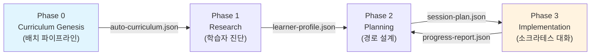

# Socratic AI Tutor — PRD v1.0

> **문서 버전**: 1.0
> **작성 기반**: `socratic-ai-tutor-workflow.md` (1,580줄 설계도) + 4인 심층 조사 + 2차 성찰
> **목적**: Claude Code `workflow.md` 생성을 위한 사전 산출물
> **최종 산출물**: 이 PRD가 아니라, 이 PRD를 기반으로 생성될 **workflow.md → 실제 작동하는 시스템**

---

## 1. 문서 개요

### 1.1 문서 목적

이 PRD는 **Socratic AI Tutor Orchestrator**의 요구사항을 정의한다. 이 시스템은 SaaS 제품이 아니라, **Claude Code의 `workflow-generator` 스킬로 생성될 `workflow.md`의 입력 명세서**이다.

```
PRD.md (이 문서)
    │
    ▼
workflow-generator 스킬
    │
    ▼
workflow.md (설계도)
    │
    ▼
실제 작동하는 AI 튜터링 시스템 (최종 산출물)
```

### 1.2 대상 독자

| 독자 | 용도 |
|------|------|
| **워크플로우 설계자** (Claude Code) | workflow.md 생성 시 입력 명세로 활용 |
| **프로젝트 소유자** | 설계 의도 확인 및 우선순위 검증 |
| **에이전트 개발자** | 각 에이전트의 책임 범위와 인터페이스 파악 |

### 1.3 용어 정의

| 용어 | 정의 |
|------|------|
| **소크라테스 문답법** | 직접적 답 제시를 피하고 질문을 통해 학습자가 스스로 진리를 발견하도록 유도하는 교수법. 확인(Level 1) → 탐구(Level 2) → 논박(Level 3) 3단계 |
| **Zero-to-Curriculum** | 키워드 하나만 입력하면 Pre-trained 지식 + 실시간 검색 + 심층 리서치를 결합하여 완전한 교수 커리큘럼을 자동 생성하는 Phase 0 파이프라인 |
| **User-Resource** | 교수자가 `user-resource/` 폴더에 직접 제공한 학습 자료 (PDF, DOCX, PPTX, MD, TXT 등). 커리큘럼 생성 시 최우선 소스 |
| **마스터리(Mastery)** | 특정 개념에 대한 학습자의 이해도. 0.0~1.0 스케일. 소크라테스 대화의 깊이와 정확성으로 측정 |
| **전이 챌린지(Transfer Challenge)** | 학습한 개념을 같은 분야(Same-field) 또는 다른 분야(Far-transfer)에 적용하는 심화 문제 |
| **SOT (Single Source of Truth)** | 시스템 상태의 단일 진실 원천. 이 시스템은 이중 SOT 구조: `state.yaml`(워크플로우) + `learner-state.yaml`(학습자) |
| **Phase** | 시스템의 실행 단계. Phase 0(커리큘럼 생성), Phase 1(연구), Phase 2(계획), Phase 3(실행) |
| **Scaffolding** | 학습자의 현재 수준에 맞춰 지원을 제공하고, 능력이 향상됨에 따라 점진적으로 지원을 줄이는 교수 전략 |
| **ZPD (Zone of Proximal Development)** | 학습자가 독립적으로 해결할 수 있는 수준과 도움을 받아 해결할 수 있는 수준 사이의 영역 |
| **pACS** | Pre-mortem Anchored Confidence Score. 품질 자기 평가 프로토콜 |

---

## 2. 문제 정의 (Problem Statement)

### 2.1 대형 강의의 구조적 한계

대학 대형 강의는 교육 접근성을 높이는 데 기여하지만, **1:1 상호작용의 근본적 부재**라는 구조적 한계를 안고 있다.

```
┌────────────────────┬────────────────────┬────────────────────┐
│      측면          │    대형 강의        │   소크라테스 AI    │
├────────────────────┼────────────────────┼────────────────────┤
│ 학생 대 교수 비율   │     300:1          │       1:1          │
│ 개인화 수준        │       없음          │      완전          │
│ 질문 기회          │    거의 없음        │     무제한         │
│ 피드백 지연        │   1-2주 (과제)      │      0초           │
│ 진도 적응          │       불가          │      실시간        │
│ 오개념 교정        │     발견 어려움     │     즉시 감지      │
│ 메타인지 훈련      │       없음          │     내장           │
│ 운영 시간          │    주 3시간         │      24/7          │
│ 확장성             │     물리적 한계     │      무한          │
└────────────────────┴────────────────────┴────────────────────┘
```

> 이 비교표는 시장 데이터가 아니라 **이 시스템이 왜 존재해야 하는지의 근본적 답변**이다.

### 2.2 기존 교육 AI 도구의 한계

팀 시장 조사 기반 경쟁 환경 분석:

| 도구 | 카테고리 | 한계 |
|------|---------|------|
| **Khan Academy (Khanmigo)** | AI 튜터 | 사전 제작된 콘텐츠 기반. 키워드 → 커리큘럼 자동 생성 불가. 교수자 자료 통합 미지원 |
| **Duolingo** | 적응형 학습 | 언어 학습 특화. 범용 주제 불가. 소크라테스 문답 부재 |
| **Carnegie Learning** | 수학 튜터 | 수학 특화. 커리큘럼 자동 생성 불가. 높은 비용 |
| **ChatGPT/Claude (일반)** | 범용 AI | 답을 직접 제공. 체계적 소크라테스 문답 불가. 커리큘럼 구조 없음. 학습 상태 비추적 |
| **Coursera/edX** | MOOC | 사전 제작 콘텐츠. 개인화 없음. 300:1 모델의 온라인 재현 |

**핵심 공백**: 시장에 **커리큘럼 자동 생성 + 소크라테스 문답 + 학습자 적응형 경로**를 end-to-end로 통합한 시스템이 존재하지 않는다.

### 2.3 해결해야 할 핵심 문제 5가지

| # | 문제 | 현재 상태 | 목표 상태 |
|---|------|----------|----------|
| P1 | **커리큘럼 부재** | 교수자가 수주~수개월 투자하여 수동 설계 | 키워드 하나로 < 5분 내 완전한 커리큘럼 자동 생성 |
| P2 | **일방향 강의** | 교수자 → 학생 단방향 전달 | 100% 양방향 소크라테스 대화 |
| P3 | **오개념 방치** | 학기 말 시험에서야 발견 | 매 응답마다 실시간 감지 + 즉시 교정 |
| P4 | **학습 경로 획일화** | 300명 동일 진도 | 학습자별 ZPD 기반 완전 개인화 경로 |
| P5 | **메타인지 부재** | 학습 전략 훈련 없음 | 체크포인트마다 사고 과정 인식 유도 |

---

## 3. 비전과 목표 (Vision & Goals)

### 3.1 제품 비전

> **"키워드 하나로 시작하여, 소크라테스와 1:1로 대화하며 배우는 세상"**

대학 대형 강의의 300:1 비율을 1:1 소크라테스식 대화로 전환하여, Bloom의 2-Sigma 문제(1984)가 제시한 **개인 튜터링의 압도적 학습 효과를 모든 학습자에게** 제공한다.

### 3.2 핵심 가치 제안 3가지

**1. Zero-to-Curriculum (핵심 혁신)**
- 키워드 하나만 입력하면 Pre-trained 지식 + 실시간 검색 + 심층 리서치를 결합하여 **완전한 교수 커리큘럼**을 자동 생성
- 교수자의 기존 자료(`user-resource/`)가 있으면 이를 최우선으로 반영하여 교수 의도를 존중
- 모듈/레슨 구조, 개념 의존성 그래프, 레슨당 3단계 소크라테스 질문까지 포함

**2. 소크라테스 문답법 (핵심 가치)**
- **절대 정답을 직접 제시하지 않는다** — 질문으로만 유도
- Level 1(확인) → Level 2(탐구) → Level 3(논박) 3단계 균형 적용
- 학습자가 **스스로 진리를 발견**하도록 유도하는 것이 시스템의 존재 이유

**3. 완전 개인화 학습 경로**
- 학습자 프로파일링(사전 지식, 학습 스타일, 응답 패턴) 기반
- ZPD 기반 적응형 난이도 곡선
- 간격 반복 알고리즘으로 복습 스케줄링
- 전이 학습 챌린지로 심화 학습

### 3.3 이 시스템의 존재 이유 (Why)

Bloom(1984)의 연구에 따르면 1:1 튜터링은 기존 강의 대비 **2 표준편차(상위 98%)** 성과 향상을 보인다 (후속 연구 보정: d=0.79, 여전히 "거대한(huge)" 효과). 그러나 1:1 튜터링은 비용과 인력의 물리적 한계로 대규모 적용이 불가능했다.

이 시스템은 **AI 에이전트의 자율적 협업**으로 이 물리적 한계를 제거한다:
- 비용: 1과목(14시간) 기준 AI 튜터링 $10-25 vs 인간 튜터 $420-1,400 (**17~56배 저렴**)
- 확장성: 동시 300명 각각에게 1:1 대화 가능
- 가용성: 24/7, 학습자가 원할 때 언제든

> **냉철한 인식**: AI 소크라테스 대화가 인간 튜터 수준의 2-sigma 효과를 완전히 재현하는지는 아직 미검증이다. 그러나 50%만 달성해도 비용 대비 압도적 가치를 제공하며, 대형 강의(0-sigma)보다는 확실히 우월하다.

---

## 4. 자동화 목적 및 범위 (Automation Purpose & Scope)

### 4.1 완전 자동화 실행 원칙 (CRITICAL)

```
┌─────────────────────────────────────────────────────────────────────────┐
│                       완전 자동화 실행 원칙                              │
├─────────────────────────────────────────────────────────────────────────┤
│                                                                         │
│  ✅ 이 시스템의 모든 준비 단계(Phase 0)는 사용자 확인 없이 자동 실행된다.  │
│                                                                         │
│  ❌ 각 단계에서 사용자에게 확인/허락을 묻지 않는다.                       │
│  ❌ "다음 단계로 진행할까요?" 같은 질문을 하지 않는다.                    │
│  ❌ 중간 결과를 보여주고 승인을 기다리지 않는다.                          │
│                                                                         │
│  이것은 기능이 아니라 아키텍처 제약 조건이다.                             │
│  이 원칙을 위반하면 시스템의 핵심 가치인 "키워드 하나로                   │
│  완전한 커리큘럼"이 무너진다.                                            │
│                                                                         │
└─────────────────────────────────────────────────────────────────────────┘
```

### 4.2 자동화 적용 범위

| 명령어 | 자동화 수준 | 사용자 개입 지점 |
|--------|------------|------------------|
| `/teach [키워드]` | **완전 자동** | 키워드 입력 → 최종 커리큘럼 결과만 출력 |
| `/teach-from-file` | **완전 자동** | 파일 지정 → 최종 커리큘럼 결과만 출력 |
| `/start-learning` | **자동 시작** | 세션 시작 → 소크라테스 대화 진입 |
| `/resume` | **자동 복구** | 복구 가능 세션 선택 후 자동 재개 |

### 4.3 이중 실행 모드 (Dual Execution Mode)

> 이 시스템은 **본질적으로 다른 두 가지 실행 모드**를 갖는다. 이것은 "Hybrid Architecture"라는 표면적 설명 이상의 근본적 아키텍처 분기이다.

**Mode A: 배치 파이프라인 (Phase 0 — Curriculum Genesis)**

```
특성:
- 실행 모드: 순차/병렬 파이프라인 (workflow.md로 구현)
- 에이전트: Phase 0의 6개 에이전트 (+ @orchestrator)
- 입력: 키워드 (+ 선택적 user-resource 파일)
- 출력: 15+ JSON 파일 (커리큘럼, 콘텐츠 분석, 검색 결과 등)
- 소요: 3-5분
- 성격: 한 번 실행, 파일 생성
- 상태 관리: state.yaml (워크플로우 진행 상태)
- 실패 모드: 생성 실패 → 재시도 가능
```

**Mode B: 대화형 세션 (Phase 1-3 — Socratic Tutoring)**

```
특성:
- 실행 모드: 실시간 대화 (Skill로 구현)
- 에이전트: @socratic-tutor 중심 + 7+ 서브에이전트
- 입력: 학습자의 실시간 응답
- 출력: 실시간 대화 + 상태 업데이트
- 소요: 25-45분 세션
- 성격: 반복적 상호작용
- 상태 관리: learner-state.yaml (학습자 상태) + 5초마다 세션 스냅샷
- 실패 모드: 세션 중단 → /resume로 복구
```

**워크플로우 자동화 시스템에서의 매핑:**

| 실행 모드 | Claude Code 구현 | SOT |
|----------|-----------------|-----|
| Mode A (배치) | `workflow.md` — 워크플로우 자동화 | `state.yaml` |
| Mode B (대화) | `Skill` — 대화형 인터페이스 | `learner-state.yaml` |

### 4.4 Non-SaaS 제약: 파일 기반 아키텍처

이 시스템은 웹 서버, 데이터베이스, API 엔드포인트를 사용하지 않는다. 모든 상태와 데이터는 **로컬 파일 시스템**에서 관리된다.

```
제약 조건:
- 실행 환경: Claude Code CLI
- 상태 저장: YAML/JSON 파일
- 데이터베이스: 없음 (파일 기반)
- 사용자 인터페이스: CLI 텍스트 + Mermaid 다이어그램
- 인증/권한: 없음 (단일 사용자)
- 동시 접속: 1명 (CLI 세션)
```

---

## 5. 대상 사용자 및 페르소나 (Target Users)

### 5.1 이중 사용자 모델

이 시스템은 **두 가지 사용 경로**를 갖는다:

```
사용자 유형 A: 교수자 (Case A)
├── 입력: 키워드 + user-resource/ 폴더에 강의 자료 제공
├── 자료 우선순위: user-resource PRIMARY → 외부 자료 SUPPLEMENTARY
├── 핵심 가치: "내 강의 자료로 커리큘럼을 만들어주고, 학생들에게 1:1 튜터링을 제공"
└── 사용 명령: /teach-from-file → /teach → 학생에게 /start-learning 안내

사용자 유형 B: 학생 (Case B — FALLBACK)
├── 입력: 키워드만 (user-resource 없음)
├── 자료 우선순위: Pre-trained + 웹 검색 + 심층 리서치 모두 PRIMARY
├── 핵심 가치: "이 주제를 소크라테스와 대화하며 배우고 싶다"
└── 사용 명령: /teach [키워드] → /start-learning
```

### 5.2 1차 타겟 페르소나 (팀 UX 연구 기반)

#### 페르소나 1: 김진수 교수 — "300명의 이름을 모르는 교수"

| 항목 | 내용 |
|------|------|
| **역할** | 국립대학교 경제학과 교수, 경제학원론 대형 강의 담당 |
| **나이** | 52세 |
| **배경** | 20년 경력. 매 학기 수강생 300명. 교육 열정은 높지만 물리적 한계에 좌절 |
| **기술 수준** | 중급. PPT, LMS 사용 가능. CLI에 대한 경험 거의 없음 |
| **핵심 고통** | 학생이 "교수님, 수요-공급 곡선에서 왜 균형점이 이동하는지 모르겠어요" 이메일을 보냄. 같은 내용으로 20명 이상 질문. 개별 답변 불가. "다음 주 보충 수업에서 다루겠습니다" 일괄 답신. 보충 수업 참석자 15명 |
| **사용 동기** | 300명 각각에게 1:1 소크라테스 문답 제공. 자신의 강의 자료(user-resource) 기반 커리큘럼 자동 생성 |
| **사용 경로** | Case A — `/teach-from-file` → 학생에게 `/start-learning` 안내 |
| **성공 기준** | 학생들의 오개념 사전 교정, 보충 수업 필요성 감소 |

#### 페르소나 2: 이수현 — "기말고사 2주 전의 대학생"

| 항목 | 내용 |
|------|------|
| **역할** | 2학년 경제학과 학생, 경제학원론 수강 |
| **나이** | 21세 |
| **배경** | 중위권 성적. 수업은 출석하지만 300명 강의실에서 질문 못 함. 기말고사 2주 전에야 공부 시작 |
| **기술 수준** | 높음. 스마트폰/노트북 자유자재. CLI 경험은 없으나 빠른 학습 가능 |
| **핵심 고통** | "수요-공급은 알겠는데, '탄력성'이 뭔지 모르겠다. 교수님한테 물어보기엔 너무 기초적인 것 같고, 유튜브는 너무 길고, ChatGPT는 답만 줘서 이해한 건지 모르겠다" |
| **사용 동기** | 자기 페이스로, 부끄러움 없이, 이해될 때까지 질문하고 싶음 |
| **사용 경로** | Case B — `/teach 경제학원론` → `/start-learning` |
| **성공 기준** | 개념별 마스터리 0.8+ 달성, 기말고사 성적 향상 |

#### 페르소나 3: 박도현 — "독학하는 개발자"

| 항목 | 내용 |
|------|------|
| **역할** | 3년차 백엔드 개발자, 블록체인 분야 전환 희망 |
| **나이** | 28세 |
| **배경** | CS 학부 졸업. 새로운 기술 분야를 체계적으로 학습하고 싶으나 적합한 커리큘럼이 없음 |
| **기술 수준** | 매우 높음. CLI 능숙. 개발 환경 설정 자유자재 |
| **핵심 고통** | "블록체인 공부하려는데 자료가 너무 흩어져있다. Coursera 과정은 너무 느리고, 문서만 읽으면 이해했는지 확인이 안 된다" |
| **사용 동기** | 키워드 하나로 체계적 커리큘럼 + 소크라테스 대화로 깊은 이해 |
| **사용 경로** | Case B — `/teach 블록체인 --depth=deep` → `/start-learning` |
| **성공 기준** | 14시간 내 블록체인 핵심 개념 마스터리 달성 |

---

## 6. 사용자 스토리 (User Stories)

### 6.1 교수자 스토리

| ID | 스토리 | 관련 Phase | 우선순위 |
|----|--------|-----------|---------|
| T-01 | 교수자로서, `/teach 경제학원론`을 입력하면 나의 강의 자료 기반으로 완전한 커리큘럼이 자동 생성되기를 원한다 | Phase 0 | P0 |
| T-02 | 교수자로서, 내 강의 PPT(`user-resource/`)를 업로드하면 이 자료가 **최우선으로** 반영된 커리큘럼이 나오기를 원한다 | Phase 0 | P0 |
| T-03 | 교수자로서, 생성된 커리큘럼의 모듈/레슨 구조와 소크라테스 질문 세트를 확인하고 싶다 | Phase 0 | P0 |
| T-04 | 교수자로서, 학생들의 전체 학습 진척도를 리포트로 확인하고 싶다 | Phase 3 | P1 |
| T-05 | 교수자로서, 학생들이 공통적으로 어려워하는 오개념을 파악하고 싶다 | Phase 3 | P1 |

### 6.2 학습자 스토리

| ID | 스토리 | 관련 Phase | 우선순위 |
|----|--------|-----------|---------|
| S-01 | 학습자로서, `/teach 블록체인`만 입력하면 체계적인 커리큘럼이 자동으로 만들어지기를 원한다 | Phase 0 | P0 |
| S-02 | 학습자로서, `/start-learning`으로 소크라테스 대화를 시작하면 AI가 **답을 주지 않고 질문으로 유도**하기를 원한다 | Phase 3 | P0 |
| S-03 | 학습자로서, 내가 잘못 이해하고 있는 부분(오개념)을 AI가 즉시 감지하고 교정해주기를 원한다 | Phase 3 | P0 |
| S-04 | 학습자로서, 내 수준에 맞는 난이도의 질문을 받고 싶다 (너무 쉽지도, 너무 어렵지도 않게) | Phase 2-3 | P0 |
| S-05 | 학습자로서, 세션이 중단되어도 `/resume`으로 정확히 이어서 할 수 있기를 원한다 | Phase 2-3 | P0 |
| S-06 | 학습자로서, 한 개념을 마스터한 후 전혀 다른 분야에 적용하는 전이 챌린지를 받고 싶다 | Phase 3 | P1 |
| S-07 | 학습자로서, `/my-progress`로 내 학습 현황(마스터리, 성장 곡선, 다음 추천)을 확인하고 싶다 | Phase 3 | P1 |

### 6.3 시스템 관리자 스토리

| ID | 스토리 | 관련 기능 | 우선순위 |
|----|--------|----------|---------|
| A-01 | 관리자로서, 세션 로그에서 학습자의 대화 이력과 마스터리 변화를 추적하고 싶다 | 세션 로깅 | P1 |
| A-02 | 관리자로서, 비정상 종료된 세션의 복구 상태를 확인하고 싶다 | 세션 복구 | P1 |

---

## 7. 시스템 아키텍처 (System Architecture)

### 7.1 전체 에이전트 구조 (13개 에이전트)

> **설계 원칙**: 원본 설계서의 13개 에이전트 구조를 **축소하지 않고 그대로 존중**한다. 각 에이전트는 독립적 전문성과 교육학적 근거를 가지며, 트리거 조건과 관심사가 다르다. 에이전트를 통합하는 것은 "기술적 편의를 위해 교육적 설계를 희생하는 것"이다.

```
┌─────────────────────────────────────────────────────────────────────┐
│                     @orchestrator (총괄 지휘)                        │
│         학습자 상태 모니터링 / 에이전트 호출 조율 / 세션 관리          │
└─────────────────────────────────────────────────────────────────────┘
                                    │
     ┌──────────────────────────────┼───────────────────────┬───────────────────────┐
     ▼                              ▼                       ▼                       ▼
┌──────────────┐           ┌──────────────┐       ┌──────────────┐       ┌──────────────┐
│  CURRICULUM  │           │   RESEARCH   │       │   PLANNING   │       │IMPLEMENTATION│
│  GENESIS     │           │   Phase 1    │       │   Phase 2    │       │   Phase 3    │
│  Phase 0     │           │              │       │              │       │              │
└──────────────┘           └──────────────┘       └──────────────┘       └──────────────┘
       │                          │                       │                       │
  ┌────┼────┐              ┌──────┴──────┐         ┌──────┴──────┐         ┌──────┴──────┐
  ▼    ▼    ▼              ▼             ▼         ▼             ▼         ▼             ▼
@topic @deep  @curriculum @content   @learner   @path       @session   @socratic   @progress
-scout -resrch -architect -analyzer  -profiler  -optimizer  -planner   -tutor      -tracker
  │         │                                       │                     │
  ▼         ▼                                       ▼       ┌─────────────┼─────────────┐
@web    @content                                 @session   ▼             ▼             ▼
-srch   -curator                                 -logger @misconception  @metacog     @concept
                                                  (BG)   -detector       -coach       -mapper
                                                              │
                                                              ▼
                                                       @knowledge
                                                       -researcher
```

### 7.2 에이전트 전체 목록 및 역할

| # | 에이전트 | Phase | 역할 | 트리거 | 출력 |
|---|---------|-------|------|--------|------|
| 1 | `@orchestrator` | 전체 | 총괄 지휘, 에이전트 호출 조율, 상태 관리 | 항상 활성 | SOT 갱신 |
| 2 | `@content-analyzer` | 0, 1 | 사용자 자료 분석, 핵심 개념 추출, 소크라테스 질문 생성 | `/teach` 실행 시 / 새 자료 업로드 시 | `user-resource-scan.json`, `content-analysis.json` |
| 3 | `@topic-scout` | 0 | 키워드에서 학습 범위/하위주제 도출, 난이도 추정 | `/teach` 실행 시 | `topic-scope.json` |
| 4 | `@web-searcher` | 0 | 실시간 웹 검색으로 최신 자료 수집 | Topic Scouting 완료 후 | `web-search-results.json` |
| 5 | `@deep-researcher` | 0 | 학술 논문/MOOC/전문 서적 심층 탐색 | Topic Scouting 완료 후 (웹 검색과 **병렬**) | `deep-research-results.json` |
| 6 | `@content-curator` | 0 | 수집 자료 품질 평가, 중복 제거, 선별 | 검색 + 리서치 완료 후 | `curated-content.json` |
| 7 | `@curriculum-architect` | 0 | 커리큘럼 자동 설계 (모듈/레슨/질문/챌린지) | 큐레이션 완료 후 | `auto-curriculum.json` |
| 8 | `@learner-profiler` | 1 | 학습자 수준 진단, 학습 스타일 파악, 응답 패턴 분석 | 최초 접속 / 주기적 재진단 | `learner-profile.json` |
| 9 | `@knowledge-researcher` | 1 (on-demand) | 오개념 교정/심화를 위한 추가 자료 검색 | 오개념 critical 감지 시 | `supplementary-knowledge.md` |
| 10 | `@path-optimizer` | 2 | 개인화 학습 경로, ZPD 기반 난이도, 간격 반복, 전이 챌린지 배치 | 프로파일링 완료 후 / 세션 종료 후 갱신 | `learning-path.json` |
| 11 | `@session-planner` | 2 | 세션 구조 설계 (Warm-up → Deep Dive → Synthesis) | 세션 시작 요청 시 | `session-plan.json` |
| 12 | `@session-logger` | 2-3 (BG) | **5초마다** 자동 스냅샷, 세션 복구 체크포인트 | 세션 시작 시 백그라운드 상주 | `{session_id}.log.json` |
| 13 | `@socratic-tutor` | 3 | **핵심 에이전트**. 소크라테스 3단계 문답 실시간 수행 | 세션 시작 | `session-transcript.json` |
| 14 | `@misconception-detector` | 3 (sub) | 학습자 응답에서 오개념 실시간 탐지 (minor/moderate/critical) | **매 응답마다** | `misconception-alert.json` |
| 15 | `@metacog-coach` | 3 (sub) | 메타인지 훈련 — 사고 과정 인식 유도 | **체크포인트에서** | 대화에 직접 삽입 |
| 16 | `@concept-mapper` | 3 | 학습 개념들의 관계 시각화 | 세션 종료 시 / 새 개념 학습 완료 시 | `concept-map.json` |
| 17 | `@progress-tracker` | 3 | 학습 진척도 추적, 성장 곡선 분석, 리포트 | 매 세션 종료 시 / 요청 시 | `progress-report.json` |

> **참고**: 에이전트 수가 13이 아닌 17로 보이는 것은, `@content-analyzer`가 Phase 0과 Phase 1에서 재사용되고, `@misconception-detector`, `@metacog-coach`가 `@socratic-tutor`의 서브에이전트로 호출되며, `@knowledge-researcher`가 on-demand이기 때문이다. **고유한 에이전트 정의는 13개**이며, 역할 인스턴스를 포함하면 17개 슬롯이다.

### 7.3 4-Phase 구조



| Phase | 이름 | 실행 모드 | 에이전트 수 | 핵심 산출물 |
|-------|------|----------|-----------|-----------|
| 0 | Curriculum Genesis | **배치** (workflow.md) | 6 + @orchestrator | `auto-curriculum.json` |
| 1 | Research | 대화 전 자동 | 3 | `learner-profile.json` |
| 2 | Planning | 대화 전 자동 | 3 | `session-plan.json` |
| 3 | Implementation | **대화형** (Skill) | 4 + 서브에이전트 | 실시간 대화 + `progress-report.json` |

### 7.4 이중 SOT 구조

```
state.yaml (워크플로우 SOT)
├── current_step: Phase 0 진행 단계
├── outputs: 각 단계별 산출물 경로
├── workflow_status: pending | in_progress | completed
└── pacs: 품질 자기 평가 점수

learner-state.yaml (학습자 SOT)
├── learner_id: 학습자 식별자
├── knowledge_state: 개념별 마스터리 + 자신감
├── learning_style: 학습 스타일
├── current_session: 현재 세션 정보
├── path: 학습 경로
└── history: 세션 이력
```

---

## 8. 핵심 기능 (Core Features)

### 8.1 Zero-to-Curriculum (Phase 0) — 핵심 혁신

키워드 하나로 완전한 교수 커리큘럼을 자동 생성하는 6개 에이전트 파이프라인.

**에이전트 파이프라인:**

```
/teach [키워드] 입력
       │
       │  ※ 아래 모든 단계는 사용자 확인 없이 연속 자동 실행
       │
       ├──▶ Step 0: @content-analyzer — User-Resource 스캔 (최우선)
       │
       ├──▶ Step 1: @topic-scout — 주제 정찰 (범위/하위주제/난이도)
       │
       ├──▶ Step 2-3: @web-searcher ──┐
       │                               ├──▶ [병렬 실행]
       │    @deep-researcher ──────────┘
       │
       ├──▶ Step 4: @content-curator — 품질 평가 + 선별
       │
       ├──▶ Step 5: @curriculum-architect — 커리큘럼 설계
       │
       └──▶ 최종 결과 출력 (여기서만 사용자에게 상세 정보 제공)
```

**진행 상태 표시 규칙:**

파이프라인 실행 중 사용자에게는 간략한 진행 상태만 표시하고, 완료 후에만 상세 통계를 제공한다.

```
진행 중 표시 (간략히):
┌────────────────────────────────────────┐
│ 📁 [1/7] 사용자 자료 스캔 중...        │
│ 🔍 [2/7] 주제 구조화 중...             │
│ 🌐 [3/7] 웹 검색 중...                 │
│ 📖 [4/7] 심층 리서치 중...             │
│ ✨ [5/7] 콘텐츠 선별 중...             │
│ 🏗️ [6/7] 커리큘럼 설계 중...           │
│ ✅ 완료!                               │
└────────────────────────────────────────┘

완료 후 표시 (상세히):
┌────────────────────────────────────────┐
│ 📚 커리큘럼 자동 생성 완료!             │
│                                        │
│ • 모듈: 5개                            │
│ • 레슨: 18개                           │
│ • 예상 학습 시간: 14시간                │
│ • 소크라테스 질문: 54개                 │
│                                        │
│ 학습을 시작하려면: /start-learning      │
└────────────────────────────────────────┘
```

> **설계 의도**: 6개 에이전트의 복잡한 내부 처리를 사용자에게 노출하지 않는다. 진행 중에는 "무엇을 하고 있는지"만 표시하고, 완료 후에는 생성된 커리큘럼의 구체적 통계를 제공하여 사용자가 결과물의 규모를 즉시 파악하도록 한다.

**User-Resource Priority Policy:**

| 조건 | 모드 | 소스 우선순위 |
|------|------|-------------|
| **Case A**: `user-resource/` 폴더에 관련 자료 존재 | User-Resource 중심 | 1. user-resource (PRIMARY, 품질점수 1.0 자동) → 2-4. 외부 자료 (SUPPLEMENTARY, 갭 보완용) |
| **Case B**: 자료 없음 / 관련성 30% 미만 | FALLBACK | 1-3. Pre-trained + 웹 검색 + 심층 리서치 (모두 PRIMARY, 품질 0.6+ 필터) |

**산출물 체인:**

```
user-resource-scan.json → topic-scope.json → web-search-results.json
                                            → deep-research-results.json
                                                        ↓
                                            curated-content.json → auto-curriculum.json
```

**Phase 0 중간 산출물 스키마:**

각 에이전트가 다음 에이전트에게 전달하는 중간 산출물의 핵심 필드 구조.

**① `user-resource-scan.json` (@content-analyzer → 전체 파이프라인):**

```json
{
  "scan_timestamp": "ISO-8601",
  "folder_path": "user-resource/",
  "files_found": 5,
  "relevant_files": [
    {
      "file_name": "lecture_notes.pdf",
      "file_type": "pdf|docx|pptx|md|txt",
      "file_size": "2.3MB",
      "relevance_to_keyword": 0.95,
      "extracted_topics": ["하위 주제 목록"],
      "priority": "primary",
      "analysis_status": "pending"
    }
  ],
  "non_relevant_files": ["관련 없는 파일명 목록"],
  "total_relevant_content_size": "4.5MB"
}
```

> `relevance_to_keyword` 점수가 **Case A/B 분기의 근거**이다. 전체 relevant_files의 평균 관련성이 0.3 미만이면 Case B(FALLBACK 모드)로 전환.

**② `topic-scope.json` (@topic-scout → @web-searcher, @deep-researcher):**

```json
{
  "keyword": "블록체인",
  "scope_definition": "분산 원장 기술의 원리, 응용, 한계",
  "sub_topics": [
    {"name": "하위 주제명", "depth": "foundation|core|application|advanced|synthesis", "estimated_hours": 2}
  ],
  "prerequisites": ["선수 지식 목록"],
  "related_fields": ["관련 분야 목록"],
  "difficulty_range": {"min": 1, "max": 5},
  "total_estimated_hours": 14
}
```

> `sub_topics`의 `depth` 값이 후속 에이전트의 검색 깊이와 `auto-curriculum.json`의 모듈 계층 구조를 결정한다.

**③ `web-search-results.json` (@web-searcher → @content-curator):**

```json
{
  "sub_topic": "하위 주제명",
  "search_queries": ["실제 검색 쿼리 목록"],
  "results": [
    {
      "title": "자료 제목",
      "source": "출처 도메인",
      "type": "official_doc|analysis|tutorial|blog|news",
      "relevance_score": 0.95,
      "recency": "2025-01",
      "url": "..."
    }
  ],
  "trending_topics": ["최신 트렌드 주제"],
  "recent_developments": ["최근 발전 사항"]
}
```

**④ `deep-research-results.json` (@deep-researcher → @content-curator):**

```json
{
  "sub_topic": "하위 주제명",
  "academic_sources": [
    {
      "title": "논문 제목",
      "authors": ["저자 목록"],
      "source": "IEEE Access|arXiv|Google Scholar",
      "year": 2024,
      "citations": 156,
      "key_insights": ["핵심 통찰 목록"]
    }
  ],
  "textbook_references": [
    {"book": "교재명", "chapter": "관련 챕터", "key_concepts": ["핵심 개념"]}
  ],
  "mooc_resources": [
    {"platform": "Coursera|edX|Khan Academy", "course": "강좌명", "relevant_module": "관련 모듈"}
  ],
  "expert_debates": [
    {"topic": "논쟁 주제", "perspectives": {"pro": "찬성 논거", "con": "반대 논거"}}
  ],
  "historical_context": "역사적 맥락 서술"
}
```

> `academic_sources`와 `mooc_resources`는 §10.4-10.5의 데이터 소스(arXiv, IEEE, Coursera, edX)와 직접 연결된다.

**⑤ `curated-content.json` (@content-curator → @curriculum-architect):**

```json
{
  "keyword": "블록체인",
  "curation_summary": {
    "total_collected": 87,
    "after_quality_filter": 34,
    "final_selected": 22
  },
  "curated_materials": {
    "foundation": [
      {
        "id": "mat_001",
        "title": "자료 제목",
        "source": "출처",
        "type": "concept_explanation|case_study|exercise|reference",
        "quality_score": 0.92,
        "socratic_potential": "high|medium|low"
      }
    ],
    "core": ["..."],
    "application": ["..."],
    "advanced": ["..."]
  },
  "knowledge_gaps_identified": ["보완이 필요한 영역"],
  "conflict_resolutions": [
    {"topic": "충돌 주제", "conflict": "수치 불일치 등", "resolution": "해결 방법 + 채택 근거"}
  ]
}
```

> `socratic_potential` 필드는 해당 자료가 소크라테스 문답에 얼마나 적합한지를 평가한다. "high"인 자료는 `auto-curriculum.json`의 `socratic_questions` 생성 시 우선 참조된다. `conflict_resolutions`는 상충 정보를 명시적으로 해결하여, 커리큘럼에 모순된 내용이 포함되지 않도록 보장한다.

**`auto-curriculum.json` 핵심 구조:**

```json
{
  "curriculum_id": "CURR_{keyword}_{id}",
  "title": "자동 생성 커리큘럼 제목",
  "generation_method": {
    "pretrained_knowledge": "40%",
    "web_search": "25%",
    "deep_research": "35%"
  },
  "learning_objectives": ["LO1: ...", "LO2: ..."],
  "structure": {
    "total_modules": 5,
    "total_lessons": 18,
    "total_hours": 14,
    "modules": [
      {
        "module_id": "M1",
        "title": "모듈명",
        "lessons": [
          {
            "lesson_id": "L1.1",
            "title": "레슨명",
            "concepts": ["concept_id"],
            "socratic_questions": {
              "level_1": ["확인 질문"],
              "level_2": ["탐구 질문"],
              "level_3": ["논박 질문"]
            },
            "transfer_challenge": { "type": "same_field|far_transfer", "prompt": "..." }
          }
        ]
      }
    ]
  },
  "concept_dependency_graph": {
    "nodes": ["concept_ids"],
    "edges": [{"from": "A", "to": "B"}]
  },
  "assessment_points": [...],
  "adaptive_paths": { "accelerated": "...", "foundation_support": "...", "deep_dive_options": [...] }
}
```

### 8.2 소크라테스 튜터링 (Phase 3) — 핵심 가치

**절대 원칙: 답을 직접 제시하지 않는다.**

```
소크라테스 대화 흐름 예시:

[Level 1 - 확인]
AI: "그렇다면 수요가 증가하면 가격은 어떻게 될까요?"
학습자: "올라가요"
AI: "맞습니다. 그런데..."

[Level 2 - 탐구]
AI: "왜 가격이 올라갈까요? 그 메커니즘을 설명해볼 수 있나요?"
학습자: "사람들이 더 많이 원하니까요"
AI: "좋아요. 그런데 공급자 입장에서는 어떤 일이 일어날까요?"

[Level 3 - 논박]
AI: "만약 공급이 무한하다면요? 그래도 가격이 오를까요?"
학습자: "음... 아닐 것 같아요"
AI: "그렇다면 가격 상승의 진짜 조건은 무엇일까요?"
```

**`@socratic-tutor` 동작 규칙:**
- 3단계 문답법을 **균형 있게** 적용 (Level 1만 반복하거나 Level 3만 반복 금지)
- 학습자 응답에 따른 **동적 질문 조정**
- 적절한 **Scaffolding** 제공 (힌트는 주되, 답은 주지 않음)
- **매 응답마다** `@misconception-detector` 호출
- **체크포인트에서** `@metacog-coach` 호출

**세션 구조 (Warm-up → Deep Dive → Synthesis):**

```json
{
  "warm_up": { "duration": "3min", "activity": "이전 개념 빠른 복습", "question_level": 1 },
  "deep_dive": { "duration": "15-25min", "activity": "핵심 개념 소크라테스 탐구", "question_levels": [1, 2, 3] },
  "synthesis": { "duration": "5min", "activity": "개념 연결 + 전이 챌린지 미리보기" }
}
```

### 8.3 학습자 프로파일링 및 적응형 경로

**`@learner-profiler` (Phase 1):**
- 사전 지식 수준 진단 (적응형 진단 테스트)
- 학습 스타일 파악 (시각/청각/읽기/실습)
- 응답 패턴 분석: 평균 응답 시간, **confidence_accuracy_gap** (자신감과 실제 정확도의 괴리), 오류 유형
- 동기 수준 추정

**`@path-optimizer` (Phase 2):**
- 학습자 수준에 맞는 개념 순서 결정
- **ZPD(Zone of Proximal Development)** 기반 적응형 난이도 곡선
- **간격 반복 알고리즘**으로 복습 주기 스케줄링
- **전이 학습 챌린지** 배치 시점 결정

**`content-analysis.json` (Phase 1 산출물 — @content-analyzer):**

Phase 0에서 User-Resource 스캔을 수행한 `@content-analyzer`는, Phase 1에서는 학습자료의 **교육적 구조 분석**을 수행한다. 핵심 개념 추출, 학습 목표 정의, 그리고 **개념당 3단계 소크라테스 질문 뱅크 생성**이 이 단계의 핵심이다.

```json
{
  "content_id": "uuid",
  "title": "학습 자료명",
  "key_concepts": [
    {
      "id": "concept_001",
      "name": "개념명",
      "definition": "정의",
      "prerequisites": ["concept_000"],
      "difficulty": "1-5 (정수)",
      "socratic_questions": {
        "level_1_confirm": ["이해 확인 질문 — '이게 맞나요?'"],
        "level_2_explore": ["탐구 질문 — '왜 그럴까요?', '반례는?'"],
        "level_3_refute": ["논박 질문 — '하지만 이 경우는 어떤가요?'"]
      }
    }
  ],
  "learning_objectives": ["학습 목표 목록"],
  "concept_graph": {"nodes": ["concept_ids"], "edges": [{"from": "A", "to": "B"}]}
}
```

> `socratic_questions` 3단계 구조가 §8.2 소크라테스 튜터링의 질문 뱅크 원천이다. `concept_graph`는 §8.7 개념 연결 관리의 초기 의존성 그래프를 형성한다.

**`learning-path.json` (Phase 2 산출물 — @path-optimizer):**

학습자 프로파일(`learner-profile.json`)과 커리큘럼(`auto-curriculum.json`)을 종합하여, 개인화된 학습 경로를 생성한다. **간격 반복 스케줄**과 **전이 챌린지 배치 시점**이 경로에 내장된다.

```json
{
  "learner_id": "uuid",
  "current_position": "concept_003",
  "path": [
    {"concept": "concept_003", "target_mastery": 0.8, "estimated_time": "15min"},
    {"concept": "concept_004", "target_mastery": 0.8, "estimated_time": "20min"},
    {"type": "transfer_challenge", "source_concept": "concept_003", "target_domain": "same_field|far_transfer"}
  ],
  "review_schedule": [
    {"concept": "concept_001", "review_at": "ISO-8601 timestamp"}
  ]
}
```

> `path` 배열 내에 일반 개념과 `transfer_challenge`가 혼합 배치된다. §8.6의 전이 학습 챌린지는 마스터리 80% 달성 시 이 경로 상에서 자동 트리거된다.

**`learner-profile.json` (Phase 1 산출물 — @learner-profiler):**

```json
{
  "learner_id": "uuid",
  "knowledge_state": {
    "concept_001": {"mastery": 0.7, "confidence": 0.8},
    "concept_002": {"mastery": 0.3, "confidence": 0.9}
  },
  "response_pattern": {
    "avg_response_time": 15,
    "confidence_accuracy_gap": 0.2,
    "common_error_types": ["overgeneralization", "missing_edge_cases"]
  }
}
```

> **핵심 지표 — `confidence_accuracy_gap`**: 자신감(0.9)과 실제 마스터리(0.3)의 차이가 0.6일 경우, 학습자가 "안다고 생각하지만 실제로는 모르는" 상태. 이것이 가장 위험한 오개념의 신호이다.

### 8.4 오개념 감지 및 교정

**`@misconception-detector` (Phase 3 — 매 응답마다 호출):**
- 학습자 응답에서 오개념 패턴 실시간 탐지
- 심각도 3단계 분류: `minor` → `moderate` → `critical`
- **Critical 감지 시 `@knowledge-researcher` 자동 호출**로 추가 교정 자료 수집

```json
{
  "detected": true,
  "type": "overgeneralization",
  "severity": "moderate",
  "student_claim": "모든 수요 증가는 가격 상승을 유발한다",
  "correct_understanding": "공급 탄력성에 따라 다름",
  "recommended_action": "Level 3 논박 질문으로 유도"
}
```

### 8.5 메타인지 코칭

**`@metacog-coach` (Phase 3 — 체크포인트에서 호출):**

세션 플랜에 정의된 체크포인트에서 `@socratic-tutor`가 `@metacog-coach`를 호출하여 학습자의 **사고 과정 인식**을 유도한다.

메타인지 질문 유형:
- "방금 답을 바꿨는데, 무엇이 생각을 바꾸게 했나요?"
- "이 문제를 풀 때 어떤 전략을 사용했나요?"
- "어디서 막혔고, 어떻게 해결했나요?"
- "다음에 비슷한 문제를 만나면 어떻게 접근하겠어요?"

> **교육학적 근거**: 메타인지는 학습 전이의 핵심 요소. 자기 사고 과정을 인식하는 학습자가 새로운 맥락에서도 지식을 적용할 수 있다 (Flavell, 1979; Schraw & Dennison, 1994).

### 8.6 전이 학습 챌린지

**트리거**: 개념 마스터리 **80% 이상** 달성 시 자동 제안.

| 유형 | 설명 | 예시 |
|------|------|------|
| **Same-field Transfer** | 같은 분야 내 다른 맥락에 적용 | 경제학 수요-공급 → 노동시장 임금 결정 |
| **Far Transfer** | 완전히 다른 분야로 적용 | 경제학 균형 → 생태계 평형 → 조직 내 권력 균형 |

**커리큘럼 내장**: `auto-curriculum.json`의 각 레슨에 `transfer_challenge` 필드가 이미 포함되어 있다.

```json
{
  "transfer_challenge": {
    "type": "far_transfer",
    "prompt": "블록체인의 '탈중앙화' 철학을 교육 시스템에 적용한다면?"
  }
}
```

### 8.7 개념 연결 관리

**두 가지 차원:**

1. **`concept_dependency_graph`** (커리큘럼 구조 — Phase 0에서 생성):
   - 선수-후속 관계 정의
   - 학습 순서의 근거

2. **`@concept-mapper`** (학습 후 관계 데이터 — Phase 3에서 생성):
   - 학습한 개념들의 관계 시각화
   - 학습자의 이해 경로 시각화
   - `concept-map.json` 생성

```json
{
  "nodes": [
    {"id": "concept_001", "label": "수요", "mastery": 0.9},
    {"id": "concept_002", "label": "공급", "mastery": 0.85},
    {"id": "concept_003", "label": "균형가격", "mastery": 0.7}
  ],
  "edges": [
    {"from": "concept_001", "to": "concept_003", "type": "prerequisite"},
    {"from": "concept_002", "to": "concept_003", "type": "prerequisite"},
    {"from": "concept_001", "to": "concept_002", "type": "contrast"}
  ]
}
```

### 8.8 세션 관리 및 복구

**`@session-logger` (백그라운드 상주):**

```
세션 시작 ──▶ start_background_logging() 호출
                    │
                    ▼
            ┌─────────────────┐
            │  while (active) │
            │    sleep(5초)   │
            │    save_snapshot│──▶ snapshots/{timestamp}.json
            │    update_log   │──▶ {session_id}.log.json
            └─────────────────┘
                    │
                    ▼
세션 종료 ──▶ end_session() 호출
            └─▶ active/ → completed/ 폴더 이동
```

**세션 로그 스키마 (마이크로 상태 추적):**

```json
{
  "session_id": "uuid",
  "current_position": {
    "module_id": "M2",
    "lesson_id": "L2.3",
    "current_phase": "deep_dive",
    "current_question_level": 2,
    "lesson_progress_pct": 45,
    "awaiting_response": true,
    "pending_question": "for 루프에서 i가 어떻게 변하나요?"
  },
  "conversation_context": {
    "last_ai_message": "for i in range(5)에서...",
    "last_user_response": "5번 반복되나요?",
    "dialogue_history_summary": "반복문 개념 탐구 중"
  },
  "recovery_checkpoint": {
    "checkpoint_id": "CP_20260114_102345",
    "recoverable": true,
    "resume_instruction": "L2.3 (반복문 기초) - deep_dive 단계. Level 2 질문 응답 대기"
  }
}
```

> **핵심**: 이 스키마는 소크라테스 대화의 **정확한 위치를 마이크로 레벨로 추적**한다. 세션이 중단되어도 "어떤 모듈의 어떤 레슨의 어떤 단계에서 몇 단계 질문을 하고 있고, 진행률이 몇 %이고, 마지막 질문이 무엇이었는지"까지 복원 가능하다.

**`/resume` 명령 — 세션 복구:**

```
1. SessionRecoveryManager.check_recoverable_sessions()
   ├── active/ 폴더 스캔 (5분 이상 업데이트 없음 = 비정상)
   └── interrupted/ 폴더 스캔 (명시적 중단)

2. 복구 가능 세션 발견 시:
   ├── 사용자에게 복구 프롬프트 표시
   └── SessionRecoveryManager.recover_session(session_id)
       ├── 로그 파일에서 마지막 상태 로드
       ├── 스냅샷에서 체크포인트 복원
       ├── 대화 컨텍스트 복원
       └── @socratic-tutor 복원 상태로 재개
```

### 8.9 진척도 추적 및 리포트

**`@progress-tracker` (Phase 3 — 매 세션 종료 시):**

```json
{
  "session_summary": {
    "duration": "28min",
    "concepts_covered": ["concept_003"],
    "mastery_change": {"concept_003": "0.4 → 0.82"},
    "socratic_depth_reached": 3,
    "metacognitive_moments": 2,
    "misconceptions_corrected": 1
  },
  "overall_progress": {
    "total_concepts": 50,
    "mastered": 12,
    "in_progress": 5,
    "not_started": 33,
    "estimated_completion": "15 sessions"
  },
  "growth_insights": [
    "논리적 추론 능력 15% 향상",
    "과잉일반화 오류 빈도 감소",
    "메타인지 응답 품질 향상"
  ],
  "recommendations": [
    "다음 세션: concept_004 (현재 경로)",
    "복습 필요: concept_001 (3일 후)",
    "도전 추천: concept_003 far-transfer"
  ]
}
```

**리포트 형식**: 텍스트 기반 (Markdown + Mermaid 다이어그램). CLI 환경 제약으로 Web UI 기반 시각화는 제외.

---

## 9. 슬래시 커맨드 인터페이스

### 9.1 전체 커맨드 사양 (9개)

#### Phase 0: Curriculum Genesis 커맨드

| 커맨드 | 설명 | 인자 |
|--------|------|------|
| **`/teach`** | 키워드로 자동 커리큘럼 생성 (Zero-to-Curriculum) | `keyword` (string, required), `depth` (enum[quick/standard/deep], default: standard), `target_hours` (integer, optional) |
| **`/teach-from-file`** | 업로드된 자료 기반 커리큘럼 생성 | `file` (file, required), `expand` (boolean, default: true) |

**`/teach` 실행 흐름:**

```
1. @content-analyzer: user-resource/ 스캔
2. @topic-scout: 키워드에서 학습 범위/하위주제 도출
3. 병렬 실행:
   - @web-searcher: 실시간 웹 검색
   - @deep-researcher: 심층 리서치 (depth에 따라)
4. @content-curator: 수집 자료 품질 평가 및 선별
5. @curriculum-architect: 커리큘럼 자동 설계
6. 사용자에게 커리큘럼 요약 제시
```

**`/teach` 사용 예시:**

```
/teach 블록체인
/teach "머신러닝" --depth=deep --target_hours=20
/teach 양자역학 --depth=quick
```

**`depth` 옵션:**

| 값 | 동작 |
|---|------|
| `quick` | 웹 검색만 (심층 리서치 스킵) |
| `standard` | 웹 검색 + 심층 리서치 (기본값) |
| `deep` | 웹 검색 + 심층 리서치 + 학술 논문 집중 |

#### Phase 1-3: 학습 세션 커맨드

| 커맨드 | 설명 | 인자 |
|--------|------|------|
| **`/start-learning`** | 학습 세션 시작 | `topic` (string, optional) |
| **`/upload-content`** | 새 학습 자료 업로드 및 분석 | `file` (file, required) |
| **`/my-progress`** | 현재 학습 진척도 확인 | — |
| **`/concept-map`** | 학습한 개념들의 연결 맵 보기 | — |
| **`/challenge`** | 전이 학습 챌린지 요청 | `type` (enum[same-field/far-transfer], default: same-field) |
| **`/end-session`** | 현재 세션 종료 | — |
| **`/resume`** | 중단된 세션 복구 및 재개 | — |

---

## 10. 데이터 소스 (Data Sources)

### 10.1 소스 유형 및 우선순위

| # | 소스 | 유형 | 접근 방식 | 용도 |
|---|------|------|----------|------|
| 1 | **User-Resource** | 교수자 제공 파일 | `user-resource/` 폴더 스캔 (PDF, DOCX, PPTX, MD, TXT) | Case A에서 커리큘럼 PRIMARY 소스 |
| 2 | **Pre-trained 지식** | LLM 내장 지식 | Claude 모델의 내재 지식 | 주제 구조화, 질문 생성, 설명 |
| 3 | **실시간 웹 검색** | 최신 웹 콘텐츠 | MCP Server (`web-search-mcp`) | 최신 트렌드, 뉴스, 사례 |
| 4 | **심층 리서치** | 학술 자료 | MCP Server (`scholar-search-mcp`, `deep-research-mcp`) | 논문, 교재, 전문가 견해 |
| 5 | **MOOC 플랫폼** | 온라인 강의 | MCP Server (`mooc-connector-mcp`) | Coursera, edX 강의 구조 참조 |
| 6 | **학습자 실시간 응답** | 대화 데이터 | 세션 중 실시간 수집 | 마스터리 업데이트, 오개념 감지 |

### 10.2 소스 간 우선순위 정책

```
Case A (User-Resource 있음):
┌──────────────┐   ┌──────────────┐   ┌──────────────┐   ┌──────────────┐
│ User-Resource│   │  Pre-trained │   │   웹 검색    │   │  심층 리서치  │
│   PRIMARY    │   │ SUPPLEMENTARY│   │ SUPPLEMENTARY│   │ SUPPLEMENTARY│
│  score: 1.0  │   │              │   │ (갭 보완용)   │   │ (갭 보완용)   │
└──────────────┘   └──────────────┘   └──────────────┘   └──────────────┘

Case B (User-Resource 없음 — FALLBACK):
┌──────────────┐   ┌──────────────┐   ┌──────────────┐
│  Pre-trained │   │   웹 검색    │   │  심층 리서치  │
│   PRIMARY    │   │   PRIMARY    │   │   PRIMARY    │
│ score ≥ 0.6  │   │ score ≥ 0.6  │   │ score ≥ 0.6  │
└──────────────┘   └──────────────┘   └──────────────┘
```

---

## 11. 데이터 아키텍처 (Data Architecture)

### 11.1 파일 기반 상태 관리

모든 데이터는 로컬 파일 시스템에서 관리된다 (비-SaaS 제약).

### 11.2 디렉터리 구조

```
data/socratic/
├── state.yaml                      ← 워크플로우 SOT
├── learner-state.yaml              ← 학습자 SOT
├── user-resource/                   ← 교수자 제공 자료
│   ├── lecture_notes.pdf
│   └── slides.pptx
├── curriculum/                      ← Phase 0 산출물
│   ├── user-resource-scan.json
│   ├── topic-scope.json
│   ├── web-search-results.json
│   ├── deep-research-results.json
│   ├── curated-content.json
│   └── auto-curriculum.json
├── analysis/                        ← Phase 1 산출물
│   ├── content-analysis.json
│   ├── learner-profile.json
│   └── supplementary-knowledge.md
├── planning/                        ← Phase 2 산출물
│   ├── learning-path.json
│   └── session-plan.json
├── sessions/                        ← Phase 3 세션 데이터
│   ├── active/
│   │   └── {session_id}.log.json
│   ├── completed/
│   │   └── {session_id}.log.json
│   ├── interrupted/
│   └── snapshots/
│       └── {timestamp}.json
├── reports/                         ← 진척도 리포트
│   ├── progress-report.json
│   ├── concept-map.json
│   └── transfer-challenge-result.json
└── misconceptions/                  ← 오개념 기록
    └── misconception-alert.json
```

### 11.3 산출물 파일 목록 (15+ JSON)

| # | 파일 | 생성 에이전트 | Phase | 용도 |
|---|------|-------------|-------|------|
| 1 | `user-resource-scan.json` | @content-analyzer | 0 | User-Resource 스캔 결과 |
| 2 | `topic-scope.json` | @topic-scout | 0 | 주제 범위/하위주제/난이도 |
| 3 | `web-search-results.json` | @web-searcher | 0 | 웹 검색 결과 |
| 4 | `deep-research-results.json` | @deep-researcher | 0 | 학술 리서치 결과 |
| 5 | `curated-content.json` | @content-curator | 0 | 큐레이션된 콘텐츠 |
| 6 | `auto-curriculum.json` | @curriculum-architect | 0 | **완전한 커리큘럼** (핵심 산출물) |
| 7 | `content-analysis.json` | @content-analyzer | 1 | 콘텐츠 분석 결과 |
| 8 | `learner-profile.json` | @learner-profiler | 1 | 학습자 프로파일 |
| 9 | `supplementary-knowledge.md` | @knowledge-researcher | 1 (on-demand) | 보충 자료 |
| 10 | `learning-path.json` | @path-optimizer | 2 | 개인화 학습 경로 |
| 11 | `session-plan.json` | @session-planner | 2 | 세션 구조 설계 |
| 12 | `{session_id}.log.json` | @session-logger | 2-3 (BG) | 세션 로그 (5초 스냅샷) |
| 13 | `session-transcript.json` | @socratic-tutor | 3 | 대화 기록 |
| 14 | `misconception-alert.json` | @misconception-detector | 3 | 오개념 감지 결과 |
| 15 | `concept-map.json` | @concept-mapper | 3 | 개념 관계 맵 |
| 16 | `transfer-challenge-result.json` | @socratic-tutor | 3 | 전이 챌린지 결과 |
| 17 | `progress-report.json` | @progress-tracker | 3 | 진척도 리포트 |

---

## 12. 내장 교육학 프레임워크 (Pedagogical Framework)

> 원본 설계서의 각 에이전트는 특정 교육 이론에 근거한다. 이것은 기능 목록이 아니라 **교육학적 근거에 의한 에이전트 분리의 정당성**이다.

| # | 교육 이론 | 핵심 원리 | 구현 에이전트 |
|---|----------|----------|-------------|
| 1 | **소크라테스 문답법** | 질문을 통해 스스로 진리를 발견하도록 유도 | `@socratic-tutor` (3단계 질문) |
| 2 | **Bloom의 2-Sigma 문제** (1984) | 1:1 튜터링 = 2 표준편차 향상 | 시스템 전체의 존재 이유 |
| 3 | **Zone of Proximal Development** (Vygotsky) | 독립 수행 가능 수준과 도움 필요 수준 사이 영역 | `@path-optimizer` (적응형 난이도) |
| 4 | **Scaffolding** (Wood, Bruner, Ross) | 점진적 지원 제공 후 철회 | `@socratic-tutor` (힌트 → 유도 → 자립) |
| 5 | **간격 반복** (Ebbinghaus) | 시간 간격을 두고 복습하면 장기 기억 강화 | `@path-optimizer` (복습 스케줄링) |
| 6 | **메타인지** (Flavell, 1979) | 자기 사고 과정의 인식과 조절 | `@metacog-coach` |
| 7 | **구성주의** (Piaget) | 학습자가 능동적으로 지식을 구성 | `@socratic-tutor` (답을 주지 않음) |
| 8 | **오개념 이론** (Chi, 2005) | 오개념은 직접 교정보다 인지적 갈등으로 교정 | `@misconception-detector` + Level 3 논박 |
| 9 | **전이 학습** (Perkins & Salomon) | 학습한 지식을 새로운 맥락에 적용 | `@socratic-tutor` (전이 챌린지) |
| 10 | **개념 맵핑** (Novak & Gowin) | 개념 간 관계 시각화로 의미 있는 학습 촉진 | `@concept-mapper` |

> **에이전트 분리의 교육학적 근거**: `@misconception-detector`와 `@metacog-coach`는 트리거 조건이 다르다 — 전자는 "매 응답마다", 후자는 "체크포인트에서". 이 두 관심사를 하나의 에이전트로 통합하면 교육학적 설계가 훼손된다. 13개 에이전트를 5개로 축소하자는 제안은 **기술적 편의를 위해 교육적 설계를 희생하는 것**이다.

---

## 13. 성공 지표 (Success Metrics)

### 13.1 커리큘럼 자동 생성 품질 지표 (6개)

| # | 지표 | 설명 | 목표 |
|---|------|------|------|
| Q1 | **Source Diversity** | 소스 유형 다양성 (Pre-trained/Web/Academic) | 3종 균형 |
| Q2 | **Content Freshness** | 최신 정보 반영률 (1년 이내 자료) | > 60% |
| Q3 | **Curriculum Completeness** | 학습 목표 대비 콘텐츠 커버리지 | > 95% |
| Q4 | **Question Bank Quality** | 생성된 소크라테스 질문의 적절성 | > 85% |
| Q5 | **Generation Time** | 키워드 → 커리큘럼 생성 소요 시간 | < 5분 |
| Q6 | **Expert Alignment** | 전문가 커리큘럼과의 일치도 (검증용) | > 80% |

### 13.2 교육 효과 측정 지표 (7개)

| # | 지표 | 설명 | 목표 |
|---|------|------|------|
| E1 | **Mastery Rate** | 목표 마스터리(0.8+) 달성 비율 | > 85% |
| E2 | **Retention Rate** | 1주 후 복습 테스트 점수 유지율 | > 80% |
| E3 | **Socratic Depth** | 평균 도달 질문 단계 (1-3) | Level 2.5+ |
| E4 | **Metacog Score** | 메타인지 응답 품질 점수 | > 7/10 |
| E5 | **Transfer Success** | 전이 챌린지 성공률 | > 60% |
| E6 | **Session Completion** | 자발적 세션 완료율 | > 90% |
| E7 | **Misconception Fix** | 오개념 교정 성공률 | > 95% |

### 13.3 대형 강의 대비 우위 지표 (4개)

| # | 대형 강의 한계 | AI 튜터 해결 | 측정 방법 |
|---|---------------|-------------|----------|
| C1 | 일방향 강의 | 100% 쌍방향 문답 | 질문-응답 비율 |
| C2 | 획일적 진도 | 완전 개인화 경로 | 학습자별 경로 분산 |
| C3 | 피드백 부재 | 실시간 + 매 응답 | 평균 피드백 지연시간 |
| C4 | 수동적 암기 | 소크라테스 탐구 | Level 2-3 질문 비율 |

---

## 14. 기술 요구사항 (Technical Requirements)

### 14.1 MCP Server (7개)

| # | Server | 용도 | 사용 에이전트 |
|---|--------|------|-------------|
| 1 | `web-search-mcp` | 실시간 웹 검색 엔진 | @web-searcher |
| 2 | `deep-research-mcp` | 심층 리서치 엔진 (Claude Deep Research 연동) | @deep-researcher |
| 3 | `scholar-search-mcp` | 학술 자료 검색 (Google Scholar, arXiv, IEEE) | @deep-researcher, @knowledge-researcher |
| 4 | `mooc-connector-mcp` | MOOC 플랫폼 콘텐츠 접근 (Coursera, edX) | @deep-researcher |
| 5 | `adaptive-test-mcp` | 적응형 진단 테스트 엔진 | @learner-profiler |
| 6 | `graph-renderer-mcp` | 개념 맵 시각화 | @concept-mapper |
| 7 | `analytics-mcp` | 학습 분석 및 리포트 생성 | @progress-tracker |

### 14.2 Required Skills (9개)

| # | Skill | 카테고리 | 설명 |
|---|-------|---------|------|
| 1 | `topic-analysis` | Curriculum Genesis | 키워드에서 학습 범위/구조 도출 |
| 2 | `content-quality-scoring` | Curriculum Genesis | 학습 자료 품질 평가 |
| 3 | `curriculum-design` | Curriculum Genesis | 교수법 기반 커리큘럼 설계 |
| 4 | `knowledge-integration` | Curriculum Genesis | Pre-trained + 검색 + 리서치 통합 |
| 5 | `socratic-questioning` | Socratic Tutoring | 소크라테스 문답법 패턴 및 질문 생성 |
| 6 | `adaptive-learning` | Socratic Tutoring | 적응형 학습 알고리즘 (간격 반복, ZPD) |
| 7 | `misconception-patterns` | Socratic Tutoring | 일반적 오개념 패턴 데이터베이스 |
| 8 | `metacognition-prompts` | Socratic Tutoring | 메타인지 유도 질문 템플릿 |
| 9 | `knowledge-graph` | Socratic Tutoring | 개념 관계 그래프 구축 |

### 14.3 AgenticWorkflow 기존 인프라 활용

| 인프라 | 활용 방식 |
|--------|----------|
| **Context Preservation Hook** | 세션 상태 보존 — `@session-logger`의 5초 스냅샷과 유사한 패턴 |
| **workflow-generator 스킬** | Phase 0 파이프라인을 workflow.md로 생성 |
| **Sub-agent 시스템** | 13개 에이전트를 Sub-agent로 정의 |
| **SOT 패턴** | `state.yaml` + `learner-state.yaml` 이중 SOT |
| **품질 보장 체계** | L0-L2 검증 + pACS 자기 평가 |

### 14.4 Claude Code 실행 환경 제약

| 제약 | 영향 | 대응 |
|------|------|------|
| 컨텍스트 윈도우 200K 토큰 | 13개 에이전트 동시 활성 불가 | Phase별 순차 실행, Sub-agent 분리 |
| CLI 인터페이스 | 시각적 대시보드 불가 | Mermaid 다이어그램, 텍스트 기반 리포트 |
| 단일 세션 | 동시 다중 학습자 불가 | 1명씩 순차 학습 |
| 파일 기반 | 실시간 DB 불가 | JSON/YAML 파일 기반 상태 관리 |

---

## 15. 리스크 및 완화 전략 (Risks & Mitigations)

### 15.1 Top 5 리스크 (팀 조사 기반)

#### Risk 1: 소크라테스 대화 품질이 LLM 프롬프트만으로 달성 가능한가?

| 항목 | 내용 |
|------|------|
| **가정** | "프롬프트 엔지니어링만으로 Level 3 논박 수준의 소크라테스 대화가 가능하다" |
| **영향도** | **높음** — 시스템 존재 이유 자체가 사라짐 |
| **발생확률** | **중간** — Level 1-2는 가능하나 Level 3 일관성은 미검증 |
| **검증 방법** | M1 프로토타입에서 교수 3명 대상 블라인드 테스트. 10개 세션, Socratic Quality Score ≥ 70 목표 |
| **대응책** | Few-shot 예제 데이터베이스 구축 / Level 3을 점진적으로 도입 / 교수자 피드백 기반 개선 |

#### Risk 2: 학습자가 CLI 환경에서 튜터링을 수용하는가?

| 항목 | 내용 |
|------|------|
| **가정** | "학습자가 CLI 텍스트 기반 대화만으로 효과적인 학습 경험을 얻는다" |
| **영향도** | **높음** — 사용자 채택 실패 |
| **발생확률** | **높음** — 대학원생/개발자 외의 사용자는 CLI 거부 가능성 |
| **검증 방법** | M2 단계에서 비-기술 배경 학습자 5명 대상 사용성 테스트 |
| **대응책** | 1차 타겟을 CLI 친화적 사용자(개발자, 대학원생)로 한정 / 향후 Web UI 확장 가능성 열어둠 |

#### Risk 3: 컨텍스트 윈도우 한계로 에이전트 간 상태 전달이 불완전한가?

| 항목 | 내용 |
|------|------|
| **가정** | "200K 토큰 컨텍스트 내에서 13개 에이전트의 상태를 관리할 수 있다" |
| **영향도** | **중간** — 대화 품질 저하, 맥락 유실 |
| **발생확률** | **중간** — Phase별 분리로 완화 가능하나 장시간 세션에서 위험 |
| **검증 방법** | M1 단계에서 45분 세션 10회 실행, 컨텍스트 사용량 프로파일링 |
| **대응책** | Phase별 순차 실행으로 동시 에이전트 수 최소화 / 파일 기반 상태 전달 / Context Preservation Hook 활용 |

#### Risk 4: AI 생성 커리큘럼의 교육적 정확성 (Hallucination)

| 항목 | 내용 |
|------|------|
| **가정** | "AI가 생성한 커리큘럼이 교육적으로 정확하고 체계적이다" |
| **영향도** | **높음** — 잘못된 정보로 학습하면 오개념 고착 |
| **발생확률** | **중간** — LLM 특성상 사실 오류 가능 |
| **검증 방법** | 생성된 커리큘럼을 해당 분야 교수자에게 리뷰 요청 (Expert Alignment 지표) |
| **대응책** | User-Resource 우선 정책으로 교수자 자료 기반 생성 / 다중 소스 교차 검증 / `@content-curator`의 충돌 해결 기능 |

#### Risk 5: 학습 효과 측정의 객관성

| 항목 | 내용 |
|------|------|
| **가정** | "소크라테스 대화에서의 마스터리 점수가 실제 학습 효과를 반영한다" |
| **영향도** | **중간** — 성공 지표의 신뢰성 |
| **발생확률** | **중간** — 자기 평가와 외부 평가의 괴리 가능 |
| **검증 방법** | M3 단계에서 AI 마스터리 점수 vs 실제 시험 성적 상관분석 |
| **대응책** | `confidence_accuracy_gap` 추적으로 자기 과신 감지 / 전이 챌린지로 실제 이해도 교차 검증 |

---

## 16. 마일스톤 (Milestones)

### 16.1 M1 (2개월): Zero-to-Curriculum 파이프라인

| 항목 | 내용 |
|------|------|
| **목표** | `/teach [키워드]` → `auto-curriculum.json` 완전 자동 생성 |
| **포함 범위** | Phase 0 전체 (6개 에이전트 파이프라인), `/teach` + `/teach-from-file` 커맨드 |
| **검증 기준** | Q1-Q6 품질 지표 달성, 3개 분야(경제학, 블록체인, 생물학) 커리큘럼 생성 성공 |
| **핵심 리스크 검증** | Risk 4 (Hallucination) — Expert Alignment ≥ 80% |
| **산출물** | workflow.md (Phase 0), 6개 에이전트 Sub-agent 정의, MCP Server 4개 연동 |

### 16.2 M2 (4개월): 소크라테스 튜터링 + 세션 복구

| 항목 | 내용 |
|------|------|
| **목표** | `/start-learning` → 소크라테스 대화 + `/resume` 세션 복구 |
| **포함 범위** | Phase 1-3 전체 (7+ 에이전트), Skill 기반 대화형 인터페이스, 세션 로깅/복구 |
| **검증 기준** | E1-E7 교육 효과 지표 달성, Socratic Depth Level 2.5+ |
| **핵심 리스크 검증** | Risk 1 (소크라테스 품질) — 블라인드 테스트, Risk 2 (CLI 수용성) — 사용성 테스트 |
| **산출물** | Socratic Tutoring Skill, 세션 관리 시스템, 학습자 프로파일링 |

### 16.3 M3 (6개월): 전체 기능 통합 + 품질 지표 달성

| 항목 | 내용 |
|------|------|
| **목표** | Phase 0 + Phase 1-3 완전 통합, 모든 9개 커맨드 작동 |
| **포함 범위** | 전이 학습 챌린지, 메타인지 코칭, 개념 맵, 진척도 리포트, 전체 품질 지표 |
| **검증 기준** | Q1-Q6 + E1-E7 + C1-C4 전체 17개 지표 달성 |
| **핵심 리스크 검증** | Risk 5 (효과 측정) — 마스터리 vs 시험 성적 상관분석 |
| **산출물** | 완전한 시스템, 사용자 문서, 성능 벤치마크 |

---

## 17. 제약 및 가정 (Constraints & Assumptions)

### 17.1 제약 조건

| # | 제약 | 설명 |
|---|------|------|
| C1 | **비-SaaS** | 웹 서버, 데이터베이스, API 엔드포인트 없음 |
| C2 | **CLI-first** | Claude Code CLI가 유일한 사용자 인터페이스 |
| C3 | **파일 기반 상태** | 모든 상태/데이터를 로컬 파일 시스템(YAML/JSON)으로 관리 |
| C4 | **단일 사용자** | 동시 다중 사용자 불가 (CLI 세션 단위) |
| C5 | **Human-in-the-Loop 없음** | Phase 0은 완전 자동. Phase 1-3의 유일한 인간 개입은 학습자의 대화 응답 |
| C6 | **Claude Code 워크플로우 자동화** | 이 시스템은 AgenticWorkflow 프레임워크 위에서 실행되는 워크플로우 |

### 17.2 가정

| # | 가정 | 근거 | 검증 시점 |
|---|------|------|----------|
| A1 | LLM이 소크라테스 3단계 문답을 일관되게 수행 가능 | 최근 연구에서 AI Socratic 대화가 비판적 사고를 향상시킨다는 결과 (단, 시험 성적 직접 효과는 미검증) | M2 |
| A2 | 파일 기반 상태 관리로 충분한 성능 | 단일 사용자 환경에서는 DB 불필요. JSON 읽기/쓰기 속도 충분 | M1 |
| A3 | 다중 소스 통합이 단일 소스보다 우월한 커리큘럼 생성 | Pre-trained만으로는 최신성/다양성 부족. 검색+리서치로 보완 필요 | M1 |
| A4 | 5초 스냅샷이 세션 복구에 충분한 해상도 | 소크라테스 대화의 최소 단위(질문-응답)가 평균 30초 이상이므로 5초 해상도는 충분 | M2 |
| A5 | `confidence_accuracy_gap`이 오개념의 유효한 지표 | 교육 심리학 연구에서 자기 과신과 오개념의 상관관계 확인 | M3 |

---

## 부록

### A. Execution Flow 상세 (원본 설계서 기반)

#### Flow A — Case A: User-Resource가 있는 경우

```
[사용자: /teach 블록체인]
         │
         ▼
┌────────────────────────────────────────────────────────────────┐
│ Phase 0: CURRICULUM GENESIS (User-Resource 중심 모드)           │
├────────────────────────────────────────────────────────────────┤
│                                                                │
│  Step 0: USER-RESOURCE 스캔 (최우선)                           │
│  → user-resource/ 폴더 확인 → 관련 자료 발견! → PRIMARY 태깅   │
│  → user-resource-scan.json                                     │
│                                                                │
│  Step 1: @content-analyzer: 사용자 자료 심층 분석               │
│  → 핵심 개념 추출, 학습 목표 도출, 커버리지 갭 식별             │
│  → user-content-analysis.json                                  │
│                                                                │
│  Step 2: @topic-scout: 주제 정찰 (user-resource 기반)          │
│  → topic-scope.json                                            │
│                                                                │
│  Step 3-4: [병렬 실행 — 갭 보완용]                              │
│  @web-searcher (SUPPLEMENTARY) + @deep-researcher (SUPPLEMENTARY)│
│                                                                │
│  Step 5: @content-curator: 콘텐츠 큐레이션                     │
│  → user-resource 무조건 포함(1.0) + 외부 자료 갭 보완          │
│  → curated-content.json                                        │
│                                                                │
│  Step 6: @curriculum-architect: 커리큘럼 설계                   │
│  → user-resource 콘텐츠 중심 구조화                             │
│  → auto-curriculum.json                                        │
│                                                                │
└────────────────────────────────────────────────────────────────┘
         │
         ▼
    [커리큘럼 요약 제시 — user-resource 기반]
         │
         ▼
    /start-learning → [Flow B로 이동]
```

#### Flow A — Case B: User-Resource가 없는 경우 (FALLBACK)

```
[사용자: /teach 블록체인]
         │
         ▼
┌────────────────────────────────────────────────────────────────┐
│ Phase 0: CURRICULUM GENESIS (FALLBACK 모드)                    │
├────────────────────────────────────────────────────────────────┤
│                                                                │
│  Step 0: USER-RESOURCE 스캔 → 관련 자료 없음! FALLBACK 활성화  │
│                                                                │
│  Step 1: @topic-scout: 주제 정찰 (Pre-trained 기반)            │
│  → topic-scope.json                                            │
│                                                                │
│  Step 2-3: [병렬 실행 — 모두 PRIMARY]                           │
│  @web-searcher (PRIMARY) + @deep-researcher (PRIMARY)          │
│                                                                │
│  Step 4: @content-curator: 콘텐츠 큐레이션                     │
│  → 모든 소스 동등 우선순위, 품질 0.6+ 필터                     │
│  → curated-content.json                                        │
│                                                                │
│  Step 5: @curriculum-architect: 커리큘럼 설계                   │
│  → topic-scout 구조 기반                                       │
│  → auto-curriculum.json                                        │
│                                                                │
└────────────────────────────────────────────────────────────────┘
         │
         ▼
    [커리큘럼 요약 제시 — 외부 자료 기반]
    "user-resource 폴더에 자료를 추가하면 더 맞춤화된 커리큘럼을 생성합니다"
```

#### Flow B: 학습 세션 실행 (/start-learning)

```
[학습자: /start-learning]
         │
         ▼
    @learner-profiler: 수준 진단 → learner-profile.json
         │
         ▼
    @path-optimizer: 학습 경로 생성/갱신 → learning-path.json
         │
         ▼
    @session-planner: 오늘 세션 설계 → session-plan.json
         │
         ▼
┌────────────────────────────────────────────────────────────────┐
│                @socratic-tutor: 실시간 대화                     │
│                                                                │
│  [매 응답마다] → @misconception-detector 호출                   │
│                  → critical이면 @knowledge-researcher 호출     │
│  [체크포인트] → @metacog-coach 호출                             │
│  [목표 달성]  → @concept-mapper 호출                            │
│               → Transfer Challenge 제안                        │
│                                                                │
│  [백그라운드] → @session-logger: 5초마다 스냅샷                 │
│                                                                │
└────────────────────────────────────────────────────────────────┘
         │
         ▼ [세션 종료]
    @progress-tracker: 리포트 생성 → progress-report.json
         │
         ▼
    @path-optimizer: 경로 갱신 → learning-path.json (updated)
```

### B. 시장 데이터 (팀 조사 기반)

| 항목 | 데이터 |
|------|--------|
| AI 교육 시장 규모 (2023) | $2.11B |
| AI 교육 시장 전망 (2030) | $26.87B |
| CAGR | 32.3% |
| 핵심 트렌드 | 적응형 학습, AI 튜터, 개인화 교육 |
| 경쟁 공백 | 커리큘럼 자동 생성 + 소크라테스 문답 + 학습자 적응형 경로 end-to-end 통합 부재 |
| 비용 비교 | AI 튜터링 $10-25/과목 vs 인간 튜터 $420-1,400/과목 (17~56배 차이) |

### C. 원본 설계서 참조

이 PRD는 `/coding-resource/socratic-ai-tutor-workflow.md` (1,580줄)의 **모든 핵심 요소**를 반영한다:

| 요소 | 원본 | PRD 반영 |
|------|------|---------|
| 에이전트 | 13개 | ✅ §7.2에 전체 목록 (축소 없음) |
| Phase | 4개 (0-3) | ✅ §7.3에 구조 |
| 슬래시 커맨드 | 9개 | ✅ §9에 전체 사양 |
| JSON 스키마 | 15개+ | ✅ §11.3에 전체 목록 |
| Quality Metrics | 17개 | ✅ §13에 3개 카테고리 |
| MCP Server | 7개 | ✅ §14.1에 전체 목록 |
| Required Skills | 9개 | ✅ §14.2에 전체 목록 |
| Execution Flow | 3개 (Flow A Case A/B, Flow B) | ✅ 부록 A에 전체 흐름 |
| User-Resource 정책 | Case A/B | ✅ §8.1, §10.2에 상세 |
| 세션 로그 스키마 | 마이크로 상태 추적 | ✅ §8.8에 전체 구조 |
| 대형 강의 비교표 | 9개 항목 | ✅ §2.1에 전체 |
| 교육학 프레임워크 | 10개 이론 | ✅ §12에 에이전트 매핑 |
