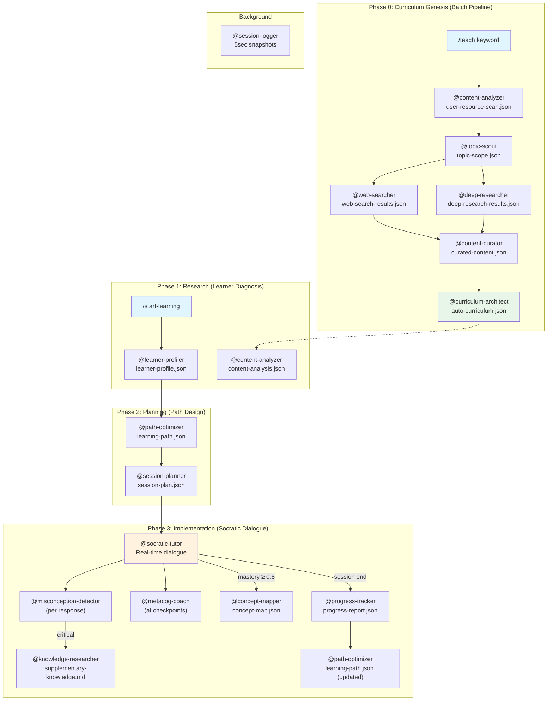

# Socratic AI Tutor — Builder Workflow

Build a fully autonomous personalized education AI system. 13 unique agent definitions (17 role slots including reused and sub-agents) collaborate via Socratic method to deliver 1:1 customized tutoring — from keyword-to-curriculum auto-generation to real-time adaptive dialogue.

## Overview

- **Input**: `coding-resource/PRD.md` (requirements specification) + `coding-resource/socratic-ai-tutor-workflow.md` (original design document)
- **Output**: Complete, working Socratic AI Tutor system — 17 sub-agents, 9 slash commands, 7 MCP server integrations, dual-SOT state management, Phase 0 batch pipeline, Phase 1-3 interactive Skill
- **Frequency**: One-time build → persistent system
- **Autopilot**: enabled — full automation with quality gates at every step
- **pACS**: enabled — Pre-mortem Anchored Confidence Score at every step

> **Absolute Goal**: This workflow exists for one purpose — to produce a **working** Socratic AI Tutor system that, once built, transforms any keyword into a complete pedagogical curriculum and delivers 1:1 Socratic tutoring sessions. Every step, every agent, every decision serves this single goal.

---

## Inherited DNA (Parent Genome)

> This workflow inherits the complete genome of AgenticWorkflow.
> Purpose varies by domain; the genome is identical. See `soul.md §0`.

**Constitutional Principles** (adapted to this workflow's domain):

1. **Quality Absolutism** — The Socratic AI Tutor must deliver educationally rigorous, pedagogically sound output. No shortcuts in agent design, question quality, or learning path logic. Speed and token cost are irrelevant compared to educational effectiveness.
2. **Single-File SOT** — `data/socratic/state.yaml` for workflow state, `data/socratic/learner-state.yaml` for learner state. Both managed by Orchestrator only. This dual-SOT is architecturally justified (PRD §7.4) — workflow state and learner state have fundamentally different lifecycles.
3. **Code Change Protocol** — Every implementation step follows Intent → Ripple Analysis → Change Plan. The 17-agent system has deep interdependencies (agent ↔ SOT ↔ slash command ↔ hook ↔ MCP). Coding Anchor Points (CAP-1~4) are internalized: think before coding (CAP-1), simplicity first (CAP-2), goal-based execution (CAP-3), surgical changes (CAP-4).

**Inherited Patterns**:

| DNA Component | Inherited Form |
|--------------|---------------|
| 3-Phase Structure | Research → Planning → Implementation |
| SOT Pattern | `data/socratic/state.yaml` — single writer (Orchestrator) |
| 4-Layer QA | L0 Anti-Skip → L1 Verification → L1.5 pACS → L2 Adversarial Review |
| P1 Hallucination Prevention | Deterministic validation scripts (`validate_*.py`) |
| P2 Expert Delegation | 17 specialized agents, each with pedagogical justification |
| Safety Hooks | `block_destructive_commands.py` — dangerous command blocking |
| Adversarial Review | `@reviewer` for architecture & final system review |
| Decision Log | `autopilot-logs/` — transparent decision tracking |
| Context Preservation | Snapshot + Knowledge Archive + RLM restoration |
| Cross-Step Traceability | `[trace:step-N:section-id]` markers for design→implementation linking |

**Domain-Specific Gene Expression**:
- **P1 (Data Refinement)** gene is strongly expressed — the PRD contains 1,500+ lines of requirements that must be precisely extracted and transformed into working code. Pre-processing scripts filter PRD sections before agent analysis.
- **P2 (Expert Delegation)** gene is critically expressed — 17 agents with distinct pedagogical roles require careful persona engineering. Each agent has a unique educational theory foundation.
- **Adversarial Review** gene is expressed at key design and final implementation checkpoints — educational content demands high accuracy. Review gates at Steps 10 and 19.
- **Cross-Step Traceability** gene is expressed throughout — every implementation artifact must trace back through planning to research findings. `[trace:step-N:section-id]` markers enforce this.

---

## Research

### 1. PRD & Design Document Deep Analysis
- **Pre-processing**: Python script to split PRD into structured sections (§7 Agents, §8 Execution Flows, §9 Commands, §11 Data Structures, §14 MCP) — each section becomes a focused input file for the analyst agent. Eliminates cross-section noise.
- **Agent**: `@prd-analyst`
- **Verification**:
  - [ ] All 17 agents listed with: name, phase, role, trigger, output file (cross-referenced with PRD §7.2 table — 0 omissions)
  - [ ] All 15+ JSON schemas extracted with field-level detail (PRD §8.1–§8.9 — complete field inventory)
  - [ ] All 9 slash commands documented with: name, args, action flow, example (PRD §9.1 — 0 omissions)
  - [ ] All 7 MCP servers catalogued with: name, purpose, consuming agent (PRD §14.1 — 0 omissions)
  - [ ] Dual execution mode (Mode A batch vs Mode B interactive) architecture captured with SOT mapping
  - [ ] User-Resource priority policy (Case A/B branching logic) fully documented
  - [ ] All 17 quality metrics extracted (Q1-Q6, E1-E7, C1-C4) with targets
  - [ ] All 5 risks extracted with mitigation strategies (PRD §15.1)
  - [ ] Cross-reference check: every agent output file maps to a consuming agent or user-facing command
- **Task**: Perform exhaustive extraction of every requirement, specification, data schema, agent definition, command interface, and quality metric from both PRD.md and the original design document. Produce a structured requirements manifest that serves as the single reference for all subsequent steps.
- **Output**: `research/requirements-manifest.md`
- **Translation**: `@translator` → `research/requirements-manifest.ko.md`
- **Post-processing**: Python validation script — count agents (expect 17), count schemas (expect ≥15), count commands (expect 9), count MCPs (expect 7). Fail if any count mismatches PRD.

### 2. Technology Feasibility & MCP Server Assessment
- **Agent**: `@tech-scout`
- **Verification**:
  - [ ] Each of 7 MCP servers assessed for: availability (exists/needs-building), integration method, fallback strategy
  - [ ] Claude Code runtime constraints mapped: context window (200K tokens), single session, file-based state, CLI interface
  - [ ] Tool availability confirmed for each agent (WebSearch, WebFetch, Read, Write, Edit, Bash, Task, Glob, Grep)
  - [ ] Feasibility rating (HIGH/MEDIUM/LOW) for each MCP with justification
  - [ ] Fallback plan for every LOW-feasibility MCP (concrete alternative, not vague)
  - [ ] 5-second session snapshot mechanism feasibility assessed for `@session-logger`
- **Task**: Assess technical feasibility of every MCP server, tool dependency, and runtime constraint. For each MCP, determine if it exists as a standard plugin, requires custom implementation, or needs a viable fallback. Map Claude Code's actual capabilities against PRD requirements.
- **Output**: `research/tech-feasibility-report.md`
- **Translation**: none

### 3. Educational Pedagogy Framework Verification
- **Pre-processing**: Extract all educational theory references from PRD §12 into a structured list (theory name → section → implementing agent) using regex pattern matching. Feed the structured list (not raw PRD) to the analyst.
- **Agent**: `@edu-analyst`
- **Verification**:
  - [ ] All 10 educational theories (PRD §12) mapped to implementing agents with verification that the mapping is educationally sound
  - [ ] Socratic 3-level questioning model validated: Level 1 (confirmation) → Level 2 (exploration) → Level 3 (refutation) with concrete prompt patterns for each
  - [ ] 17-agent separation justified on pedagogical grounds (trigger condition differences documented)
  - [ ] ZPD-based adaptive difficulty algorithm design verified against Vygotsky's framework
  - [ ] Spaced repetition algorithm selection justified (Ebbinghaus curve parameters)
  - [ ] Metacognition checkpoint timing strategy validated (Flavell 1979, Schraw & Dennison 1994)
  - [ ] Misconception detection taxonomy established (overgeneralization, missing edge cases, etc.)
  - [ ] Transfer challenge design validated (same-field + far-transfer types with pedagogical rationale)
- **Task**: Verify that every educational theory referenced in the PRD has a concrete, implementable mapping to the agent system. Validate the pedagogical soundness of the Socratic questioning hierarchy, the agent separation rationale, and the learning algorithms. Produce a pedagogy implementation guide that translates educational theory into agent behavior specifications.
- **Output**: `research/pedagogy-implementation-guide.md`
- **Translation**: `@translator` → `research/pedagogy-implementation-guide.ko.md`
- **Post-processing**: Cross-reference validation — check that every agent mentioned in the pedagogy guide exists in the requirements manifest (Step 1). Flag orphaned theory→agent mappings.

### 4. (human) Research Findings Approval
- **Action**: Review the three research outputs:
  1. **Requirements Manifest** — Are all 17 agents, 9 commands, 7 MCPs, 15+ schemas captured?
  2. **Tech Feasibility** — Are MCP fallback plans acceptable? Any blocking constraints?
  3. **Pedagogy Guide** — Does the educational framework mapping satisfy pedagogical rigor?
- **Command**: `/review-research`

---

## Planning

### 5. System Architecture Blueprint
- **Pre-processing**: Merge key outputs from Steps 1-3 into a consolidated architecture input: agent list (Step 1) + feasibility constraints (Step 2) + pedagogy mappings (Step 3). Python script produces a single `temp/architecture-inputs.md` — eliminates need for architect to cross-reference 3 documents.
- **Agent**: `@architect`
- **Verification**:
  - [ ] Dual execution mode (Mode A + Mode B) architecture diagram with data flow arrows between all components
  - [ ] Dual SOT design: `state.yaml` schema (workflow) + `learner-state.yaml` schema (learner) with field-level detail
  - [ ] Directory structure matches PRD §11.2 exactly: `data/socratic/` with all 7 subdirectories
  - [ ] Agent orchestration graph: which agent calls which, in what order, under what conditions
  - [ ] State transition diagram for Phase 0 pipeline (6 agents, sequential + parallel stages)
  - [ ] State transition diagram for Phase 1-3 session lifecycle (start → warm-up → deep-dive → synthesis → end)
  - [ ] Session recovery mechanism design (5-second snapshot + `/resume` flow)
  - [ ] Context window budget allocation across 17 agents (ensure no single session exceeds 200K tokens)
  - [ ] Data flow diagram: every JSON file traced from producing agent to consuming agent(s)
  - [ ] Error handling strategy for each failure mode (PRD §15.1 risks)
  - [ ] [trace:step-1:agent-list] — Agent list traces to Step 1 requirements manifest
  - [ ] [trace:step-2:mcp-feasibility] — MCP integration design traces to Step 2 feasibility report
  - [ ] [trace:step-3:pedagogy-mapping] — Agent behavior design traces to Step 3 pedagogy guide
- **Task**: Design the complete system architecture integrating all research findings. This is the master blueprint — every subsequent implementation step derives from this document. Include Mermaid diagrams for all architecture views. Design the dual-SOT schema with full field definitions. Map the complete data flow across all 17 agents and 15+ JSON files.
- **Output**: `planning/architecture-blueprint.md`
- **Translation**: `@translator` → `planning/architecture-blueprint.ko.md`
- **Post-processing**: `python3 .claude/hooks/scripts/validate_traceability.py --step 5 --project-dir .` — verify cross-step traceability markers resolve to existing Step 1-3 outputs
- **Review**: `@reviewer` — Architecture soundness, SOT design, data flow completeness

### 6. (team) Agent Persona & System Prompt Design
- **Team**: `step-6-agent-design`
- **Checkpoint Pattern**: dense — each designer produces 5-6 complex agent definitions requiring mid-point alignment
- **Tasks**:
  - `@agent-designer-alpha` (opus): Phase 0 agents — `@content-analyzer`, `@topic-scout`, `@web-searcher`, `@deep-researcher`, `@content-curator`, `@curriculum-architect` (6 agents)
    - CP-1: Agent skeleton (name, model, tools, maxTurns) for all 6 agents
    - CP-2: System prompts draft (pedagogical behavior encoding)
    - CP-3: Final prompts with inter-agent calling protocols
  - `@agent-designer-beta` (opus): Phase 1-2 agents + orchestrator — `@orchestrator`, `@learner-profiler`, `@knowledge-researcher`, `@path-optimizer`, `@session-planner`, `@session-logger` (6 agents)
    - CP-1: Agent skeleton for all 6 agents
    - CP-2: System prompts draft (SOT management for @orchestrator, session lifecycle for others)
    - CP-3: Final prompts with state management protocols
  - `@agent-designer-gamma` (opus): Phase 3 agents — `@socratic-tutor`, `@misconception-detector`, `@metacog-coach`, `@concept-mapper`, `@progress-tracker` (5 agents, but @socratic-tutor is the most complex)
    - CP-1: Agent skeleton for all 5 agents
    - CP-2: System prompts draft (@socratic-tutor 3-level questioning, @misconception-detector severity taxonomy)
    - CP-3: Final prompts with sub-agent calling chains
- **Join**: All 3 designers complete → Team Lead reviews cross-team consistency (naming conventions, SOT access patterns, tool assignments)
- **SOT Write**: Team Lead only updates `state.yaml` (teammates produce persona files only)
- **Verification**:
  - [ ] All 17 unique agent definitions produced (cross-check with PRD §7.2 — 0 omissions)
  - [ ] Each agent has: name, description, model selection (opus/sonnet/haiku with quality justification), tools list, maxTurns, memory scope, system prompt (≥ 200 words)
  - [ ] System prompts encode pedagogical behavior from Step 3 pedagogy guide [trace:step-3:pedagogy-mapping]
  - [ ] `@socratic-tutor` prompt embeds: 3-level questioning balance, never-give-answers rule, scaffolding strategy, sub-agent calling protocol
  - [ ] `@misconception-detector` prompt embeds: severity classification (minor/moderate/critical), detection patterns, `@knowledge-researcher` auto-trigger on critical
  - [ ] `@metacog-coach` prompt embeds: checkpoint-based activation, 4 metacognition question types
  - [ ] Agent-to-agent calling chains verified: `@socratic-tutor` → `@misconception-detector` → `@knowledge-researcher` chain is explicit
  - [ ] `@orchestrator` prompt embeds: SOT write authority, agent dispatch rules, session lifecycle management
  - [ ] `@session-logger` prompt embeds: 5-second snapshot logic, recovery checkpoint format
  - [ ] Tool assignments follow least-privilege principle (agents only get tools they need)
  - [ ] Model selection justified for each agent (opus for @socratic-tutor/complex analysis, sonnet for search/scanning, haiku for monitoring/per-response detection)
  - [ ] All 9 Required Skills from PRD §14.2 embedded across agent personas: topic-analysis, content-quality-scoring, curriculum-design, knowledge-integration, socratic-questioning, adaptive-learning, misconception-patterns, metacognition-prompts, knowledge-graph (source: Step 1)
  - [ ] [trace:step-5:architecture] — Agent interaction patterns trace to Step 5 architecture blueprint
- **Task**: Design complete system prompts for all 17 agents. Each prompt must encode the agent's pedagogical role, interaction protocols, output format requirements, and calling relationships. This is the most quality-critical step — agent prompts determine the educational experience quality.
- **Output**: `planning/agent-personas/` (17 files: `{agent-name}-persona.md`)
- **Translation**: none (agent prompts are in English for AI performance — English-First principle)

### 7. Data Architecture & JSON Schema Design
- **Pre-processing**: Extract all JSON field references from PRD §8.1-§8.9 into a structured field inventory (`temp/field-inventory.json`). Python script parses PRD markdown tables and code blocks to produce deterministic field list.
- **Agent**: `@schema-designer`
- **Verification**:
  - [ ] All 15+ JSON schemas defined with: every field, type, required/optional, example values, validation rules
  - [ ] Schema chain integrity verified: output of agent N is valid input for agent N+1 (no field name mismatches)
  - [ ] `auto-curriculum.json` schema includes: curriculum_id, modules[].lessons[].socratic_questions (3 levels), concept_dependency_graph, transfer_challenges, adaptive_paths
  - [ ] `learner-state.yaml` schema includes: knowledge_state (concept→mastery+confidence), learning_style, response_pattern (avg_time, confidence_accuracy_gap, error_types), session history
  - [ ] `session-log.json` schema includes: micro-state tracking (module→lesson→phase→question_level→progress_pct), conversation context, recovery checkpoint
  - [ ] User-Resource priority policy encoded: Case A (user-resource PRIMARY, quality 1.0) vs Case B (FALLBACK, all PRIMARY, quality ≥ 0.6)
  - [ ] `misconception-alert.json` schema includes: type taxonomy, severity enum, recommended_action field
  - [ ] `progress-report.json` schema includes: mastery_change, socratic_depth_reached, metacognitive_moments, growth_insights
  - [ ] All schema cross-references resolved (concept_id referenced across multiple schemas is consistent)
  - [ ] [trace:step-1:json-schemas] — Schema fields trace to Step 1 requirements manifest
- **Task**: Design complete JSON/YAML schemas for all 15+ data files. Ensure schema chain integrity across the full pipeline — from `user-resource-scan.json` through `auto-curriculum.json` to `progress-report.json`. Include validation rules that can be checked programmatically.
- **Output**: `planning/data-schemas.md`
- **Translation**: none
- **Post-processing**: Python script to validate schema chain — parse all schema definitions and verify that every field referenced by a downstream schema exists in its upstream producer schema. Output: `temp/schema-chain-validation.json`.

### 8. Command Interface & Interaction Flow Design
- **Agent**: `@interface-designer`
- **Verification**:
  - [ ] All 9 slash commands designed: `/teach`, `/teach-from-file`, `/start-learning`, `/upload-content`, `/my-progress`, `/concept-map`, `/challenge`, `/end-session`, `/resume`
  - [ ] Each command has: argument specification, validation rules, execution flow (step-by-step agent dispatch), output format, error handling
  - [ ] `/teach` flow: keyword parsing → Case A/B branching → 6-agent pipeline → progress display → curriculum summary
  - [ ] `/start-learning` flow: profiling → path optimization → session planning → tutor activation → background logger start
  - [ ] `/resume` flow: session recovery scan → checkpoint load → context restoration → tutor resumption
  - [ ] Progress display design: compact during execution, detailed on completion (PRD §8.1)
  - [ ] Error messages designed for each failure scenario (no curriculum found, session not recoverable, etc.)
  - [ ] Command-to-agent mapping verified: every command triggers the correct agent sequence
  - [ ] [trace:step-5:command-flow] — Command execution flows trace to Step 5 architecture blueprint
- **Task**: Design the complete slash command interface — argument parsing, execution flow, agent dispatch sequence, user-facing output format, and error handling for all 9 commands. Include the progress display rules (compact during, detailed after) from the PRD.
- **Output**: `planning/command-interface-design.md`
- **Translation**: none

### 9. Quality Framework & Testing Strategy Design
- **Agent**: `@qa-designer`
- **Verification**:
  - [ ] All 17 quality metrics (Q1-Q6, E1-E7, C1-C4) have: measurement method, data source, threshold, automated check (where possible)
  - [ ] Curriculum quality validation strategy: Source Diversity check, Content Freshness check, Completeness coverage analysis
  - [ ] Socratic dialogue quality assessment: Level distribution balance, scaffolding appropriateness, never-give-answer compliance
  - [ ] Integration test plan: at least 3 end-to-end scenarios (keyword-to-curriculum, full tutoring session, session recovery)
  - [ ] Test data: 3 keyword examples from PRD (경제학원론, 블록체인, 양자역학)
  - [ ] Session logging validation: 5-second snapshot integrity, recovery checkpoint correctness
  - [ ] Risk mitigation verification plan for all 5 risks (PRD §15.1)
  - [ ] [trace:step-1:quality-metrics] — Quality metrics trace to Step 1 requirements manifest
- **Task**: Design the complete quality assurance framework. Map every quality metric to a concrete measurement method. Design integration test scenarios that validate the full system pipeline from keyword input to tutoring session completion.
- **Output**: `planning/quality-framework.md`
- **Translation**: none

### 10. Review: Architecture & Design Completeness
- **Agent**: `@reviewer`
- **Review**: `@reviewer` — adversarial review of all planning outputs (Steps 5-9)
- **Verification**:
  - [ ] Architecture blueprint (Step 5) is internally consistent — no contradictions between diagrams
  - [ ] All 17 agent personas (Step 6) align with PRD specifications — no role drift, no missing capabilities
  - [ ] Data schemas (Step 7) form a complete, consistent chain — no broken references
  - [ ] Command interfaces (Step 8) correctly dispatch to agents defined in Step 6
  - [ ] Quality framework (Step 9) covers all 17 metrics and 5 risks from PRD
  - [ ] No PRD requirement is unaddressed across all planning documents (completeness audit)
  - [ ] Cross-step traceability: every planning artifact traces back to a research finding
- **Task**: Perform adversarial review of the complete planning phase. Check for internal consistency, PRD compliance, cross-document coherence, and completeness. Flag any gaps, contradictions, or unaddressed requirements.
- **Output**: `review-logs/step-10-review.md`
- **Translation**: none

### 11. (human) Complete Design Approval
- **Action**: Review the complete planning phase:
  1. **Architecture Blueprint** — Is the dual-mode, dual-SOT design sound?
  2. **Agent Personas** — Do the 17 agent prompts satisfy pedagogical requirements?
  3. **Data Schemas** — Are all 15+ JSON schemas complete and consistent?
  4. **Command Interface** — Are all 9 commands properly designed?
  5. **Quality Framework** — Does the testing strategy cover all risks?
  6. **Reviewer Report** — Are all flagged issues resolved?
- **Command**: `/approve-design`

---

## Implementation

### 12. Project Scaffolding & SOT Initialization
- **Agent**: `@builder`
- **Verification**:
  - [ ] Directory structure created matching PRD §11.2 exactly:
    ```
    data/socratic/
    ├── state.yaml
    ├── learner-state.yaml
    ├── user-resource/
    ├── curriculum/
    ├── analysis/
    ├── planning/
    ├── sessions/{active,completed,interrupted,snapshots}/
    ├── reports/
    └── misconceptions/
    ```
  - [ ] `state.yaml` initialized with all fields from Step 5 architecture blueprint [trace:step-5:sot-schema]
  - [ ] `learner-state.yaml` template created with all fields from Step 7 data schemas [trace:step-7:learner-schema]
  - [ ] `.gitkeep` in every empty directory to preserve structure
  - [ ] File permissions correct (SOT files read-only for all agents except orchestrator)
  - [ ] No stale files from previous builds present
- **Task**: Create the complete project directory structure and initialize SOT files with proper schemas. This establishes the physical infrastructure that all subsequent implementation steps build upon.
- **Output**: `data/socratic/` directory tree + initialized SOT files
- **Translation**: none
- **Post-processing**: Bash validation — `find data/socratic/ -type d | wc -l` matches expected directory count. `python3 -c "import yaml; yaml.safe_load(open('data/socratic/state.yaml'))"` validates YAML syntax.

### 13. (team) Sub-Agent Implementation — 17 Agents
- **Team**: `step-13-agent-impl`
- **Checkpoint Pattern**: dense — each implementer produces 5-6 complex agent files requiring cross-validation
- **Tasks**:
  - `@implementer-alpha` (opus): Phase 0 agents — `@content-analyzer`, `@topic-scout`, `@web-searcher`, `@deep-researcher`, `@content-curator`, `@curriculum-architect` (6 agents)
    - CP-1: Agent frontmatter (YAML metadata validated)
    - CP-2: System prompt implementation (pedagogical behavior from Step 6 personas)
    - CP-3: Cross-agent integration testing (calling chains work)
  - `@implementer-beta` (opus): Phase 1-2 agents + orchestrator — `@orchestrator`, `@learner-profiler`, `@knowledge-researcher`, `@path-optimizer`, `@session-planner`, `@session-logger` (6 agents)
    - CP-1: Agent frontmatter (SOT access patterns verified)
    - CP-2: System prompt implementation (@orchestrator SOT write logic)
    - CP-3: State management integration testing
  - `@implementer-gamma` (opus): Phase 3 agents — `@socratic-tutor`, `@misconception-detector`, `@metacog-coach`, `@concept-mapper`, `@progress-tracker` (5 agents)
    - CP-1: Agent frontmatter (@socratic-tutor special config)
    - CP-2: System prompt implementation (3-level questioning, misconception detection)
    - CP-3: Sub-agent calling chain testing (@tutor → @detector → @researcher)
- **Join**: All 3 implementers complete → Team Lead validates: all 17 files exist, frontmatter YAML is valid, naming conventions consistent, tool assignments match architecture
- **SOT Write**: Team Lead only updates `state.yaml` (teammates produce `.claude/agents/*.md` files only)
- **Verification**:
  - [ ] 17 agent files created in `.claude/agents/`: one `.md` file per agent
  - [ ] Each agent file has valid frontmatter: name, description, model, tools, maxTurns, memory, permissionMode
  - [ ] System prompts match Step 6 persona designs [trace:step-6:personas]
  - [ ] Tool assignments match Step 5 architecture blueprint [trace:step-5:tool-mapping]
  - [ ] Model selections follow quality-based criteria (PRD §14.4 context window awareness):
    - `opus`: `@socratic-tutor`, `@curriculum-architect`, `@content-analyzer`
    - `sonnet`: `@topic-scout`, `@web-searcher`, `@deep-researcher`, `@content-curator`, `@learner-profiler`, `@path-optimizer`, `@session-planner`, `@orchestrator`
    - `haiku`: `@session-logger`, `@progress-tracker`, `@concept-mapper`, `@misconception-detector`, `@metacog-coach`, `@knowledge-researcher`
  - [ ] `@socratic-tutor` includes: 3-level question protocol, never-answer rule, sub-agent calling (@misconception-detector per response, @metacog-coach at checkpoints)
  - [ ] `@orchestrator` includes: SOT write logic, agent dispatch rules, Phase 0 pipeline coordination, Phase 1-3 session lifecycle
  - [ ] `@session-logger` includes: 5-second snapshot mechanism, recovery checkpoint generation, session state serialization
  - [ ] `@misconception-detector` includes: severity taxonomy (minor/moderate/critical), @knowledge-researcher trigger on critical
  - [ ] No syntax errors in any frontmatter YAML
  - [ ] Each agent can be successfully loaded by Claude Code (valid format validation)
- **Task**: Implement all 17 sub-agent definition files based on the persona designs from Step 6. Each file must be a complete, syntactically valid Claude Code agent definition with a comprehensive system prompt that encodes the agent's pedagogical role, behavioral rules, interaction protocols, and output format requirements.
- **Output**: `.claude/agents/{agent-name}.md` × 17 files
- **Translation**: none
- **Post-processing**:
  - `ls .claude/agents/*.md | wc -l` confirms 17 files. Bash YAML frontmatter syntax check on each file.
  - `python3 .claude/hooks/scripts/validate_traceability.py --step 13 --project-dir .` — verify trace markers to Step 5 architecture and Step 6 personas resolve correctly

### 14. Phase 0 Pipeline: Zero-to-Curriculum Engine
- **Pre-processing**: Extract Phase 0 agent calling sequence from Step 5 architecture blueprint and Step 6 agent personas into a consolidated pipeline specification (`temp/phase0-spec.md`). This focused input prevents the builder from re-reading all planning documents.
- **Agent**: `@pipeline-builder`
- **Verification**:
  - [ ] Phase 0 orchestration script created: dispatches 6 agents in correct sequence (scan → scout → parallel[web,deep] → curate → architect)
  - [ ] Case A/B branching logic implemented: user-resource relevance check (threshold 0.3) determines mode
  - [ ] Parallel execution of `@web-searcher` + `@deep-researcher` implemented (using Task tool)
  - [ ] Progress display logic implemented: compact during execution, detailed summary on completion
  - [ ] Each pipeline stage validates previous stage output before proceeding (L0 Anti-Skip pattern)
  - [ ] `depth` parameter correctly routes: quick (web only), standard (web + deep), deep (web + deep + academic focus)
  - [ ] All 6 intermediate JSON files written to `data/socratic/curriculum/` with correct schemas [trace:step-7:schemas]
  - [ ] Pipeline failure handling: retry on transient errors, graceful degradation on permanent failures
  - [ ] `auto-curriculum.json` output includes: modules, lessons, socratic_questions (3 levels per lesson), concept_dependency_graph, transfer_challenges, adaptive_paths
  - [ ] Generation time target: pipeline completes in < 5 minutes for standard depth
  - [ ] [trace:step-5:phase0-flow] — Pipeline stages trace to Step 5 architecture state transition diagram
  - [ ] [trace:step-8:teach-command] — Execution flow traces to Step 8 /teach command design
- **Task**: Implement the complete Phase 0 Zero-to-Curriculum pipeline — the automated engine that transforms a keyword into a full pedagogical curriculum. This is the core innovation of the system. Implement the 6-agent orchestration with Case A/B branching, parallel execution, progress display, and comprehensive error handling.
- **Output**: `.claude/skills/socratic-tutor/phase0-pipeline.md` + supporting scripts
- **Translation**: none

### 15. Phase 1-3 Skill: Socratic Tutoring Engine
- **Pre-processing**: Extract Phase 1-3 session lifecycle from Step 5 architecture and relevant agent personas (Steps 6: @learner-profiler, @path-optimizer, @session-planner, @socratic-tutor, @session-logger) into `temp/phase13-spec.md`.
- **Agent**: `@skill-builder`
- **Verification**:
  - [ ] Socratic tutoring Skill definition created at `.claude/skills/socratic-tutor/SKILL.md`
  - [ ] Skill implements the complete `/start-learning` flow: profiling → path optimization → session planning → tutor activation
  - [ ] Warm-up → Deep Dive → Synthesis session structure implemented with timing parameters
  - [ ] `@socratic-tutor` correctly invokes `@misconception-detector` on every learner response
  - [ ] `@socratic-tutor` correctly invokes `@metacog-coach` at designated checkpoints
  - [ ] Mastery tracking: `learner-state.yaml` updated after each concept assessment
  - [ ] `confidence_accuracy_gap` calculation implemented: |confidence - mastery| tracked per concept
  - [ ] Transfer challenge auto-trigger at mastery ≥ 0.8 implemented
  - [ ] `@concept-mapper` invoked on concept mastery completion
  - [ ] `@progress-tracker` invoked on session end with full session summary
  - [ ] `@path-optimizer` invoked on session end to update learning path
  - [ ] Session exit conditions implemented: success (objectives met), user exit (anytime), timeout (45min soft limit)
  - [ ] `@session-logger` background snapshot mechanism implemented (5-second interval)
  - [ ] `/resume` session recovery flow implemented: scan active/interrupted → load checkpoint → restore context → resume tutor
  - [ ] [trace:step-5:phase13-flow] — Session lifecycle traces to Step 5 architecture diagram
  - [ ] [trace:step-6:tutor-persona] — Tutor behavior traces to Step 6 @socratic-tutor persona
- **Task**: Implement the complete Phase 1-3 Socratic Tutoring Skill — the interactive engine that conducts real-time Socratic dialogue with learners. This is the heart of the educational experience. Implement learner profiling, adaptive path optimization, session planning, the Socratic tutor with sub-agent integration, session logging with recovery, and progress tracking.
- **Output**: `.claude/skills/socratic-tutor/SKILL.md` + `references/` (session templates, question banks, etc.)
- **Translation**: none

### 16. Slash Command Implementation — 9 Commands
- **Agent**: `@command-builder`
- **Verification**:
  - [ ] All 9 slash commands implemented as `.claude/commands/{command}.md`:
    1. `/teach` — keyword-to-curriculum (Phase 0 pipeline dispatch)
    2. `/teach-from-file` — file-based curriculum generation
    3. `/start-learning` — Socratic session start (Phase 1-3 Skill activation)
    4. `/upload-content` — new content analysis and integration
    5. `/my-progress` — progress report generation
    6. `/concept-map` — concept relationship visualization
    7. `/challenge` — transfer learning challenge request
    8. `/end-session` — session termination with summary
    9. `/resume` — interrupted session recovery
  - [ ] Each command: validates arguments, dispatches correct agent(s), handles errors gracefully
  - [ ] `/teach` correctly branches Case A/B based on `user-resource/` contents
  - [ ] `/teach` `depth` argument correctly routes pipeline (quick/standard/deep)
  - [ ] `/resume` correctly scans `sessions/active/` and `sessions/interrupted/` directories
  - [ ] All commands produce user-friendly output in Korean (user-facing) while agents work in English
  - [ ] Error messages are helpful and actionable (not technical stack traces)
  - [ ] [trace:step-8:command-spec] — Each command implementation traces to Step 8 interface design
- **Task**: Implement all 9 slash commands as Claude Code command definition files. Each command is the user-facing entry point that dispatches to the appropriate agents and produces user-friendly output.
- **Output**: `.claude/commands/{command}.md` × 9 files
- **Translation**: none

### 17. Hook & State Management Implementation
- **Agent**: `@infra-builder`
- **Verification**:
  - [ ] Session state management hooks implemented:
    - PreToolUse hook for `learner-state.yaml` write protection (only @orchestrator can write)
    - PostToolUse hook for session activity tracking
    - Stop hook for session snapshot on unexpected termination
  - [ ] `@session-logger` background logging mechanism configured (5-second snapshot to `sessions/snapshots/`)
  - [ ] Session recovery infrastructure: checkpoint format, recovery scan logic, context restoration
  - [ ] SOT write protection: `state.yaml` and `learner-state.yaml` guarded against unauthorized writes
  - [ ] Mastery state persistence: `learner-state.yaml` correctly persists across sessions
  - [ ] MCP server configuration (for available servers):
    - Web search integration (WebSearch tool or web-search-mcp)
    - Deep research integration (Task + WebSearch or deep-research-mcp)
    - Scholar search integration (WebSearch with academic filters or scholar-search-mcp)
    - Concept graph rendering (Mermaid-based fallback if graph-renderer-mcp unavailable)
    - Analytics (file-based calculation if analytics-mcp unavailable)
  - [ ] Fallback implementations for unavailable MCP servers [trace:step-2:mcp-fallbacks]
  - [ ] Configuration files validated — no syntax errors, correct paths
- **Task**: Implement the infrastructure layer — hooks for state management, session logging configuration, SOT write protection, and MCP server integrations (with fallbacks where needed). This is the invisible plumbing that makes the system reliable.
- **Output**: Hook configuration entries + MCP integration scripts + state management utilities
- **Translation**: none

### 18. Integration Testing & System Validation
- **Pre-processing**: Generate test fixture data from Step 7 data schemas — create sample `user-resource/` files, expected JSON outputs for each pipeline stage. Python script produces `testing/fixtures/` directory with deterministic test inputs.
- **Agent**: `@tester`
- **Verification**:
  - [ ] **Test 1 — Keyword-to-Curriculum (Case B)**: `/teach 블록체인` → verifies full Phase 0 pipeline produces `auto-curriculum.json` with ≥ 3 modules, ≥ 10 lessons, socratic_questions at all 3 levels
  - [ ] **Test 2 — User-Resource Curriculum (Case A)**: `/teach 경제학원론` with sample files in `user-resource/` → verifies Case A branching, user-resource PRIMARY tagging, curriculum reflects uploaded content
  - [ ] **Test 3 — Socratic Session Lifecycle**: `/start-learning` → learner profiling → at least 5 question-answer exchanges → misconception detection fires → session ends → progress report generated
  - [ ] **Test 4 — Session Recovery**: Start session → simulate interruption → `/resume` → verify conversation context restored, question position correct
  - [ ] **Test 5 — Quality Metrics Validation**: Generated curriculum checked against Q1-Q6 metrics (Source Diversity, Content Freshness, Completeness, Question Quality, Generation Time, Expert Alignment proxy)
  - [ ] All 9 slash commands tested for: valid input, invalid input, edge cases
  - [ ] SOT integrity maintained throughout all tests (no corruption, no unauthorized writes)
  - [ ] `learner-state.yaml` correctly tracks mastery changes across test sessions
  - [ ] No agent produces hallucinated file references or broken JSON
  - [ ] System operates within 200K token context window for all test scenarios
  - [ ] [trace:step-9:test-plan] — Test cases trace to Step 9 quality framework
- **Task**: Execute the complete integration test suite. Run all 5 end-to-end test scenarios. Validate every quality metric. Verify SOT integrity. Document results with pass/fail for each test case. If any test fails, document the failure with root cause analysis and fix.
- **Output**: `testing/integration-test-results.md`
- **Translation**: none

### 19. Review: Final System Completeness
- **Agent**: `@reviewer`
- **Review**: `@reviewer` — adversarial review of the complete implemented system
- **Verification**:
  - [ ] All 17 agent files exist and are syntactically valid
  - [ ] All 9 slash commands exist and are functional
  - [ ] Phase 0 pipeline produces valid curriculum from keyword
  - [ ] Phase 1-3 Skill conducts valid Socratic dialogue
  - [ ] Dual SOT files are correctly initialized and maintained
  - [ ] Session logging and recovery works end-to-end
  - [ ] All 15+ JSON schemas are implemented as specified
  - [ ] Directory structure matches PRD §11.2
  - [ ] PRD §4.1 automation principle satisfied — Phase 0 runs without user confirmation
  - [ ] PRD §8.2 absolute principle satisfied — `@socratic-tutor` never gives direct answers
  - [ ] No orphaned files, no missing dependencies, no broken references
  - [ ] Cross-step traceability: every implementation artifact traces to a planning document traces to a research finding
  - [ ] Integration test results show all tests passing
- **Task**: Perform final adversarial review of the complete system. Verify that every PRD requirement is implemented, every agent is functional, every command works, and the system operates as a coherent whole. This is the last quality gate before user acceptance.
- **Output**: `review-logs/step-19-review.md`
- **Translation**: none

### 20. (human) System Acceptance & Deployment Guide
- **Action**: Final system review and acceptance:
  1. **System Completeness** — Are all 17 agents, 9 commands, and supporting infrastructure in place?
  2. **Integration Tests** — Do all 5 test scenarios pass?
  3. **Reviewer Report** — Are all flagged issues resolved?
  4. **Try It**: Run `/teach [your-keyword]` to see the Zero-to-Curriculum pipeline in action
  5. **Try It**: Run `/start-learning` to experience a Socratic tutoring session
- **Command**: `/accept-system`

### 21. User Documentation & Quick-Start Guide
- **Agent**: `@documenter`
- **Verification**:
  - [ ] Quick-start guide covers: installation (none — just `cd` into project), first `/teach` command, first `/start-learning` session
  - [ ] All 9 slash commands documented with examples
  - [ ] Troubleshooting section for common issues (no curriculum generated, session recovery failed, etc.)
  - [ ] Architecture overview for developers (how to extend, add agents, modify behavior)
  - [ ] Learner guide: how Socratic method works, what to expect, how progress tracking works
  - [ ] Professor guide: how to use `user-resource/`, how to customize curriculum, how to view student progress
- **Task**: Generate comprehensive user documentation — a quick-start guide, command reference, troubleshooting guide, and separate guides for learners and professors. Documentation should enable any user to start using the system immediately.
- **Output**: `docs/user-guide.md` + `docs/quick-start.md` + `docs/developer-guide.md`
- **Translation**: `@translator` → `docs/user-guide.ko.md` + `docs/quick-start.ko.md`

---

## Claude Code Configuration

### Sub-agents (Builder Workflow Agents)

> These are the agents used by **this builder workflow** to construct the Socratic AI Tutor system.
> The 17 Socratic AI Tutor agents are **outputs** of Steps 6 and 13.

```yaml
# Phase: Research
prd-analyst:
  name: prd-analyst
  description: "Exhaustive requirements extractor — extracts all agents, schemas, commands, MCPs, and quality metrics from PRD and design documents with zero omissions"
  model: opus
  tools: Read, Glob, Grep, Write
  maxTurns: 40
  memory: project

tech-scout:
  name: tech-scout
  description: "Technology feasibility analyst — assesses MCP server availability, tool compatibility, runtime constraints, and designs concrete fallback strategies"
  model: sonnet
  tools: Read, Glob, Grep, WebSearch, WebFetch, Write
  maxTurns: 30
  memory: project

edu-analyst:
  name: edu-analyst
  description: "Educational framework verification specialist — validates pedagogical soundness of agent-to-theory mappings and produces implementable behavior specifications"
  model: opus
  tools: Read, Glob, Grep, WebSearch, WebFetch, Write
  maxTurns: 30
  memory: project

# Phase: Planning
architect:
  name: architect
  description: "System architect — designs dual execution mode, dual SOT, 17-agent orchestration graph, data flow diagrams, and complete directory structure"
  model: opus
  tools: Read, Glob, Grep, Write, Edit
  maxTurns: 50
  memory: project

agent-designer-alpha:
  name: agent-designer-alpha
  description: "Agent persona designer (Phase 0) — creates system prompts for 6 Curriculum Genesis agents with pedagogical behavior encoding"
  model: opus
  tools: Read, Glob, Grep, Write
  maxTurns: 40
  memory: project

agent-designer-beta:
  name: agent-designer-beta
  description: "Agent persona designer (Phase 1-2) — creates system prompts for Orchestrator + 5 Research/Planning agents with SOT management protocols"
  model: opus
  tools: Read, Glob, Grep, Write
  maxTurns: 40
  memory: project

agent-designer-gamma:
  name: agent-designer-gamma
  description: "Agent persona designer (Phase 3) — creates system prompts for Socratic Tutor + 4 dialogue support agents with questioning hierarchy encoding"
  model: opus
  tools: Read, Glob, Grep, Write
  maxTurns: 40
  memory: project

schema-designer:
  name: schema-designer
  description: "Data architect — designs 15+ JSON/YAML schemas with schema chain integrity verification across the full agent pipeline"
  model: sonnet
  tools: Read, Glob, Grep, Write
  maxTurns: 30
  memory: project

interface-designer:
  name: interface-designer
  description: "Interface designer — designs argument parsing, execution flows, output formats, and error handling for all 9 slash commands"
  model: sonnet
  tools: Read, Glob, Grep, Write
  maxTurns: 25
  memory: project

qa-designer:
  name: qa-designer
  description: "QA strategist — designs measurement methods for 17 quality metrics and integration test scenarios covering the full system pipeline"
  model: sonnet
  tools: Read, Glob, Grep, Write
  maxTurns: 25
  memory: project

# Phase: Implementation
builder:
  name: builder
  description: "Infrastructure builder — creates project directory structure and initializes SOT files with proper schemas"
  model: sonnet
  tools: Read, Write, Edit, Bash, Glob, Grep
  maxTurns: 30
  memory: project

implementer-alpha:
  name: implementer-alpha
  description: "Agent implementer (Phase 0) — builds 6 Phase 0 agent definition files with complete system prompts from persona designs"
  model: opus
  tools: Read, Write, Edit, Glob, Grep
  maxTurns: 50
  memory: project

implementer-beta:
  name: implementer-beta
  description: "Agent implementer (Phase 1-2) — builds Orchestrator + 5 agent definition files with SOT management and session lifecycle logic"
  model: opus
  tools: Read, Write, Edit, Glob, Grep
  maxTurns: 50
  memory: project

implementer-gamma:
  name: implementer-gamma
  description: "Agent implementer (Phase 3) — builds Socratic Tutor + 4 agent definition files with 3-level questioning and sub-agent calling chains"
  model: opus
  tools: Read, Write, Edit, Glob, Grep
  maxTurns: 50
  memory: project

pipeline-builder:
  name: pipeline-builder
  description: "Pipeline builder — implements the Phase 0 Zero-to-Curriculum engine with 6-agent orchestration, Case A/B branching, and parallel execution"
  model: opus
  tools: Read, Write, Edit, Bash, Glob, Grep
  maxTurns: 50
  memory: project

skill-builder:
  name: skill-builder
  description: "Skill builder — implements the Phase 1-3 Socratic Tutoring Skill with real-time dialogue, mastery tracking, and session recovery"
  model: opus
  tools: Read, Write, Edit, Bash, Glob, Grep
  maxTurns: 60
  memory: project

command-builder:
  name: command-builder
  description: "Command builder — implements 9 slash command definition files with argument validation, agent dispatch, and user-friendly output"
  model: sonnet
  tools: Read, Write, Edit, Glob, Grep
  maxTurns: 40
  memory: project

infra-builder:
  name: infra-builder
  description: "Infrastructure builder — implements hooks for SOT protection, session logging, MCP server integrations, and fallback mechanisms"
  model: sonnet
  tools: Read, Write, Edit, Bash, Glob, Grep
  maxTurns: 40
  memory: project

tester:
  name: tester
  description: "QA engineer — executes 5 integration test scenarios, validates 17 quality metrics, and verifies SOT integrity across the complete system"
  model: opus
  tools: Read, Write, Edit, Bash, Glob, Grep
  maxTurns: 60
  memory: project

documenter:
  name: documenter
  description: "Technical writer — produces user guide, quick-start guide, developer guide with complete command reference and troubleshooting"
  model: sonnet
  tools: Read, Write, Edit, Glob, Grep
  maxTurns: 40
  memory: project
```

### Target System Agents (Output of Steps 6 & 13)

> These 17 agents are the **deliverables** — the actual Socratic AI Tutor system's agents.
> They will be implemented as `.claude/agents/{name}.md` files.

| # | Agent | Model | Phase | Key Tools | Pedagogical Role |
|---|-------|-------|-------|-----------|-----------------|
| 1 | `@orchestrator` | sonnet | All | State management | System conductor — SOT writer, agent dispatcher |
| 2 | `@content-analyzer` | opus | 0, 1 | Read, Glob, Grep | User-resource analysis, concept extraction, Socratic question bank generation |
| 3 | `@topic-scout` | sonnet | 0 | Read, Write | Keyword → scope/subtopics/difficulty derivation |
| 4 | `@web-searcher` | sonnet | 0 | WebSearch, WebFetch, Write | Real-time web content collection |
| 5 | `@deep-researcher` | sonnet | 0 | WebSearch, WebFetch, Write | Academic paper/MOOC/expert analysis |
| 6 | `@content-curator` | sonnet | 0 | Read, Write | Quality evaluation, dedup, conflict resolution |
| 7 | `@curriculum-architect` | opus | 0 | Read, Write | Curriculum auto-design with Socratic questions |
| 8 | `@learner-profiler` | sonnet | 1 | Read, Write | Diagnostic testing, learning style, response patterns |
| 9 | `@knowledge-researcher` | haiku | 1 (on-demand) | WebSearch, WebFetch, Write | Supplementary materials for misconception correction |
| 10 | `@path-optimizer` | sonnet | 2 | Read, Write | ZPD-based path, spaced repetition, transfer timing |
| 11 | `@session-planner` | sonnet | 2 | Read, Write | Session structure: Warm-up → Deep Dive → Synthesis |
| 12 | `@session-logger` | haiku | 2-3 (BG) | Read, Write | 5-second snapshots, recovery checkpoints |
| 13 | `@socratic-tutor` | opus | 3 | Read, Write | **Core agent** — 3-level Socratic dialogue, never give answers |
| 14 | `@misconception-detector` | haiku | 3 (sub) | Read | Per-response misconception detection (minor/moderate/critical) |
| 15 | `@metacog-coach` | haiku | 3 (sub) | Read | Checkpoint-based metacognition training |
| 16 | `@concept-mapper` | haiku | 3 | Read, Write | Concept relationship visualization |
| 17 | `@progress-tracker` | haiku | 3 | Read, Write | Mastery tracking, growth analysis, reports |

### Slash Commands (Output of Step 16)

| Command | Category | Description |
|---------|----------|-------------|
| `/teach` | Phase 0 | Keyword → auto-curriculum generation (Zero-to-Curriculum) |
| `/teach-from-file` | Phase 0 | File-based curriculum generation with user-resource priority |
| `/start-learning` | Phase 1-3 | Start Socratic tutoring session |
| `/upload-content` | Phase 1 | Upload and analyze new learning material |
| `/my-progress` | Phase 3 | View learning progress report |
| `/concept-map` | Phase 3 | View concept relationship map |
| `/challenge` | Phase 3 | Request transfer learning challenge |
| `/end-session` | Phase 3 | End current tutoring session |
| `/resume` | Phase 1-3 | Recover and resume interrupted session |

### MCP Servers

| Server | Purpose | Agent(s) | Feasibility | Fallback |
|--------|---------|----------|-------------|----------|
| `web-search-mcp` | Real-time web search | @web-searcher | HIGH — use built-in WebSearch | Built-in WebSearch tool |
| `deep-research-mcp` | Deep research engine | @deep-researcher | MEDIUM — use Task + WebSearch | Task agent with extended WebSearch |
| `scholar-search-mcp` | Academic paper search | @deep-researcher, @knowledge-researcher | MEDIUM — use WebSearch with academic filters | WebSearch with `site:arxiv.org OR site:scholar.google.com` queries |
| `mooc-connector-mcp` | MOOC platform access | @deep-researcher | LOW — no standard API | WebSearch for MOOC course structures |
| `adaptive-test-mcp` | Adaptive diagnostic testing | @learner-profiler | LOW — custom implementation needed | Prompt-based adaptive questioning |
| `graph-renderer-mcp` | Concept map visualization | @concept-mapper | LOW — custom needed | Mermaid diagram generation (CLI-native) |
| `analytics-mcp` | Learning analytics & reports | @progress-tracker | LOW — custom needed | File-based JSON analytics calculation |

### SOT (State Management)

- **SOT File**: `data/socratic/state.yaml` (workflow state) + `data/socratic/learner-state.yaml` (learner state)
- **Write Authority**: `@orchestrator` only — single write point for both SOT files
- **Agent Access**: Read-only — all other agents produce output files, never modify SOT directly
- **Quality Priority Adjustment**: Dual SOT is a departure from the default single-file pattern. Justified because workflow state (pipeline progress, step tracking) and learner state (mastery, learning style, session history) have fundamentally different lifecycles — workflow state resets per workflow run, learner state persists across sessions. Merging them would create stale-data risks for the learner state during pipeline reruns.

#### Agent Team SOT Schema (active_team — Steps 6 & 13)

```yaml
# state.yaml — Agent Team active section
workflow:
  # ... base fields ...
  active_team:
    name: "step-6-agent-design"     # or "step-13-agent-impl"
    status: "partial"                # partial | all_completed
    tasks_completed: []
    tasks_pending: ["alpha", "beta", "gamma"]
    completed_summaries:
      alpha:
        agent: "@agent-designer-alpha"
        model: "opus"
        output: "planning/agent-personas/phase0-agents/"
        summary: "6 Phase 0 agent personas designed with pedagogical behavior encoding"
  completed_teams: []
```

**SOT Update Timing (Team Lead only):**
1. `TeamCreate` → `active_team` initialized
2. Each Teammate completes → `tasks_completed` + `completed_summaries` updated
3. All Tasks complete → `outputs` recorded, `current_step` +1
4. `TeamDelete` → `active_team` → `completed_teams` moved

### Task Management (Agent Team Steps)

#### Step 6 Tasks

```markdown
Task alpha: Phase 0 Agent Personas
- subject: "Design Phase 0 agent personas (6 agents)"
- description: "Create system prompts for @content-analyzer, @topic-scout, @web-searcher, @deep-researcher, @content-curator, @curriculum-architect. Each prompt ≥200 words encoding pedagogical role, tools, output format. Reference Step 3 pedagogy guide and Step 5 architecture."
- activeForm: "Designing Phase 0 agent personas"
- owner: @agent-designer-alpha

Task beta: Phase 1-2 Agent Personas
- subject: "Design Phase 1-2 agent personas (6 agents)"
- description: "Create system prompts for @orchestrator, @learner-profiler, @knowledge-researcher, @path-optimizer, @session-planner, @session-logger. @orchestrator must encode SOT write authority. Reference Step 5 architecture."
- activeForm: "Designing Phase 1-2 agent personas"
- owner: @agent-designer-beta

Task gamma: Phase 3 Agent Personas
- subject: "Design Phase 3 agent personas (5 agents)"
- description: "Create system prompts for @socratic-tutor (most complex — 3-level questioning, never-answer rule), @misconception-detector, @metacog-coach, @concept-mapper, @progress-tracker. Reference Step 3 pedagogy guide."
- activeForm: "Designing Phase 3 agent personas"
- owner: @agent-designer-gamma
```

#### Step 13 Tasks (parallel structure, same alpha/beta/gamma split for implementation)

### Hooks (Target System)

| Event | Script | Purpose |
|-------|--------|---------|
| PreToolUse (Write) | `learner-state-guard.py` | Protect `learner-state.yaml` from unauthorized writes (only @orchestrator allowed) |
| PostToolUse (Write) | `session-activity-tracker.py` | Track session activity for 5-second snapshot mechanism |
| Stop | `session-snapshot-guard.py` | Save session snapshot on unexpected termination |

### Runtime Directories

```yaml
runtime_directories:
  # Required — Verification Gate outputs
  verification-logs/:        # step-N-verify.md (L1 verification results)

  # Required — pACS outputs
  pacs-logs/:                # step-N-pacs.md (pACS self-rating results)

  # Required — Adversarial Review outputs
  review-logs/:              # step-N-review.md (Enhanced L2 review results)

  # Required — Autopilot decision tracking
  autopilot-logs/:           # step-N-decision.md (auto-approved decision logs)

  # Required — Translation outputs
  translations/:             # glossary.yaml + *.ko.md

  # Required — Diagnosis logs (quality gate failure analysis)
  diagnosis-logs/:           # step-N-{gate}-{timestamp}.md

  # Target system directories
  data/socratic/:            # All Socratic AI Tutor runtime data
  data/socratic/curriculum/: # Generated curriculum files
  data/socratic/sessions/:   # Session data (active, completed, interrupted, snapshots)
  data/socratic/reports/:    # Progress reports
  data/socratic/misconceptions/: # Misconception records

  # Builder workflow intermediate files
  research/:                 # Step 1-3 outputs
  planning/:                 # Step 5-9 outputs
  planning/agent-personas/:  # Step 6 output (17 persona files)
  testing/:                  # Step 18 test results
  testing/fixtures/:         # Test fixture data
  docs/:                     # Step 21 documentation
  temp/:                     # Pre/post-processing intermediate files (gitignored)
```

### Error Handling

```yaml
error_handling:
  on_agent_failure:
    action: retry_with_feedback
    max_attempts: 3
    escalation: human    # 3 retries exhausted → user escalation

  on_validation_failure:
    action: retry_or_rollback
    retry_with_feedback: true
    rollback_after: 3    # 3 failures → rollback to previous step

  on_hook_failure:
    action: log_and_continue   # Hook failure does not block workflow

  on_context_overflow:
    action: save_and_recover   # Context Preservation System auto-applied

  on_teammate_failure:              # Agent Team steps (6, 13)
    attempt_1: retry_same_agent     # SendMessage feedback → same Teammate retries
    attempt_2: replace_with_upgrade # Teammate shutdown → new Teammate (higher model)
    attempt_3: human_escalation     # AskUserQuestion for user judgment
```

### Autopilot Logs

```yaml
autopilot_logging:
  log_directory: "autopilot-logs/"
  log_format: "step-{N}-decision.md"
  required_fields:
    - step_number
    - checkpoint_type        # slash_command | ask_user_question
    - decision
    - rationale              # Based on Absolute Criterion 1 (Quality)
    - timestamp
  template: "references/autopilot-decision-template.md"
```

### pACS Logs

```yaml
pacs_logging:
  log_directory: "pacs-logs/"
  log_format: "step-{N}-pacs.md"
  translation_log_format: "step-{N}-translation-pacs.md"
  dimensions: [F, C, L]                  # Factual Grounding, Completeness, Logical Coherence
  translation_dimensions: [Ft, Ct, Nt]   # Fidelity, Translation Completeness, Naturalness
  scoring: "min-score"                    # pACS = min(F, C, L)
  triggers:
    GREEN: "≥ 70 → auto-proceed"
    YELLOW: "50-69 → proceed with flag"
    RED: "< 50 → rework or escalate"
  protocol: "AGENTS.md §5.4"
```

---

## Appendix: Data Flow Diagram



## Appendix: Dual SOT Schema Summary

### `data/socratic/state.yaml` (Workflow SOT)

```yaml
workflow:
  name: "Socratic AI Tutor"
  current_step: 1          # Phase 0 pipeline step (0-6)
  status: "pending"         # pending | in_progress | completed | failed
  mode: "case_b"           # case_a (user-resource) | case_b (fallback)

  parent_genome:
    source: "AgenticWorkflow"
    version: "2026-02-27"
    inherited_dna: ["absolute-criteria", "sot-pattern", "3-phase-structure", "4-layer-qa", "safety-hooks", "adversarial-review", "decision-log", "context-preservation", "cross-step-traceability"]

  outputs:
    step-0: "curriculum/user-resource-scan.json"
    step-1: "curriculum/topic-scope.json"
    # ... populated as pipeline progresses

  autopilot:
    enabled: true
    decision_log_dir: "autopilot-logs/"
    auto_approved_steps: []

  pacs:
    current_step_score: null
    dimensions: {F: null, C: null, L: null}
    weak_dimension: null
    pre_mortem_flag: null
    history: {}
```

### `data/socratic/learner-state.yaml` (Learner SOT)

```yaml
learner:
  id: null                    # Set on first /start-learning
  knowledge_state: {}         # concept_id → {mastery: 0.0-1.0, confidence: 0.0-1.0}
  learning_style: null        # visual | auditory | reading | kinesthetic
  response_pattern:
    avg_response_time: null
    confidence_accuracy_gap: null
    common_error_types: []
  current_session:
    session_id: null
    status: null              # active | completed | interrupted
    module_id: null
    lesson_id: null
  path:
    current_position: null
    planned_path: []
    review_schedule: []
  history:
    sessions: []
    total_concepts_mastered: 0
    total_study_time_minutes: 0
```
